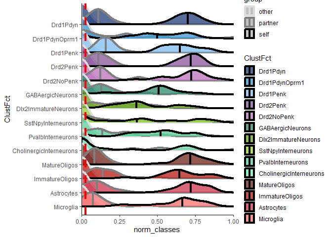
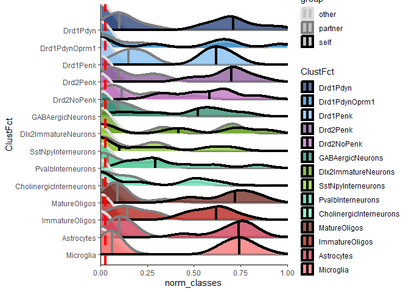
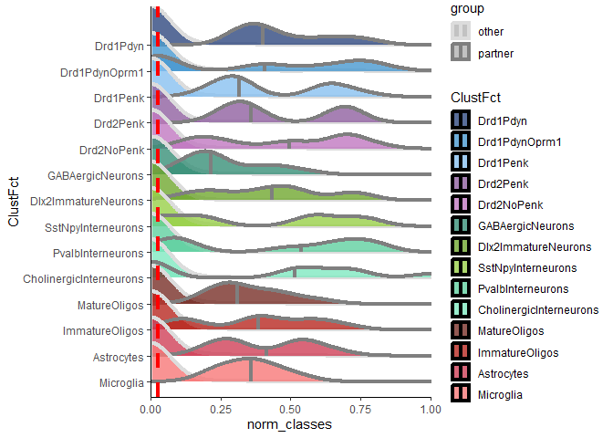
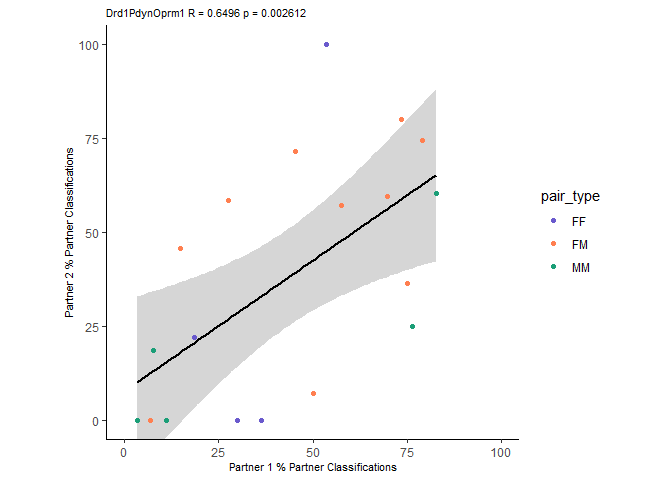
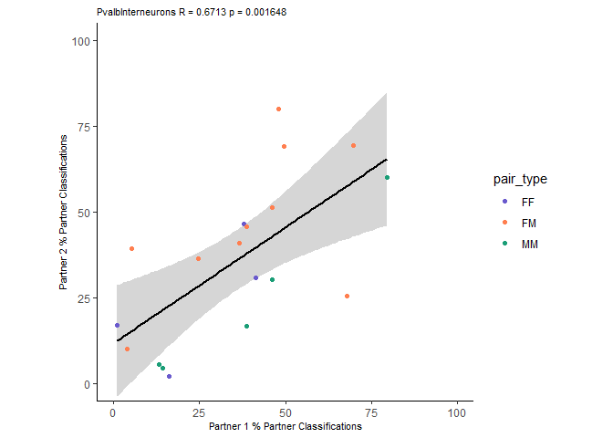
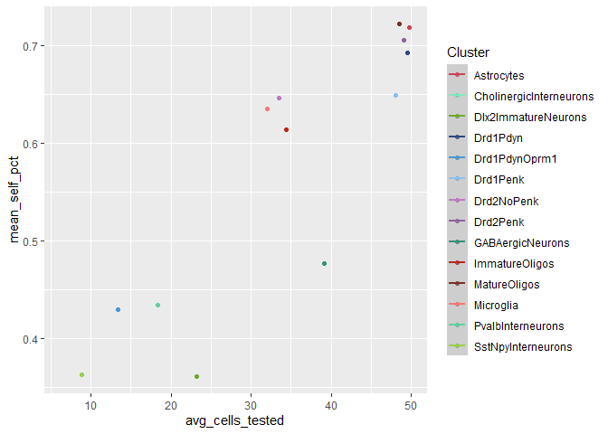

SVM plots
================
Liza Brusman
2024-10-29

``` r
library(dplyr)
library(tidyr)
library(ggplot2)
library(ggridges)
library(forcats)
library(ggpubr)
library(glmmTMB)
library(DHARMa)
library(gridExtra)
library(emmeans)
library(Hmisc)
library(corrplot)
source("SVM_plot_fxns.R")
```

metadata

``` r
metadata <- read.csv("../../docs/seq_beh_metadata.csv")
metadata$Group <- paste(metadata$sex, metadata$SS_OS, sep = "_")
metadata <- metadata %>% filter(!animal %in% c("4918", "4967"))
```

module data

``` r
all_cells <- read.csv("../hotspot/docs/ani_mod_scores_allcells_lognorm_counts.csv")
modules <- colnames(all_cells)
modules <- modules[modules != "animal"]

data <- merge(all_cells, metadata, on = "animal")
```

for SVMs that include self:

``` r
with_self <- read.csv("output/ani_pairwise_classifications_withself.csv")
```

for SVMs that do not include self

``` r
exclude_self <- read.csv("output/all_svm_combined_excludeself_200cells.csv") %>% filter(animal == Var1)
```

put clusters in right order and assign colors

``` r
f.levels <- c('Drd1Pdyn', 'Drd1PdynOprm1', 'Drd1Penk', 'Drd2Penk', 'Drd2NoPenk', 
                                      'GABAergicNeurons', 'Dlx2ImmatureNeurons', 'SstNpyInterneurons', 
                                      'PvalbInterneurons', 'CholinergicInterneurons', 'MatureOligos', 
                                      'ImmatureOligos', 'Astrocytes', 'Microglia')

clust_cols <- c("Drd1Pdyn" = "#304880", "Drd1PdynOprm1" = "#4898D0", "Drd1Penk" = "#88C0F0", "Drd2Penk" = "#9060A0", "Drd2NoPenk" = "#C078C0", "GABAergicNeurons" = "#389078", "Dlx2ImmatureNeurons" = "#70A830", "SstNpyInterneurons" = "#98D048", "PvalbInterneurons" = "#60D0A0", "CholinergicInterneurons" = "#80E8C0", "MatureOligos" = "#783028", "ImmatureOligos" = "#B82820", "Astrocytes" = "#D04058", "Microglia" = "#F87878")
```

process df into format for ridgeline plots

``` r
with_self2 <- process_df_withself(with_self)
```

    ## `summarise()` has grouped output by 'Cluster'. You can override using the
    ## `.groups` argument.

plot ridgeline plot

``` r
plot_ridgeline(with_self2, save = FALSE)
```

    ## Picking joint bandwidth of 0.0453

<!-- -->
STAT TESTS - GLM for with self - self vs. partner vs. other

``` r
with_self_stats <- GLM_SVM(with_self2)

# setwd("output/")
# write.csv(with_self_stats, "glm_svm_with_self_groups_ordbeta.csv")
```

widen dataframe for other analyses later

``` r
with_self_wide <- widen_df_withself(with_self2)
```

process df for excluding self

``` r
exclude_self2 <- process_df_excludeself(exclude_self)
```

    ## `summarise()` has grouped output by 'Cluster'. You can override using the
    ## `.groups` argument.

plot exclude self ridgeline

``` r
plot_ridgeline(exclude_self2, save = FALSE)
```

    ## Picking joint bandwidth of 0.0526

<!-- -->

GLM stats: exclude self

``` r
exclude_self_stats <- GLM_SVM(exclude_self2)

# setwd("output/")
# write.csv(exclude_self_stats, "svm_exclude_self_glm_groups.csv")
```

exclude self widened df

``` r
exclude_self_wide <- widen_df_excludeself(exclude_self2)
```

plot ridgelines by pairing type - with self

``` r
pair_types <- unique(data$pair_type)
for (type in pair_types) {
  print(type)
  plot_ridgeline(with_self2, grouping = "pair_type", save = FALSE)

}
```

    ## [1] "FM"

    ## Picking joint bandwidth of 0.0477

<!-- -->

    ## [1] "MM"

    ## Picking joint bandwidth of 0.0549

<!-- -->

    ## [1] "FF"

    ## Picking joint bandwidth of 0.0623

<!-- -->
ridgeline by pair type without self

``` r
pair_types <- unique(data$pair_type)
for (type in pair_types) {
  print(type)
  plot_ridgeline(exclude_self2, grouping = "pair_type", save = FALSE)
  
}
```

    ## [1] "FM"

    ## Picking joint bandwidth of 0.0527

<!-- -->

    ## [1] "MM"

    ## Picking joint bandwidth of 0.0699

<!-- -->

    ## [1] "FF"

    ## Picking joint bandwidth of 0.0608

<!-- -->
ridgeline by cohort with self

``` r
cohs <- unique(data$beh_cohort)
for (type in cohs) {
  print(type)
  plot_ridgeline(with_self2, grouping = "beh_cohort", save = FALSE)
  
}
```

    ## [1] 3

    ## Picking joint bandwidth of 0.0539

<!-- -->

    ## [1] 2

    ## Picking joint bandwidth of 0.0565

<!-- -->

    ## [1] 4

    ## Picking joint bandwidth of 0.0504

<!-- -->
ridgelines by cohort exclude self

``` r
cohs <- unique(data$beh_cohort)
for (type in cohs) {
  print(type)
  plot_ridgeline(exclude_self2, grouping = "beh_cohort", save = FALSE)
  
}
```

    ## [1] 3

    ## Picking joint bandwidth of 0.0698

<!-- -->

    ## [1] 2

    ## Picking joint bandwidth of 0.0637

<!-- -->

    ## [1] 4

    ## Picking joint bandwidth of 0.0522

<!-- -->

directly compare pairing types. each point in these plots is the
percentage of classification for one animal to one other animal

``` r
exclude_self2$group_type <- paste(exclude_self2$pair_type, exclude_self2$group, sep = "_")

plot_dotcloud(exclude_self2)
```

<!-- -->

for stats - looking at partner/other\*pair_type

``` r
exclude_self_pairtype_stats <- GLM_SVM_pairtype(exclude_self2)

# setwd("output/")
# write.csv(exclude_self_pairtype_stats, "svm_excludeself_glm_posthocs_by_pairtype.csv")
```

correlation between partners in partner % classification

``` r
plot_SVM_corrs(exclude_self_wide, save = FALSE)
```

    ## `geom_smooth()` using formula = 'y ~ x'

<!-- -->

    ## `geom_smooth()` using formula = 'y ~ x'

<!-- -->

    ## `geom_smooth()` using formula = 'y ~ x'

<!-- -->

    ## `geom_smooth()` using formula = 'y ~ x'

<!-- -->

    ## `geom_smooth()` using formula = 'y ~ x'

<!-- -->

    ## `geom_smooth()` using formula = 'y ~ x'

<!-- -->

    ## `geom_smooth()` using formula = 'y ~ x'

<!-- -->

    ## `geom_smooth()` using formula = 'y ~ x'

<!-- -->

    ## `geom_smooth()` using formula = 'y ~ x'

<!-- -->

    ## `geom_smooth()` using formula = 'y ~ x'

<!-- -->

    ## `geom_smooth()` using formula = 'y ~ x'

<!-- -->

    ## `geom_smooth()` using formula = 'y ~ x'

<!-- -->

    ## `geom_smooth()` using formula = 'y ~ x'

<!-- -->

    ## `geom_smooth()` using formula = 'y ~ x'

<!-- -->

    ## `geom_smooth()` using formula = 'y ~ x'
    ## `geom_smooth()` using formula = 'y ~ x'
    ## `geom_smooth()` using formula = 'y ~ x'
    ## `geom_smooth()` using formula = 'y ~ x'
    ## `geom_smooth()` using formula = 'y ~ x'
    ## `geom_smooth()` using formula = 'y ~ x'
    ## `geom_smooth()` using formula = 'y ~ x'
    ## `geom_smooth()` using formula = 'y ~ x'
    ## `geom_smooth()` using formula = 'y ~ x'
    ## `geom_smooth()` using formula = 'y ~ x'
    ## `geom_smooth()` using formula = 'y ~ x'
    ## `geom_smooth()` using formula = 'y ~ x'
    ## `geom_smooth()` using formula = 'y ~ x'
    ## `geom_smooth()` using formula = 'y ~ x'

<!-- -->

get out some summary stats for exclude self data

``` r
summ_stats <- exclude_self_wide %>% group_by(Cluster) %>% summarise(mean_partner_pct = mean(partner.pct), avg_cells_tested = mean(partner+other))

ggplot(summ_stats, aes(x = avg_cells_tested, y = mean_partner_pct, color = Cluster)) +
  geom_point() +
  geom_smooth(method = "lm") +
  scale_color_manual(values = clust_cols)
```

    ## `geom_smooth()` using formula = 'y ~ x'

<!-- -->

``` r
#here i correlated the mean partner % vs. the number of cells tested
rcorr(summ_stats$mean_partner_pct, summ_stats$avg_cells_tested)
```

    ##      x    y
    ## x 1.00 0.49
    ## y 0.49 1.00
    ## 
    ## n= 14 
    ## 
    ## 
    ## P
    ##   x      y     
    ## x        0.0727
    ## y 0.0727

get some summary stats for with self data

``` r
summ_stats <- with_self_wide %>% group_by(Cluster) %>% summarise(mean_self_pct = mean(self.pct), avg_cells_tested = mean(self+partner+other))

#here i correlated the self classifications to the number of cells tested. this is highly correlated
cor_test <- rcorr(summ_stats$mean_self_pct, summ_stats$avg_cells_tested, type = "spearman")
print(cor_test)
```

    ##      x    y
    ## x 1.00 0.88
    ## y 0.88 1.00
    ## 
    ## n
    ##    x  y
    ## x 13 13
    ## y 13 14
    ## 
    ## P
    ##   x  y 
    ## x     0
    ## y  0

``` r
ggplot(summ_stats, aes(x = avg_cells_tested, y = mean_self_pct, color = Cluster)) +
  geom_point() +
  geom_smooth(method = "lm") +
  scale_color_manual(values = clust_cols)
```

    ## `geom_smooth()` using formula = 'y ~ x'

<!-- -->

self vs. chance - one-sample t-test vs. 1/38 (correct classification by
random)

``` r
vs_chance_df <- data.frame()

for (clust in f.levels) {
  clust_df <- with_self2 %>% filter(Cluster == clust) %>% filter(group == "self")
  
  onesamp <- t.test(clust_df$norm_classes, mu = 1/38)
  # print(oneway)
  
  stats_df <- data.frame(Cluster = clust,
                        T_val = onesamp$statistic[1],
                        p.value = onesamp$p.value,
                        test = "onesamp t-test")
  
  vs_chance_df <- rbind(vs_chance_df, stats_df)
  
}
```

partner vs. chance for exclude self

``` r
vs_chance_df_exclude <- data.frame()

for (clust in f.levels) {
  clust_df <- exclude_self2 %>% filter(Cluster == clust) %>% filter(group == "partner")
  
  onesamp <- t.test(clust_df$norm_classes, mu = 1/37)
  # print(oneway)
  
  stats_df <- data.frame(Cluster = clust,
                        T_val = onesamp$statistic[1],
                        p.value = onesamp$p.value,
                        test = "onesamp t-test")
  
  vs_chance_df_exclude <- rbind(vs_chance_df_exclude, stats_df)
  
}
```

look at classifications for same sex, same cohort, same pairing type,
relatedness, etc. basically - what other factors are at play other than
partner ID?

``` r
exclude_self_newclass <- exclude_self2
exclude_self_newclass <- exclude_self_newclass %>% merge(metadata, on = "animal")

#basically just creating named lists to match to predicted animal
sex_vec <- metadata$sex
names(sex_vec) <- metadata$animal

exclude_self_newclass$y_pred <- as.character(exclude_self_newclass$y_pred)
exclude_self_newclass$same_opp_sex <- if_else(exclude_self_newclass$sex == sex_vec[exclude_self_newclass$y_pred], "same", "different")

coh_vec <- metadata$beh_cohort
names(coh_vec) <- metadata$animal
exclude_self_newclass$same_diff_coh <- if_else(exclude_self_newclass$beh_cohort == coh_vec[exclude_self_newclass$y_pred], "same", "different")

type_vec <- metadata$pair_type
names(type_vec) <- metadata$animal
exclude_self_newclass$same_diff_type <- if_else(exclude_self_newclass$pair_type == type_vec[exclude_self_newclass$y_pred], "same", "different")

group_vec <- metadata$Group
names(group_vec) <- metadata$animal
exclude_self_newclass$same_diff_group <- if_else(exclude_self_newclass$Group == group_vec[exclude_self_newclass$y_pred], "same", "different")

parent_vec <- metadata$parents
names(parent_vec) <- metadata$animal
exclude_self_newclass$same_diff_parents <- if_else(exclude_self_newclass$parents == parent_vec[exclude_self_newclass$y_pred], "same", "different")
```

only look at “other” classifications

``` r
exclude_self_newclass_other <- exclude_self_newclass %>% filter(group == "other")
norm_to_other_class <- exclude_self_newclass_other %>% group_by(Cluster, animal) %>% summarise(sum_other_classes = sum(Freq))
```

    ## `summarise()` has grouped output by 'Cluster'. You can override using the
    ## `.groups` argument.

``` r
same_sex_norm <- exclude_self_newclass_other %>% group_by(Cluster, animal, same_opp_sex) %>% summarise(classes = sum(Freq))
```

    ## `summarise()` has grouped output by 'Cluster', 'animal'. You can override using
    ## the `.groups` argument.

``` r
same_sex_norm$metric <- "sex"
same_sex_norm <- same_sex_norm %>% rename("same_diff" = "same_opp_sex")
same_sex_norm <- same_sex_norm %>% merge(norm_to_other_class, on = "animal")

same_coh_norm <- exclude_self_newclass_other %>% group_by(Cluster, animal, same_diff_coh) %>% summarise(classes = sum(Freq))
```

    ## `summarise()` has grouped output by 'Cluster', 'animal'. You can override using
    ## the `.groups` argument.

``` r
same_coh_norm$metric <- "cohort"
same_coh_norm <- same_coh_norm %>% rename("same_diff" = "same_diff_coh")
same_coh_norm <- same_coh_norm %>% merge(norm_to_other_class, on = "animal")

same_type_norm <- exclude_self_newclass_other %>% group_by(Cluster, animal, same_diff_type) %>% summarise(classes = sum(Freq))
```

    ## `summarise()` has grouped output by 'Cluster', 'animal'. You can override using
    ## the `.groups` argument.

``` r
same_type_norm$metric <- "pair_type"
same_type_norm <- same_type_norm %>% rename("same_diff" = "same_diff_type")
same_type_norm <- same_type_norm %>% merge(norm_to_other_class, on = "animal")


same_group_norm <- exclude_self_newclass_other %>% group_by(Cluster, animal, same_diff_group) %>% summarise(classes = sum(Freq))
```

    ## `summarise()` has grouped output by 'Cluster', 'animal'. You can override using
    ## the `.groups` argument.

``` r
same_group_norm$metric <- "group"
same_group_norm <- same_group_norm %>% rename("same_diff" = "same_diff_group")
same_group_norm <- same_group_norm %>% merge(norm_to_other_class, on = "animal")


same_parents_norm <- exclude_self_newclass_other %>% group_by(Cluster, animal, same_diff_parents) %>% summarise(classes = sum(Freq))
```

    ## `summarise()` has grouped output by 'Cluster', 'animal'. You can override using
    ## the `.groups` argument.

``` r
same_parents_norm$metric <- "parents"
same_parents_norm <- same_parents_norm %>% rename("same_diff" = "same_diff_parents")
same_parents_norm <- same_parents_norm %>% merge(norm_to_other_class, on = "animal")


# norm_to_other_class <- norm_to_other_class %>% merge(same_sex_norm, on = "animal") %>% merge(same_coh_norm, on = "animal") %>% merge(same_type_norm, on = "animal") %>% merge(same_group_norm, on = "animal") %>% merge(same_parents_norm, on = "animal")
norm_to_other_class <- rbind(same_sex_norm, same_coh_norm, same_type_norm, same_group_norm, same_parents_norm)
norm_to_other_class$pcts <- norm_to_other_class$classes/norm_to_other_class$sum_other_classes
```

normalize to the percent of classifications that are for “other”
(i.e. what percent of “other” classifications?)

``` r
norm_to_other_pct <- exclude_self_newclass_other %>% group_by(Cluster, animal) %>% summarise(sum_other_classes = sum(Freq))
```

    ## `summarise()` has grouped output by 'Cluster'. You can override using the
    ## `.groups` argument.

``` r
exclude_self_newclass_other <- merge(exclude_self_newclass_other, norm_to_other_pct, on = "animal")
exclude_self_newclass_other$norm_to_other <- exclude_self_newclass_other$Freq/exclude_self_newclass_other$sum_other_classes
```

plot misclassification allocations by cluster

``` r
clust_cols <- c("Drd1Pdyn" = "#304880",
                "Drd1PdynOprm1" = "#4898D0",
                "Drd1Penk" = "#88C0F0",
                "Drd2Penk" = "#9060A0",
                "Drd2NoPenk" = "#C078C0",
                "GABAergicNeurons" = "#389078",
                "Dlx2ImmatureNeurons" = "#70A830",
                "SstNpyInterneurons" = "#98D048",
                "PvalbInterneurons" = "#60D0A0",
                "CholinergicInterneurons" = "#80E8C0",
                "MatureOligos" = "#783028",
                "ImmatureOligos" = "#B82820",
                "Astrocytes" = "#D04058",
                "Microglia" = "#F87878")

clust_cols_new <- clust_cols
names(clust_cols_new) <- paste0(names(clust_cols), "_same")
clust_cols_light <- colorspace::lighten(clust_cols, 0.6)
clust_cols_light <- rep("gray69", 14)
names(clust_cols_light) <- paste0(names(clust_cols), "_different")

idx <- order(c(seq_along(clust_cols_new), seq_along(clust_cols_light)))
all_clust_cols <- (c(clust_cols_new,clust_cols_light))[idx]

newclass_long_pcts <- exclude_self_newclass_other %>% pivot_longer(cols = c("same_opp_sex", "same_diff_coh", "same_diff_type", "same_diff_group", "same_diff_parents"))

newclass_long_pcts$value <- factor(newclass_long_pcts$value, levels = c("same", "different"))
newclass_long_pcts$Cluster <- factor(newclass_long_pcts$Cluster, levels = f.levels)
newclass_long_pcts$Cluster_samediff <- paste0(newclass_long_pcts$Cluster, "_", newclass_long_pcts$value)
p <- ggplot(newclass_long_pcts, aes(x = factor(Cluster_samediff, levels = names(all_clust_cols)), y = norm_to_other*100, color = Cluster_samediff, fill = Cluster_samediff, alpha = 0.8)) +
  # geom_boxplot() +
  # geom_point(position = position_jitterdodge(jitter.width = 0, dodge.width = 0.9)) +
  geom_jitter(size = 0.5, width = 0.2) +
  scale_color_manual(values = all_clust_cols) +
  scale_fill_manual(values = all_clust_cols) +
  xlab("Group") +
  ylab("% of Classifications") +
  theme_classic()

p2 <- p + facet_wrap(~ name, nrow = 5)
print(p2)
```

<!-- -->

``` r
# setwd("output/new_plots/")
# ggsave("by_metrics_animal_by_animal.pdf", p2)
```

plot allocations of misclassifications as barplot

``` r
plt_list <- list()
for (m in c("same_diff_coh", "same_diff_group", "same_diff_type", "same_diff_parents", "same_opp_sex")) {
  print(m)
  #first find expected values
  metadata2 <- metadata
  if (m == "same_opp_sex") {
    metadata2 <- metadata2 %>% rename(m = "sex")
  }
  else if (m == "same_diff_group") {
    metadata2 <- metadata2 %>% rename(m = "Group")
  }
  else if(m == "same_diff_type") {
    metadata2 <- metadata2 %>% rename(m = "pair_type")
  }
  else if(m == "same_diff_parents") {
    metadata2 <- metadata2 %>% rename(m = "parents")
  }
  else if(m == "same_diff_coh") {
    metadata2 <- metadata2 %>% rename(m = "beh_cohort")
  }
  
  #get weighted avg expected value
  m_summ <- metadata2 %>% summarise(n_metric = n(), .by = m)
  m_summ$norm_pct <- m_summ$n_metric/38
  weighted_mean <- weighted.mean(m_summ$norm_pct, m_summ$n_metric)
  print(weighted_mean)
  
  #make df to sum all other classifications, don't group by cluster first
  test_m <- exclude_self_newclass_other %>% group_by_at(c("animal", "group", m)) %>% summarise_at(.vars = "Freq", .funs = sum)
  test_m <- test_m %>% rename("same_diff" = m)
  test_m2 <- test_m %>% group_by_at(c("animal", "group")) %>% summarise(total_other_classifications = sum(Freq)) %>% merge(test_m, on = "animal") %>% filter(same_diff == "same")
  test_m2$pct_same_classes <- test_m2$Freq/test_m2$total_other_classifications
  test_m2$metric <- m
  
  #one sample ttest vs. chance line
  one_samp_ttest <- t.test(test_m2$pct_same_classes*100, mu = weighted_mean*100)
  print(one_samp_ttest)
  
  p3 <- ggplot(test_m2, aes(x = metric, y = pct_same_classes*100)) + 
    geom_bar(stat = "summary", fun = "mean", color = "black", fill = "white") +
    stat_summary(
    fun.data = mean_se, fun.args = list(mult = 1), geom = "errorbar", color = "black", #fun.args = list(mult = 1), 
    position = position_dodge(0.8), width = 0.2, linewidth = 0.8
      ) +
    geom_jitter(height=0, width = 0.2, color = "black", alpha = 0.6, stroke = NA) +
    geom_hline(yintercept = weighted_mean*100, color = "red", linetype = "dashed") +
    ylim(0, 100) +
    theme_classic()
    print(p3)
  
  plt_list[[m]] <- p3
}
```

    ## [1] "same_diff_coh"
    ## [1] 0.3462604

    ## `summarise()` has grouped output by 'animal'. You can override using the
    ## `.groups` argument.

    ## 
    ##  One Sample t-test
    ## 
    ## data:  test_m2$pct_same_classes * 100
    ## t = 45.411, df = 37, p-value < 2.2e-16
    ## alternative hypothesis: true mean is not equal to 34.62604
    ## 95 percent confidence interval:
    ##  84.55940 89.22346
    ## sample estimates:
    ## mean of x 
    ##  86.89143

    ## [1] "same_diff_group"
    ## [1] 0.2520776

    ## `summarise()` has grouped output by 'animal'. You can override using the
    ## `.groups` argument.

<!-- -->

    ## 
    ##  One Sample t-test
    ## 
    ## data:  test_m2$pct_same_classes * 100
    ## t = -7.2743, df = 37, p-value = 1.226e-08
    ## alternative hypothesis: true mean is not equal to 25.20776
    ## 95 percent confidence interval:
    ##   7.989812 15.491970
    ## sample estimates:
    ## mean of x 
    ##  11.74089

    ## [1] "same_diff_type"
    ## [1] 0.3905817

    ## `summarise()` has grouped output by 'animal'. You can override using the
    ## `.groups` argument.

<!-- -->

    ## 
    ##  One Sample t-test
    ## 
    ## data:  test_m2$pct_same_classes * 100
    ## t = -4.6812, df = 37, p-value = 3.76e-05
    ## alternative hypothesis: true mean is not equal to 39.05817
    ## 95 percent confidence interval:
    ##  13.11857 28.79036
    ## sample estimates:
    ## mean of x 
    ##  20.95446

    ## [1] "same_diff_parents"
    ## [1] 0.09695291

    ## `summarise()` has grouped output by 'animal'. You can override using the
    ## `.groups` argument.

<!-- -->

    ## 
    ##  One Sample t-test
    ## 
    ## data:  test_m2$pct_same_classes * 100
    ## t = 2.6022, df = 35, p-value = 0.01349
    ## alternative hypothesis: true mean is not equal to 9.695291
    ## 95 percent confidence interval:
    ##  11.55082 24.72063
    ## sample estimates:
    ## mean of x 
    ##  18.13572

    ## [1] "same_opp_sex"
    ## [1] 0.501385

    ## `summarise()` has grouped output by 'animal'. You can override using the
    ## `.groups` argument.

<!-- -->

    ## 
    ##  One Sample t-test
    ## 
    ## data:  test_m2$pct_same_classes * 100
    ## t = -1.526, df = 37, p-value = 0.1355
    ## alternative hypothesis: true mean is not equal to 50.1385
    ## 95 percent confidence interval:
    ##  37.54385 51.91185
    ## sample estimates:
    ## mean of x 
    ##  44.72785

<!-- -->

``` r
p4 <- grid.arrange(grobs = plt_list, nrow = 1)
```

<!-- -->

``` r
print(p4)
```

    ## TableGrob (1 x 5) "arrange": 5 grobs
    ##                   z     cells    name           grob
    ## same_diff_coh     1 (1-1,1-1) arrange gtable[layout]
    ## same_diff_group   2 (1-1,2-2) arrange gtable[layout]
    ## same_diff_type    3 (1-1,3-3) arrange gtable[layout]
    ## same_diff_parents 4 (1-1,4-4) arrange gtable[layout]
    ## same_opp_sex      5 (1-1,5-5) arrange gtable[layout]

``` r
setwd("output/new_plots/")
# ggsave("by_metrics_percent_cells_no_partner_combine_clusts_bars_se_noclustcollapsefirst.pdf", p4, width = 7, height = 7)
```

try a way to visualize only means (from data normalized to “other”
counts) this sets up dataframe to make a bubble plot

``` r
norm_to_other_class2 <- norm_to_other_class %>% filter(same_diff == "same")

norm_for_summary <- norm_to_other_class2 %>% group_by(Cluster, metric) %>% summarise(mean_same_pct = mean(pcts, na.rm = TRUE))
```

    ## `summarise()` has grouped output by 'Cluster'. You can override using the
    ## `.groups` argument.

bubble plot with normalized avg expected values colored bubble indicates
true mean black line indicates expected (weighted mean)

``` r
norm_wts <- data.frame()
for (m in unique(norm_for_summary$metric)) {
  print(m)
  m_df <- norm_for_summary %>% filter(metric == m)
  
  metadata2 <- metadata %>% filter(!animal %in% c("4918", "4967"))
  if (m == "cohort") {
    metadata2 <- metadata2 %>% rename(m = "beh_cohort")
  }
  
  else if (m == "group") {
    metadata2 <- metadata2 %>% rename(m = "Group")
  }
  
  #get weighted avg expected value
  m_summ <- metadata2 %>% summarise(n_metric = n(), .by = m)
  m_summ$norm_pct <- m_summ$n_metric/38
  weighted_mean <- weighted.mean(m_summ$norm_pct, m_summ$n_metric)
  
  mini_df <- data.frame("metric" = m, "weighted_mean" = weighted_mean)
  norm_wts <- rbind(norm_wts, mini_df)
}
```

    ## [1] "cohort"
    ## [1] "group"
    ## [1] "pair_type"
    ## [1] "parents"
    ## [1] "sex"

``` r
norm_for_summary_weighted <- norm_for_summary %>% merge(norm_wts, on = "metric")
p <- ggplot(norm_for_summary_weighted, aes(x = metric, y = factor(Cluster, levels = rev(f.levels)), fill = Cluster, color = Cluster)) +
  geom_point(aes(size = mean_same_pct), alpha = 1, shape = 21) +
  geom_point(aes(size = weighted_mean), alpha = 1, shape = 1, color = "black") +
  # geom_point(aes(size = 1), alpha = 1, shape = 1, color = "black") + #if you want 100% circle
  scale_size_continuous(limits = c(0, 1), range = c(0, 10)) +
  scale_fill_manual(values = clust_cols, guide = FALSE) +
  scale_color_manual(values = clust_cols, guide = FALSE) +
  theme(panel.background = element_blank(), panel.border = element_rect(colour = "black", fill = NA, size = 1.2))

print(p)
```

<!-- -->

``` r
# setwd("output/new_plots/")
# ggsave("SVM_metric_classifications_bubbleplot_normalized_expected.pdf", p)
```

``` r
sessionInfo()
```

    ## R version 4.2.2 (2022-10-31 ucrt)
    ## Platform: x86_64-w64-mingw32/x64 (64-bit)
    ## Running under: Windows 10 x64 (build 22631)
    ## 
    ## Matrix products: default
    ## 
    ## locale:
    ## [1] LC_COLLATE=English_United States.utf8 
    ## [2] LC_CTYPE=English_United States.utf8   
    ## [3] LC_MONETARY=English_United States.utf8
    ## [4] LC_NUMERIC=C                          
    ## [5] LC_TIME=English_United States.utf8    
    ## 
    ## attached base packages:
    ## [1] stats     graphics  grDevices utils     datasets  methods   base     
    ## 
    ## other attached packages:
    ##  [1] corrplot_0.92  Hmisc_5.0-1    emmeans_1.8.5  gridExtra_2.3  DHARMa_0.4.6  
    ##  [6] glmmTMB_1.1.8  ggpubr_0.6.0   forcats_1.0.0  ggridges_0.5.4 ggplot2_3.4.2 
    ## [11] tidyr_1.3.0    dplyr_1.1.1   
    ## 
    ## loaded via a namespace (and not attached):
    ##  [1] splines_4.2.2       carData_3.0-5       Formula_1.2-5      
    ##  [4] highr_0.10          yaml_2.3.7          numDeriv_2016.8-1.1
    ##  [7] pillar_1.9.0        backports_1.4.1     lattice_0.21-8     
    ## [10] glue_1.6.2          digest_0.6.31       ggsignif_0.6.4     
    ## [13] checkmate_2.1.0     minqa_1.2.5         colorspace_2.1-0   
    ## [16] sandwich_3.0-2      htmltools_0.5.5     Matrix_1.6-2       
    ## [19] pkgconfig_2.0.3     broom_1.0.4         purrr_1.0.1        
    ## [22] xtable_1.8-4        mvtnorm_1.1-3       scales_1.2.1       
    ## [25] lme4_1.1-33         tibble_3.2.1        htmlTable_2.4.1    
    ## [28] mgcv_1.8-42         farver_2.1.1        generics_0.1.3     
    ## [31] car_3.1-2           TH.data_1.1-2       withr_2.5.0        
    ## [34] nnet_7.3-18         TMB_1.9.10          cli_3.6.0          
    ## [37] survival_3.5-5      magrittr_2.0.3      estimability_1.4.1 
    ## [40] evaluate_0.20       fansi_1.0.4         nlme_3.1-162       
    ## [43] MASS_7.3-58.3       rstatix_0.7.2       foreign_0.8-84     
    ## [46] data.table_1.14.6   tools_4.2.2         lifecycle_1.0.3    
    ## [49] multcomp_1.4-23     stringr_1.5.0       munsell_0.5.0      
    ## [52] cluster_2.1.4       compiler_4.2.2      rlang_1.1.1        
    ## [55] grid_4.2.2          nloptr_2.0.3        rstudioapi_0.14    
    ## [58] htmlwidgets_1.6.2   labeling_0.4.2      base64enc_0.1-3    
    ## [61] rmarkdown_2.25      boot_1.3-28.1       gtable_0.3.3       
    ## [64] codetools_0.2-19    abind_1.4-5         R6_2.5.1           
    ## [67] zoo_1.8-12          knitr_1.42          fastmap_1.1.1      
    ## [70] utf8_1.2.3          stringi_1.7.12      Rcpp_1.0.10        
    ## [73] vctrs_0.6.1         rpart_4.1.19        tidyselect_1.2.0   
    ## [76] xfun_0.38           coda_0.19-4

Add a new chunk by clicking the *Insert Chunk* button on the toolbar or
by pressing *Ctrl+Alt+I*.

When you save the notebook, an HTML file containing the code and output
will be saved alongside it (click the *Preview* button or press
*Ctrl+Shift+K* to preview the HTML file).

The preview shows you a rendered HTML copy of the contents of the
editor. Consequently, unlike *Knit*, *Preview* does not run any R code
chunks. Instead, the output of the chunk when it was last run in the
editor is displayed.
