SVM_plots_forpaper
================
Liza Brusman
2024-02-26

``` r
library(dplyr)
```

    ## Warning: package 'dplyr' was built under R version 4.2.3

``` r
library(tidyr)
library(ggplot2)
```

    ## Warning: package 'ggplot2' was built under R version 4.2.3

``` r
library(ggridges)
```

    ## Warning: package 'ggridges' was built under R version 4.2.3

``` r
library(forcats)
library(ggpubr)
library(glmmTMB)
```

    ## Warning: package 'glmmTMB' was built under R version 4.2.3

``` r
library(DHARMa)
```

    ## Warning: package 'DHARMa' was built under R version 4.2.3

``` r
library(gridExtra)
library(emmeans)
```

    ## Warning: package 'emmeans' was built under R version 4.2.3

``` r
library(Hmisc)
```

    ## Warning: package 'Hmisc' was built under R version 4.2.3

``` r
library(corrplot)
source("SVM_plot_fxns.R")
```

metadata

``` r
metadata <- read.csv("../../docs/seq_beh_metadata.csv")
metadata$Group <- paste(metadata$sex, metadata$SS_OS, sep = "_")
```

module data

``` r
all_cells <- read.csv("../hotspot/docs/ani_mod_scores_allcells_lognorm_counts.csv")
modules <- colnames(all_cells)
modules <- modules[modules != "animal"]

data <- merge(all_cells, metadata, on = "animal")
```

for SVMs that include self:

``` r
with_self <- read.csv("output/ani_pairwise_classifications_withself.csv")
```

for SVMs that do not include self

``` r
exclude_self <- read.csv("output/all_svm_combined_excludeself_200cells.csv") %>% filter(animal == Var1)
```

``` r
f.levels <- c('Drd1Pdyn', 'Drd1PdynOprm1', 'Drd1Penk', 'Drd2Penk', 'Drd2NoPenk', 
                                      'GABAergicNeurons', 'Dlx2ImmatureNeurons', 'SstNpyInterneurons', 
                                      'PvalbInterneurons', 'CholinergicInterneurons', 'MatureOligos', 
                                      'ImmatureOligos', 'Astrocytes', 'Microglia')

clust_cols <- c("Drd1Pdyn" = "#304880", "Drd1PdynOprm1" = "#4898D0", "Drd1Penk" = "#88C0F0", "Drd2Penk" = "#9060A0", "Drd2NoPenk" = "#C078C0", "GABAergicNeurons" = "#389078", "Dlx2ImmatureNeurons" = "#70A830", "SstNpyInterneurons" = "#98D048", "PvalbInterneurons" = "#60D0A0", "CholinergicInterneurons" = "#80E8C0", "MatureOligos" = "#783028", "ImmatureOligos" = "#B82820", "Astrocytes" = "#D04058", "Microglia" = "#F87878")
```

``` r
with_self2 <- process_df_withself(with_self)
```

    ## `summarise()` has grouped output by 'Cluster'. You can override using the
    ## `.groups` argument.

plot using function

``` r
plot_ridgeline(with_self2, save = FALSE)
```

    ## Warning: Using `size` aesthetic for lines was deprecated in ggplot2 3.4.0.
    ## ℹ Please use `linewidth` instead.
    ## This warning is displayed once every 8 hours.
    ## Call `lifecycle::last_lifecycle_warnings()` to see where this warning was
    ## generated.

    ## Picking joint bandwidth of 0.0453

    ## Warning: Removed 38 rows containing non-finite values
    ## (`stat_density_ridges()`).

    ## Warning: Using the `size` aesthetic with geom_segment was deprecated in ggplot2 3.4.0.
    ## ℹ Please use the `linewidth` aesthetic instead.
    ## This warning is displayed once every 8 hours.
    ## Call `lifecycle::last_lifecycle_warnings()` to see where this warning was
    ## generated.

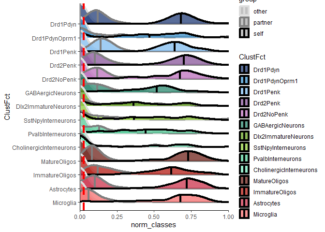<!-- -->
STAT TESTS for with self - self vs. partner vs. other GLM

``` r
with_self_stats <- GLM_SVM(with_self2)

# setwd("output/")
# write.csv(with_self_stats, "glm_svm_with_self_groups_ordbeta.csv")
```

widen dataframe

``` r
with_self_wide <- widen_df_withself(with_self2)
```

    ## Warning: Values from `Freq` are not uniquely identified; output will contain list-cols.
    ## • Use `values_fn = list` to suppress this warning.
    ## • Use `values_fn = {summary_fun}` to summarise duplicates.
    ## • Use the following dplyr code to identify duplicates.
    ##   {data} %>%
    ##   dplyr::group_by(Var1, Cluster, group) %>%
    ##   dplyr::summarise(n = dplyr::n(), .groups = "drop") %>%
    ##   dplyr::filter(n > 1L)

for excluding self:

``` r
exclude_self2 <- process_df_excludeself(exclude_self)
```

    ## `summarise()` has grouped output by 'Cluster'. You can override using the
    ## `.groups` argument.

``` r
plot_ridgeline(exclude_self2, save = FALSE)
```

    ## Picking joint bandwidth of 0.0526

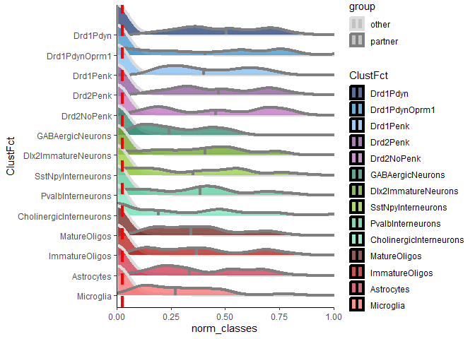<!-- -->

stats: exclude self GLM

``` r
exclude_self_stats <- GLM_SVM(exclude_self2)

# setwd("output/")
# write.csv(exclude_self_stats, "svm_exclude_self_glm_groups.csv")
```

exclude self wide

``` r
exclude_self_wide <- widen_df_excludeself(exclude_self2)
```

    ## Warning: Values from `Freq` are not uniquely identified; output will contain list-cols.
    ## • Use `values_fn = list` to suppress this warning.
    ## • Use `values_fn = {summary_fun}` to summarise duplicates.
    ## • Use the following dplyr code to identify duplicates.
    ##   {data} %>%
    ##   dplyr::group_by(Var1, Cluster, group) %>%
    ##   dplyr::summarise(n = dplyr::n(), .groups = "drop") %>%
    ##   dplyr::filter(n > 1L)

by pairing type - with self

``` r
pair_types <- unique(data$pair_type)
for (type in pair_types) {
  plot_ridgeline(with_self2, grouping = "pair_type", save = FALSE)

}
```

    ## Picking joint bandwidth of 0.0477

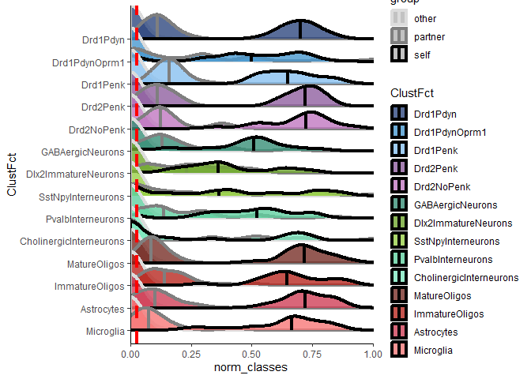<!-- -->

    ## Picking joint bandwidth of 0.0549

    ## Warning: Removed 38 rows containing non-finite values
    ## (`stat_density_ridges()`).

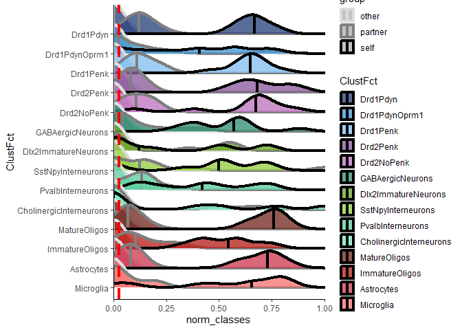<!-- -->

    ## Picking joint bandwidth of 0.0623

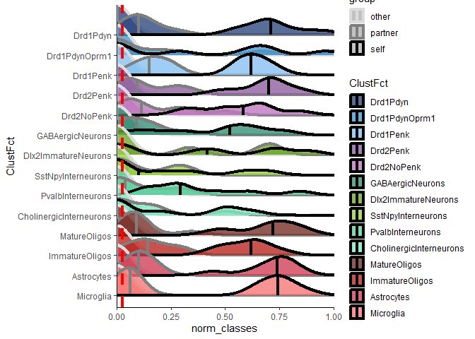<!-- -->
by pair type without self

``` r
pair_types <- unique(data$pair_type)
for (type in pair_types) {
  plot_ridgeline(exclude_self2, grouping = "pair_type", save = FALSE)
  
}
```

    ## Picking joint bandwidth of 0.0527

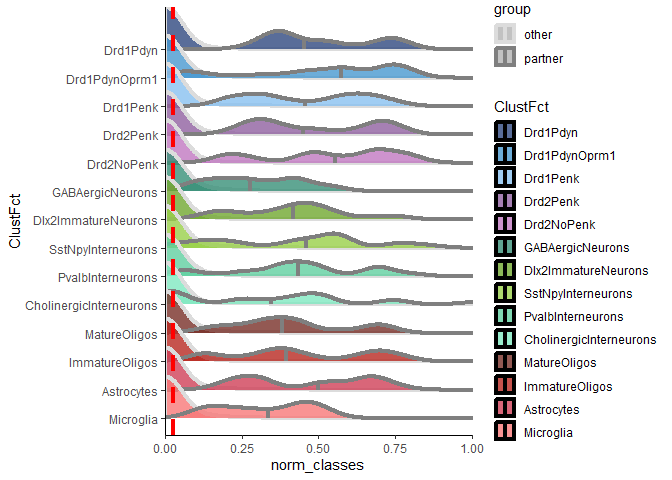<!-- -->

    ## Picking joint bandwidth of 0.0699

<!-- -->

    ## Picking joint bandwidth of 0.0608

<!-- -->
by cohort with self

``` r
cohs <- unique(data$beh_cohort)
for (type in cohs) {
  plot_ridgeline(with_self2, grouping = "beh_cohort", save = FALSE)
  
}
```

    ## Picking joint bandwidth of 0.0539

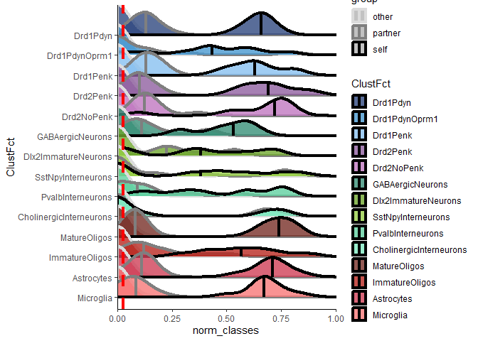<!-- -->

    ## Picking joint bandwidth of 0.0565

    ## Warning: Removed 38 rows containing non-finite values
    ## (`stat_density_ridges()`).

<!-- -->

    ## Picking joint bandwidth of 0.0504

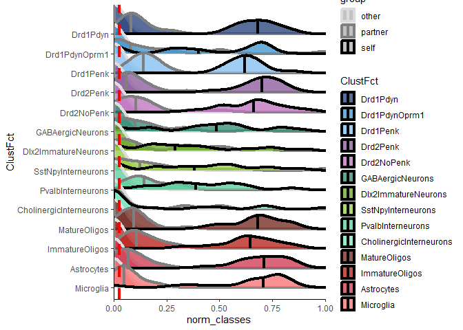<!-- -->
by cohort exclude self

``` r
cohs <- unique(data$beh_cohort)
for (type in cohs) {
  plot_ridgeline(exclude_self2, grouping = "beh_cohort", save = FALSE)
  
}
```

    ## Picking joint bandwidth of 0.0698

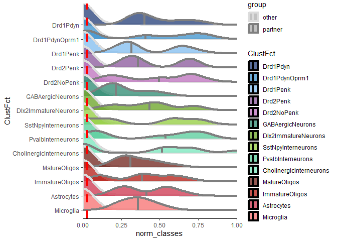<!-- -->

    ## Picking joint bandwidth of 0.0637

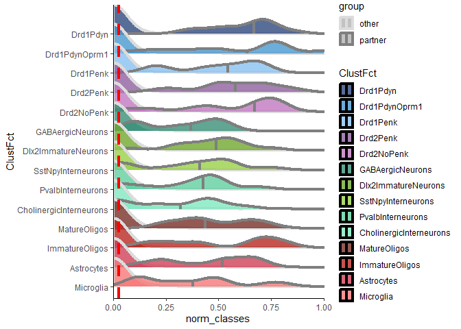<!-- -->

    ## Picking joint bandwidth of 0.0522

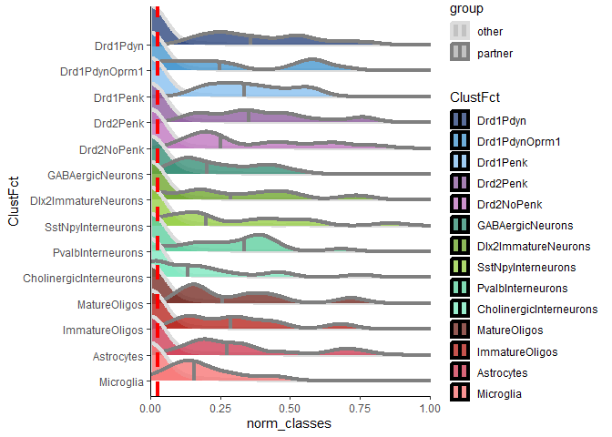<!-- -->

directly compare pairing types

``` r
exclude_self2$group_type <- paste(exclude_self2$pair_type, exclude_self2$group, sep = "_")

plot_dotcloud(exclude_self2)
```

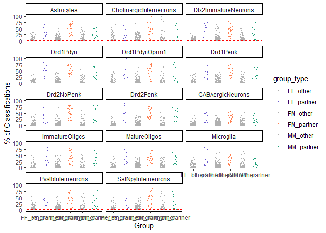<!-- -->

for stats - looking at partner/other\*pair_type

``` r
exclude_self_pairtype_stats <- GLM_SVM_pairtype(exclude_self2)

# setwd("output/")
# write.csv(exclude_self_pairtype_stats, "svm_excludeself_glm_posthocs_by_pairtype.csv")
```

correlation between partners in partner % classification

``` r
plot_SVM_corrs(exclude_self_wide, save = FALSE)
```

    ## `geom_smooth()` using formula = 'y ~ x'

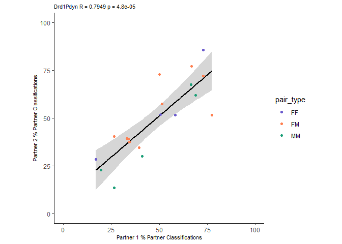<!-- -->

    ## `geom_smooth()` using formula = 'y ~ x'

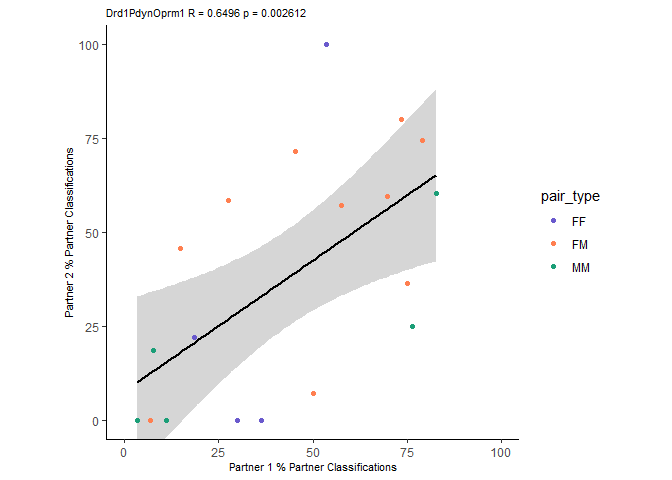<!-- -->

    ## `geom_smooth()` using formula = 'y ~ x'

<!-- -->

    ## `geom_smooth()` using formula = 'y ~ x'

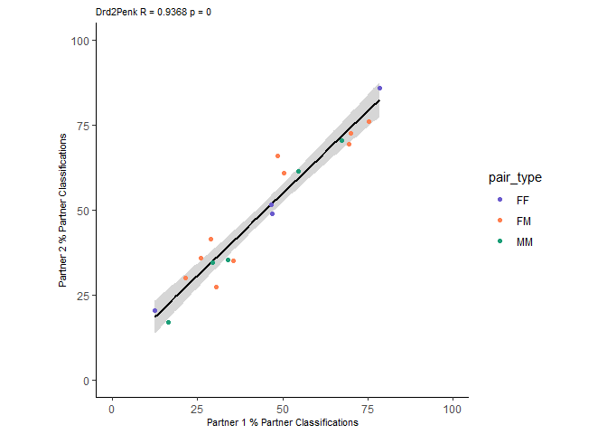<!-- -->

    ## `geom_smooth()` using formula = 'y ~ x'

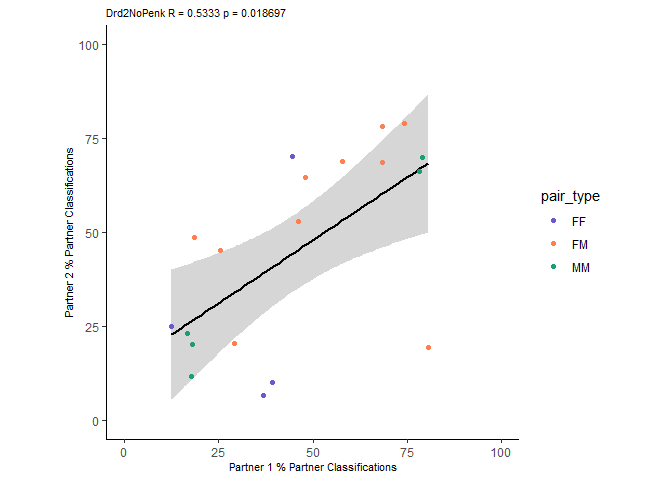<!-- -->

    ## `geom_smooth()` using formula = 'y ~ x'

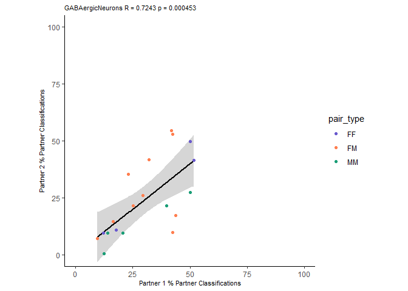<!-- -->

    ## `geom_smooth()` using formula = 'y ~ x'

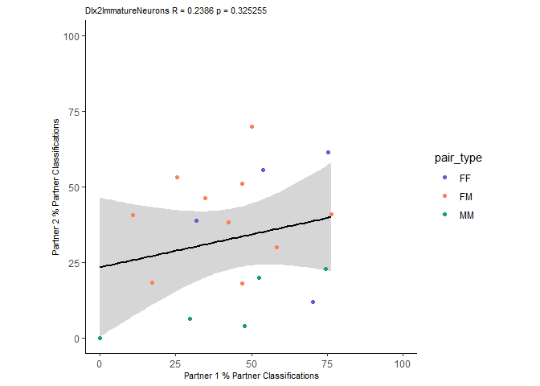<!-- -->

    ## `geom_smooth()` using formula = 'y ~ x'

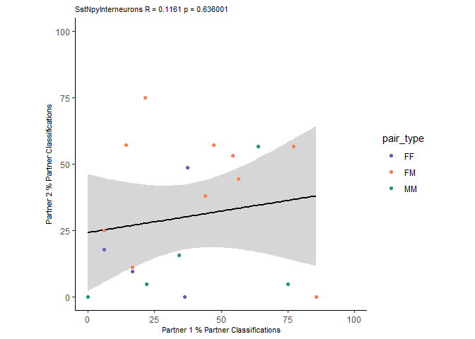<!-- -->

    ## `geom_smooth()` using formula = 'y ~ x'

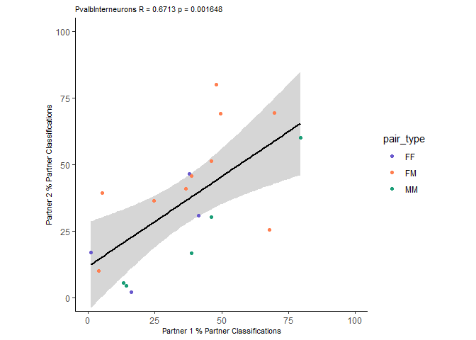<!-- -->

    ## `geom_smooth()` using formula = 'y ~ x'

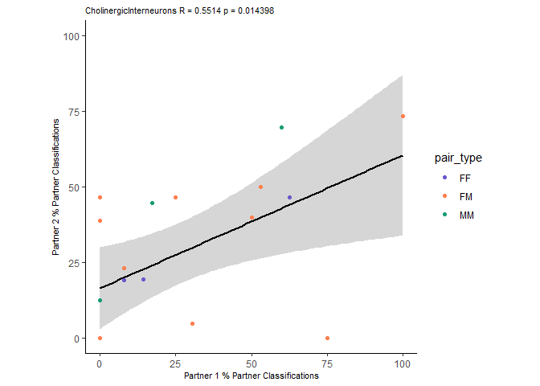<!-- -->

    ## `geom_smooth()` using formula = 'y ~ x'

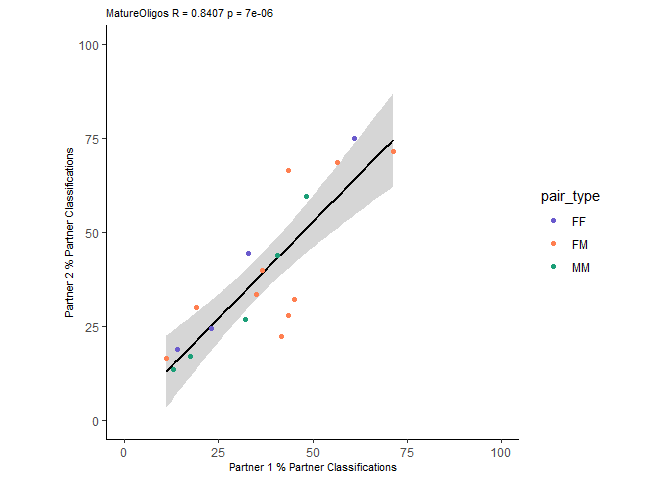<!-- -->

    ## `geom_smooth()` using formula = 'y ~ x'

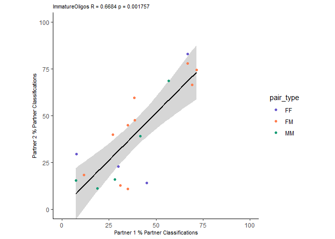<!-- -->

    ## `geom_smooth()` using formula = 'y ~ x'

<!-- -->

    ## `geom_smooth()` using formula = 'y ~ x'

<!-- -->

    ## `geom_smooth()` using formula = 'y ~ x'
    ## `geom_smooth()` using formula = 'y ~ x'
    ## `geom_smooth()` using formula = 'y ~ x'
    ## `geom_smooth()` using formula = 'y ~ x'
    ## `geom_smooth()` using formula = 'y ~ x'
    ## `geom_smooth()` using formula = 'y ~ x'
    ## `geom_smooth()` using formula = 'y ~ x'
    ## `geom_smooth()` using formula = 'y ~ x'
    ## `geom_smooth()` using formula = 'y ~ x'
    ## `geom_smooth()` using formula = 'y ~ x'
    ## `geom_smooth()` using formula = 'y ~ x'
    ## `geom_smooth()` using formula = 'y ~ x'
    ## `geom_smooth()` using formula = 'y ~ x'
    ## `geom_smooth()` using formula = 'y ~ x'

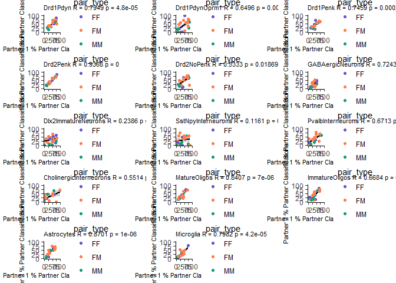<!-- -->

get out some summary stats for exclude self data

``` r
summ_stats <- exclude_self_wide %>% group_by(Cluster) %>% summarise(mean_partner_pct = mean(partner.pct), avg_cells_tested = mean(partner+other))

ggplot(summ_stats, aes(x = avg_cells_tested, y = mean_partner_pct, color = Cluster)) +
  geom_point() +
  geom_smooth(method = "lm") +
  scale_color_manual(values = clust_cols)
```

    ## `geom_smooth()` using formula = 'y ~ x'

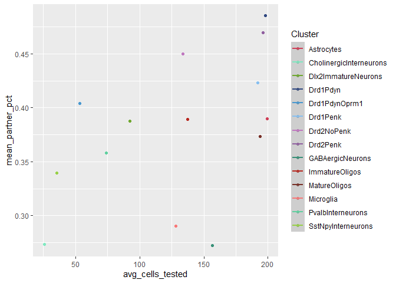<!-- -->

``` r
rcorr(summ_stats$mean_partner_pct, summ_stats$avg_cells_tested)
```

    ##      x    y
    ## x 1.00 0.49
    ## y 0.49 1.00
    ## 
    ## n= 14 
    ## 
    ## 
    ## P
    ##   x      y     
    ## x        0.0727
    ## y 0.0727

get some summary stats for with self data

``` r
summ_stats <- with_self_wide %>% group_by(Cluster) %>% summarise(mean_self_pct = mean(self.pct), avg_cells_tested = mean(self+partner+other))

cor_test <- rcorr(summ_stats$mean_self_pct, summ_stats$avg_cells_tested, type = "spearman")
print(cor_test)
```

    ##      x    y
    ## x 1.00 0.88
    ## y 0.88 1.00
    ## 
    ## n
    ##    x  y
    ## x 13 13
    ## y 13 14
    ## 
    ## P
    ##   x  y 
    ## x     0
    ## y  0

``` r
ggplot(summ_stats, aes(x = avg_cells_tested, y = mean_self_pct, color = Cluster)) +
  geom_point() +
  geom_smooth(method = "lm") +
  scale_color_manual(values = clust_cols)
```

    ## `geom_smooth()` using formula = 'y ~ x'

    ## Warning: Removed 1 rows containing non-finite values (`stat_smooth()`).

    ## Warning: Removed 1 rows containing missing values (`geom_point()`).

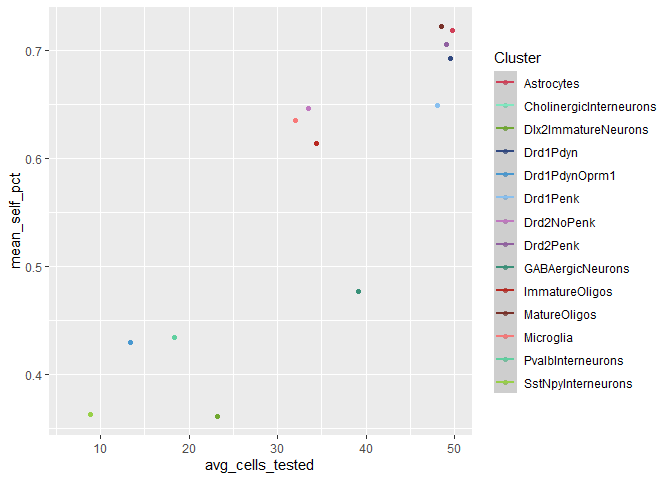<!-- -->

self vs. chance

``` r
vs_chance_df <- data.frame()

for (clust in f.levels) {
  clust_df <- with_self2 %>% filter(Cluster == clust) %>% filter(group == "self")
  
  oneway <- t.test(clust_df$norm_classes, mu = 1/38)
  # print(oneway)
  
  stats_df <- data.frame(Cluster = clust,
                        T_val = oneway$statistic[1],
                        p.value = oneway$p.value,
                        test = "oneway t-test")
  
  vs_chance_df <- rbind(vs_chance_df, stats_df)
  
}
```

partner vs. chance

``` r
vs_chance_df_exclude <- data.frame()

for (clust in f.levels) {
  clust_df <- exclude_self2 %>% filter(Cluster == clust) %>% filter(group == "partner")
  
  oneway <- t.test(clust_df$norm_classes, mu = 1/37)
  # print(oneway)
  
  stats_df <- data.frame(Cluster = clust,
                        T_val = oneway$statistic[1],
                        p.value = oneway$p.value,
                        test = "oneway t-test")
  
  vs_chance_df_exclude <- rbind(vs_chance_df_exclude, stats_df)
  
}
```

Add a new chunk by clicking the *Insert Chunk* button on the toolbar or
by pressing *Ctrl+Alt+I*.

When you save the notebook, an HTML file containing the code and output
will be saved alongside it (click the *Preview* button or press
*Ctrl+Shift+K* to preview the HTML file).

The preview shows you a rendered HTML copy of the contents of the
editor. Consequently, unlike *Knit*, *Preview* does not run any R code
chunks. Instead, the output of the chunk when it was last run in the
editor is displayed.
