Analyze Correlated Genes
================
Liza Brusman
2024-03-11

``` r
library(dplyr)
library(tidyr)
library(ggplot2)
library(gprofiler2)
library(ComplexHeatmap)
library(viridis)
library(colorRamp2)
```

``` r
high_expr_corrs <- read.csv("docs/all_corrs_combined_min1ct.csv") 
high_expr_corrs <- high_expr_corrs %>% filter(Rho_true > (mean+(stdev)*2) & pval_true < 0.05)

# write.csv(high_expr_corrs, "output/sig_corr_genes.csv")
```

``` r
clust_order = c('Drd1Pdyn', 'Drd1PdynOprm1', 'Drd1Penk', 'Drd2Penk', 'Drd2NoPenk',     'GABAergicNeurons', 'Dlx2ImmatureNeurons', 'SstNpyInterneurons', 'PvalbInterneurons',        'CholinergicInterneurons', 'MatureOligos', 'ImmatureOligos', 'Astrocytes', 'Microglia')
```

``` r
summ_signif <- high_expr_corrs %>% group_by(cluster) %>% summarise(n_sig_genes = n())
```

get GO terms for significantly correlated genes

``` r
gos_list <- list()
gos_df_list <- list()
for (clust in clust_order) {
  print(clust)
  corr_clust <- high_expr_corrs %>% filter(cluster == clust) #%>% slice_max(order_by = Rho_true, n=20)
  gostres <- gost(query = corr_clust$gene, 
                  organism = "mochrogaster", 
                  # custom_bg = bg_genes,
                  domain_scope = "known",
                  evcodes = TRUE,
                  correction_method = "fdr",
                  )
  
  if(length(gostres) > 1) {
    ## plot GOs if you want to
    # p <- gostplot(gostres, capped = FALSE, interactive = TRUE)
    # print(p)
    
    gos_list[[clust]] <- gostres

    gos_df_clust <- gostres$result
    gos_df_clust$Cluster <- clust

    gos_df_list[[clust]] <- gos_df_clust
  }
  
  
}

gos_df_all_highexpr <- bind_rows(gos_df_list)
```

SAVE GOS

``` r
# gos_df_all_save <- apply(gos_df_all_highexpr, 2, as.character)
# write.csv(gos_df_all_save, "output/all_new_GO_terms.csv")
```

re-import GOs

``` r
gos_df_all_highexpr <- read.csv("output/all_new_GO_terms.csv")
```

lollipop plots

``` r
gos_df_bp <- gos_df_all_highexpr %>% filter(source == "GO:BP")

for (clust in clust_order) {
  mini.df <- gos_df_bp %>% filter(Cluster == clust) %>% slice_min(order_by = p_value, n=20) %>% slice_max(order_by = intersection_size, n=20)
  p <- ggplot(mini.df, aes(x=term_name, y=intersection_size, color = p_value)) +
  geom_segment( aes(x=term_name, xend=term_name, y=0, yend=intersection_size), color="slategrey", lwd=0.5) +
  geom_point(size=6, alpha=1) +
  scale_color_viridis(option = "plasma", direction = -1, limits = c(0, 0.05)) +
  theme_light() +
  coord_flip() +
  theme(
    panel.grid.major.y = element_blank(),
    panel.border = element_blank(),
    axis.ticks.y = element_blank()) +
  ggtitle(clust)
  print(p)
}
```

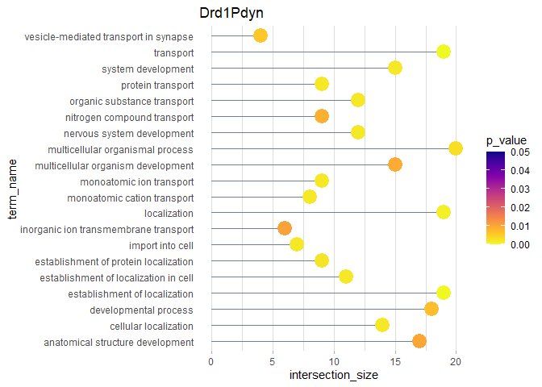<!-- -->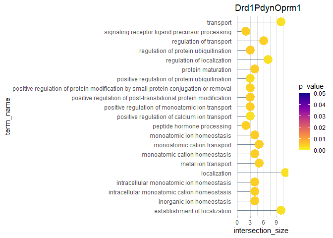<!-- -->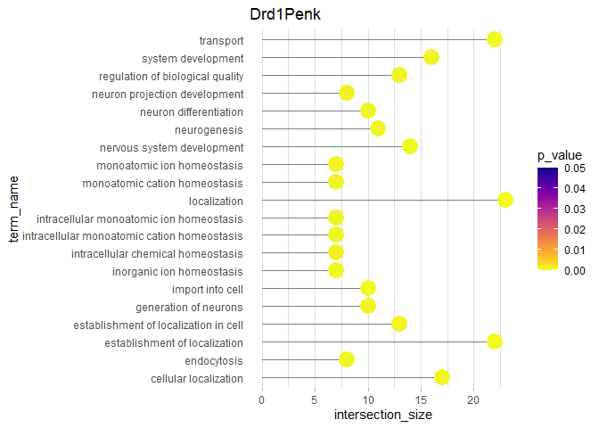<!-- -->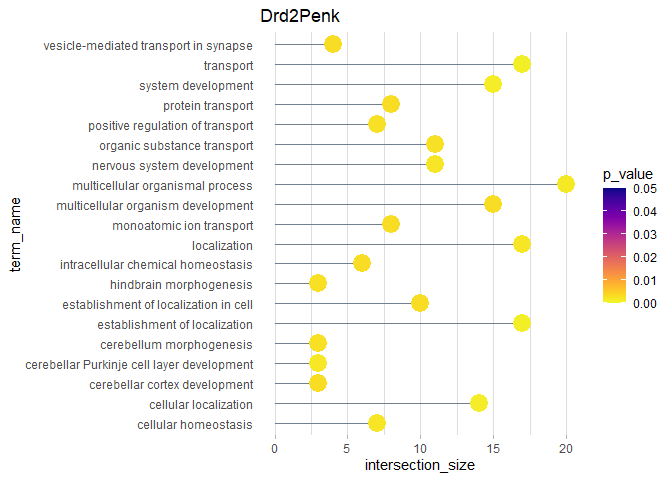<!-- -->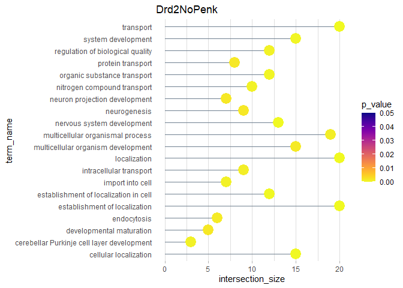<!-- -->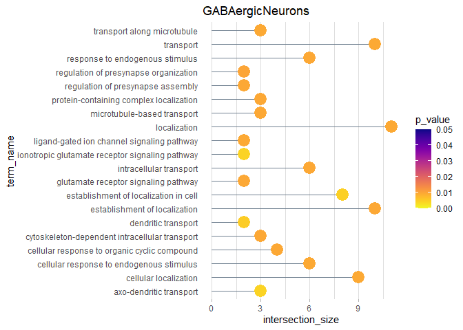<!-- -->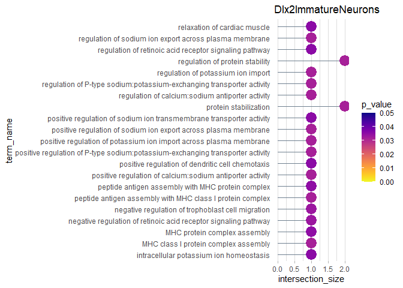<!-- -->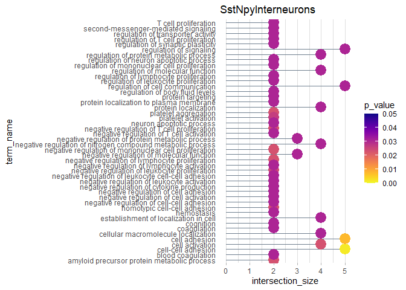<!-- -->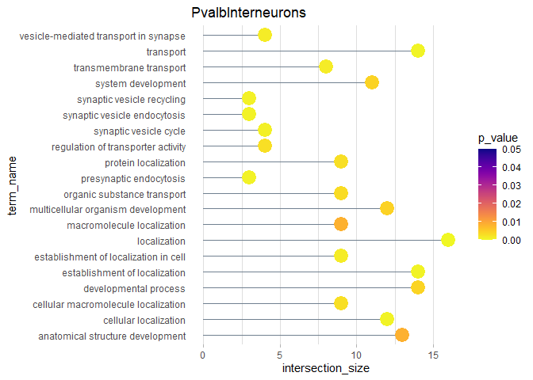<!-- -->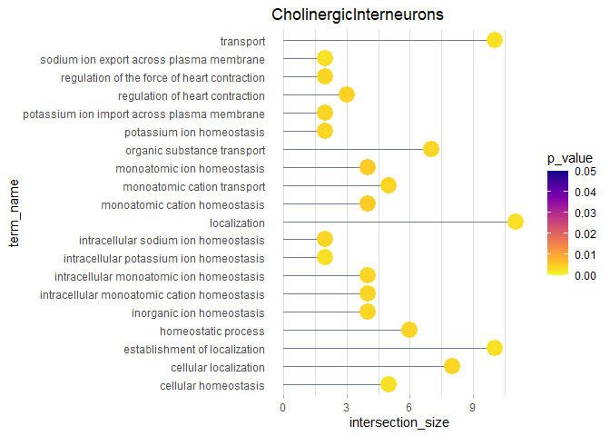<!-- -->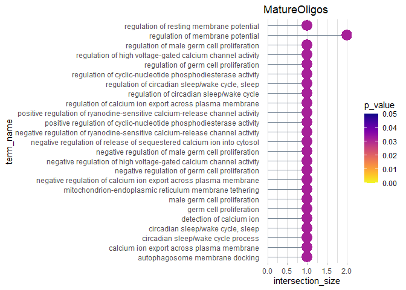<!-- -->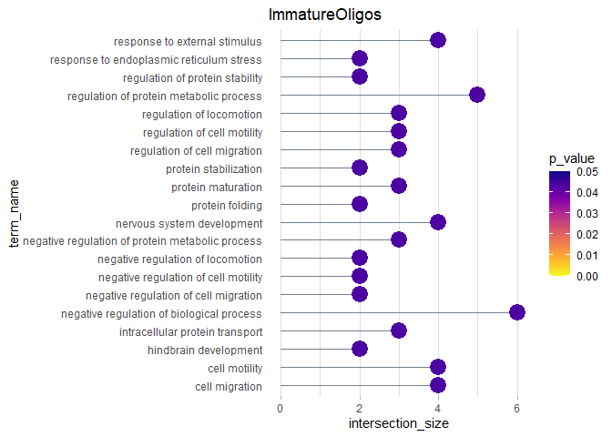<!-- -->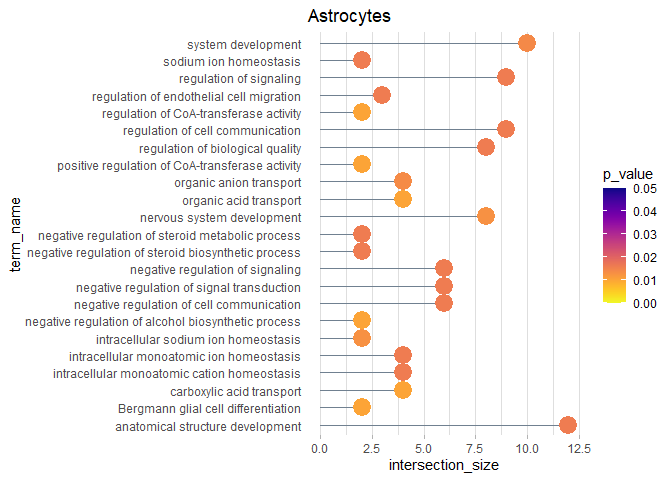<!-- -->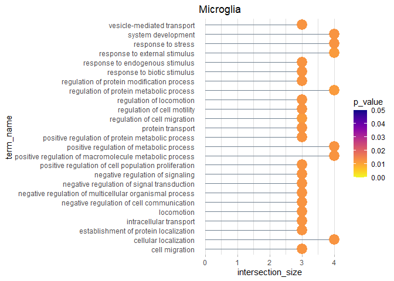<!-- -->

``` r
gos_df_wide <- gos_df_all_highexpr %>% filter(Cluster != "RadialGlia-LikeCells", source == "GO:BP") %>% group_by(Cluster) %>%
# slice_min(order_by = p_value, n = 10) %>% slice_max(order_by = intersection_size, n = 10) %>%
pivot_wider(names_from = "term_name", values_from = "p_value", id_cols = "Cluster")
```

new set of GO Terms 2023/12/11

``` r
groupings_new <- list("transport" = "cellular localization",
                    "establishment of localization" = "cellular localization",
                    "cellular localization" = "cellular localization",
                    "organic substance transport" = "cellular localization",
                    "protein transport" = "cellular localization",
                    "intracellular protein transport" = "cellular localization",
                    "monoatomic ion transport" = "cellular localization",
                    "monoatomic cation transport" = "cellular localization",
                    "metal ion transport" = "cellular localization",
                    "carboxylic acid transport" = "cellular localization",
                    "axo-dendritic transport" = "cellular localization",
                    "transport along microtubule" = "cellular localization",
                    "transmembrane transport" = "cellular localization",
                    "cellular homeostasis" = "cellular homeostasis",
                    "intracellular sodium ion homeostasis" = "cellular homeostasis",
                    "intracellular monoatomic ion homeostasis" = "cellular homeostasis",
                    "inorganic ion homeostasis" = "cellular homeostasis",
                    "regulation of resting membrane potential" = "cellular homeostasis",
                    "import into cell" = "cell import",
                    "endocytosis" = "cell import",
                    "ionotropic glutamate receptor signaling pathway" = "neural activity",
                    "ligand-gated ion channel signaling pathway" = "neural activity",
                    "synaptic vesicle cycle" = "neural activity",
                    "vesicle-mediated transport in synapse" = "neural activity",
                    "synaptic vesicle endocytosis" = "neural activity",
                    "presynaptic endocytosis" = "neural activity",
                    "synaptic vesicle recycling" = "neural activity",
                    "regulation of membrane potential" = "neural activity",
                    "positive regulation of sodium ion export across plasma membrane" = "ion exchange",
                    "positive regulation of calcium:sodium antiporter activity" = "ion exchange",
                    "positive regulation of P-type sodium:potassium-exchanging transporter activity" = "ion exchange",
                    "positive regulation of potassium ion import across plasma membrane" = "ion exchange",
                    "positive regulation of ryanodine-sensitive calcium-release channel activity" = "ion exchange",
                    "negative regulation of ryanodine-sensitive calcium-release channel activity" = "ion exchange",
                    "negative regulation of release of sequestered calcium ion into cytosol" = "ion exchange",
                    "detection of calcium ion" = "ion exchange",
                    "calcium ion export across plasma membrane" = "ion exchange",
                    "negative regulation of high voltage-gated calcium channel activity" = "ion exchange",
                    "negative regulation of calcium ion export across plasma membrane" = "ion exchange",
                    "cell-cell adhesion" = "cell communication",
                    "cell activation" = "cell communication",
                    "protein stabilization" = "protein regulation",
                    "protein maturation" = "protein regulation",
                    "negative regulation of protein metabolic process" = "protein regulation",
                    "regulation of protein metabolic process" = "protein regulation",
                    "regulation of protein stability" = "protein regulation",
                    "regulation of locomotion" = "cell migration",
                    "regulation of cell motility" = "cell migration",
                    "regulation of cell migration" = "cell migration",
                    "nervous system development" = "other",
                    "positive regulation of cyclic-nucleotide phosphodiesterase activity" = "other",
                    "autophagosome membrane docking" = "other",
                    "mitochondrion-endoplasmic reticulum membrane tethering" = "other",
                    "positive regulation of CoA-transferase activity" = "other",
                    "positive regulation of heparan sulfate proteoglycan binding" = "other",
                    "intermediate-density lipoprotein particle clearance" = "other",
                    "cellular response to endogenous stimulus" = "other",
                    "regulation of cellular response to very-low-density lipoprotein particle stimulus" = "other"
                    )
```

getting terms in right order, etc. for plotting

``` r
gos_df_long <- gos_df_all_highexpr %>% filter(Cluster != "RadialGlia-LikeCells" & source == "GO:BP") %>% pivot_wider(id_cols = "term_name", names_from = "Cluster", values_from = "p_value") %>% filter(term_name %in% names(groupings_new))

gos_df_long$count <- rowSums(!is.na(gos_df_long[,clust_order]))

gos_grouping_df <- data.frame(term_name = names(groupings_new), group = unlist(groupings_new))

gos_df_long <- gos_df_long %>% merge(gos_grouping_df, on = term_name)


order <- names(groupings_new)
grpings <- unname(groupings_new) %>% unlist()
gos_df_long$group <- factor(gos_df_long$group, levels = unique(grpings))


gos_df_long <- gos_df_long %>% group_by(group) %>% arrange(factor(group, levels = unique(grpings)), desc(count))
count2 <- gos_df_long$count
grpings2 <- as.character(gos_df_long$group)

stash_terms <- gos_df_long$term_name

gos_df_long <- gos_df_long %>% select(-c("term_name", "group", "count"))
```

    ## Adding missing grouping variables: `group`

``` r
gos_df_long <- gos_df_long[,-1]

rownames(gos_df_long) <- stash_terms
```

    ## Warning: Setting row names on a tibble is deprecated.

``` r
test_count <- rowSums(!is.na(gos_df_long)) %>% as.numeric()
```

plot GO terms in heatmap

``` r
col_fun = colorRamp2(c(0, 10), c("whitesmoke", "#ed07c7"))

##for new GO terms
group_cols <- c("cellular localization" = "#ff595e", 
                "cellular homeostasis" = "#ff924c", 
                "cell import" = "#ffca3a", 
                "neural activity" = "#c5ca30", 
                "ion exchange" = "#8ac926", 
                "cell communication" = "#52a675",
                "protein regulation" = "#1982c4",
                "cell migration" = "#4267ac", 
                "other" = "#6a4c93")

grpings <- unname(groupings_new) %>% unlist()

annot_leg <- list(group = list(title = "Group", at = unique(grpings2),
                  labels = unique(grpings2)))


ha_both = HeatmapAnnotation(count = count2,
                            group = grpings2,
                            col = list(count = col_fun,
                                       group = group_cols),
                            which = "row", gp = gpar(col = "white"),
                            annotation_legend_param = annot_leg
                            )

leg <- list(title = "p-value", at = c(0, 0.01, 0.02, 0.03, 0.04, 0.05), 
        labels = c("0", "0.01", "0.02", "0.03", "0.04", "0.05"))


# pdf("output/selected_GOs_all_pvalue_groupings_newGOs.pdf", width = 7, height = 12)
Heatmap(gos_df_long, 
        cluster_rows = FALSE, 
        cluster_row_slices = FALSE, 
        cluster_columns = FALSE, 
        row_split = factor(grpings2, levels = unique(grpings2)),
        col = rev(plasma(100)),
        heatmap_legend_param = leg,
        rect_gp = gpar(col = "white", lwd = 0.5), 
        row_gap = unit(0.1, "in"),
        right_annotation = ha_both
        )
```

    ## Warning: The input is a data frame-like object, convert it to a matrix.

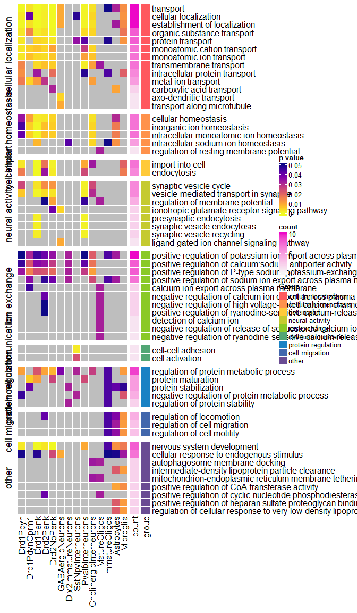<!-- -->

``` r
# dev.off()
```
