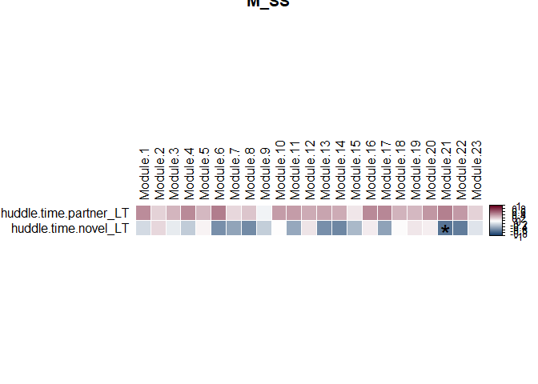
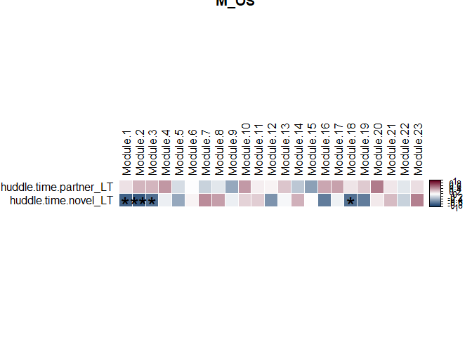
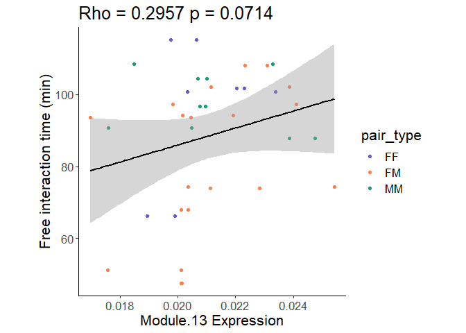

Analysis of Hotspot data with behavior data
================
Liza Brusman
2024-10-31 👻

``` r
library(dplyr)
library(tidyr)
library(ggplot2)
library(ggpubr)
library(Hmisc)
library(corrplot)
library(ggridges)
library(forcats)
library(stringr)
library(gprofiler2)
library(ComplexHeatmap)
library(lme4)
library(glmmTMB)
library(Matrix)
library(boot)
library(readxl)
library(emmeans)
```

``` r
free_int_data <- readxl::read_excel("../../docs/free_int_beh.xlsx") %>% rename("free_int_time" = "Total Duration(Second)") %>% filter(pair != "4918x4967")
```

import metadata

``` r
metadata <- read.csv("../../docs/seq_beh_metadata.csv")
metadata$Group <- paste(metadata$sex, metadata$SS_OS, sep = "_")

free_int_data <- free_int_data %>% filter(pair %in% metadata$pair) #%>% merge(metadata, on = "pair")
```

import ppt behavior

``` r
all_beh_data <- read.csv("../../docs/PPTMetrics_coh1234_updated.csv")

all_beh_data2 <- all_beh_data %>% pivot_wider(id_cols=c("Animal.id", "Pair", "Treatment", "Sex", "Color"), names_from="Timepoint", values_from=c(16:24))

all_beh_data2 <- all_beh_data2 %>% rename("animal" = "Animal.id")
```

import module expression data from Hotspot

``` r
lognorm_mods <- read.csv("../../docs/ani_mod_scores_allcells_lognorm_counts.csv") %>% merge(all_beh_data2, on = "animal") %>% filter(animal != "4967")

lognorm_meta <- lognorm_mods %>% merge(metadata, on = "animal")
```

get module names

``` r
modules <- c()
for (i in 1:23) {
  mod_num <- paste0("Module.", i)
  modules <- modules %>% append(mod_num)
}
```

merge free interaction data, behavior data, and module expression

``` r
free_int_data <- free_int_data %>% rename("Pair" = "pair")

lognorm_mods_beh <- lognorm_mods %>% merge(free_int_data[,c("Pair", "free_int_time")], on = "Pair") %>% merge(metadata, on = "animal")
```

make pairwise df

``` r
pairwise_df <- data.frame(Pair = unique(lognorm_mods$Pair)) %>% filter(Pair != "4918x4967")
behs_mods <- lognorm_mods %>% select_if(is.numeric) %>% select(-c("animal")) %>% colnames()
for (i in behs_mods) {
  i_df <- lognorm_mods %>% pivot_wider(id_cols = Pair, names_from = Color, values_from = i)
  i_df[paste0(i, "_absdiff")] <- abs(i_df$O - i_df$B)
  i_df[paste0(i, "_avg")] <- (i_df$O + i_df$B)/2
  i_df <- i_df %>% select(Pair, paste0(i, "_absdiff"), paste0(i, "_avg"))
  pairwise_df <- merge(pairwise_df, i_df, on = "Pair")
}

pairs_types <- metadata[,c("pair", "pair_type")] %>% unique() %>% filter(pair != "4918x4967") %>% rename("Pair" = "pair")

pairwise_df <- pairwise_df %>% merge(pairs_types, on = "pair")

free_int_pairs <- free_int_data[,c("Pair", "free_int_time")] %>% merge(pairwise_df, on = "pair") # 
```

look at correlation between PPT data and module expression

``` r
groups <- c("F_SS", "F_OS", "M_SS", "M_OS")

lognorm_mods_beh <- lognorm_mods_beh %>% merge(metadata[,c("animal", "pair_type", "SS_OS", "Group")], on = "animal")

for (group in groups) {
  group_df <- lognorm_mods_beh %>% filter(Group == group)

  to_plot <- group_df %>% select(contains("Module"), "huddle.time.partner_LT", "huddle.time.novel_LT")
  res <- rcorr(as.matrix(to_plot), type = "spearman")
  diag(res$P) <- 1
  
  behaviors <- c("huddle.time.partner_LT", "huddle.time.novel_LT") #, "percent.phuddle_LT" huddle.time.partner_LT", "huddle.time.novel_LT "free_int_time", 

  #for padj method
  Rhos_plot <- res$r[behaviors, modules] #%>% as.matrix()
  ps_plot <- res$P[behaviors, modules] #%>% as.matrix()

  # pdf(file = paste0("output/corrplot_seq_beh_individual_", type, ".pdf"), width = 12, height = 6)
  corrplot(Rhos_plot, 
           type = "full",
           method = "color",
           tl.col = "black", 
           addgrid.col = "white",
           col=colorRampPalette(c("#053061","white", "#67001F"))(200),
           tl.srt = 90,
           p.mat = ps_plot,
           sig.level=c(0.001, 0.01, 0.05),
           insig="label_sig",
           pch.cex=2,
           title=group)
  # dev.off()
}
```

<!-- --><!-- --><!-- --><!-- -->

DIY permutations/bootstrapping to find significant correlations

``` r
set.seed(123)
groups <- c("F_SS", "F_OS", "M_SS", "M_OS")

#merge with metadata
lognorm_mods_beh <- lognorm_mods_beh %>% merge(metadata[,c("animal", "pair_type", "SS_OS", "Group")], on = "animal")

#set up df to hold summary stats
summary_stats <- data.frame()
for (group in groups) {
  print(group)
  #make separate df just for that group
  group_df <- lognorm_mods_beh %>% filter(Group == group)
  
  #pick out variables to plot in correlation matrix
  to_plot <- group_df %>% select(contains("Module"), "huddle.time.partner_LT", "huddle.time.novel_LT", "free_int_time")
  
  vars <- colnames(to_plot)
  
  #loop through all combinations of variables to run individual correlations
  for (v in vars) {
    for (w in vars) {
      c <- rcorr(to_plot[[v]], to_plot[[w]], type = "spearman")
      
      #then shuffle variables to determine the null distribution of correlations
      sub_shuffled_df <- data.frame()
      for (i in 1:1000) { #1:1000
        c2 <- rcorr(sample(to_plot[[v]]), sample(to_plot[[w]]), type = "spearman")
        
        #create mini df for that shuffle
        mini_shuffled_df <- data.frame("Var1" = v, "Var2" = w, "Rho_shuff" = c2$r[2], "pval_shuff" = c2$P[2], "n_iter" = i, "Group" = group)
        sub_shuffled_df <- rbind(sub_shuffled_df, mini_shuffled_df)
        # shuffled_df <- rbind(shuffled_df, mini_shuffled_df)
      }
      
      #create df with true values and means of shuffled values
      mini_df <- data.frame("Var1" = v, "Var2" = w, "Rho_true" = c$r[2], "pval_true" = c$P[2], 
                            "Rho_shuff" = mean(sub_shuffled_df$Rho_shuff), "pval_shuff" = mean(sub_shuffled_df$pval_shuff))
      
      #find top 1% of p-values
      n <- 1
      pval_top1perc_df <- sub_shuffled_df[sub_shuffled_df$pval_shuff < quantile(sub_shuffled_df$pval_shuff, prob=0.01),]
      pval_top1perc <- max(pval_top1perc_df$pval_shuff)
      #find top 5% of p-values
      n <- 5
      pval_top5perc_df <- sub_shuffled_df[sub_shuffled_df$pval_shuff < quantile(sub_shuffled_df$pval_shuff, prob=0.05),]
      pval_top5perc <- max(pval_top5perc_df$pval_shuff)
      
      #create df with all these summary stats
      summ_df <- data.frame(Group = group,
                           Var1 = v,
                           Var2 = w,
                           n_samps = nrow(sub_shuffled_df),
                           Rho_shuff_mean = mean(sub_shuffled_df$Rho_shuff),
                           Rho_shuff_stdev = sd(sub_shuffled_df$Rho_shuff),
                           Rho_shuff_sterr = sd(sub_shuffled_df$Rho_shuff)/sqrt(nrow(sub_shuffled_df)),
                           pval_shuff_mean = mean(sub_shuffled_df$pval_shuff),
                           pval_shuff_stdev = sd(sub_shuffled_df$pval_shuff),
                           pval_shuff_sterr = sd(sub_shuffled_df$pval_shuff)/sqrt(nrow(sub_shuffled_df)),
                           Rho_true = c$r[2],
                           pval_true = c$P[2],
                           pval_cutoff_1perc = pval_top1perc,
                           pval_cutoff_5perc = pval_top5perc
                           )
      summary_stats <- rbind(summary_stats, summ_df)
    }
  }
}
```

save p-values as csv

``` r
write.csv(summary_stats, "output/shuffled_corrs_behs_mods.csv")
```

read in csv

``` r
summary_stats <- read.csv("output/shuffled_corrs_behs_mods.csv")
```

cutoff p-values to be within the top (lowest) 5% of shuffled p-values.
these are the p-values plotted on the heatmaps

``` r
sig_corrs <- summary_stats %>% filter(pval_true < pval_cutoff_5perc) %>% filter(Var1 == "huddle.time.partner_LT" | Var1 == "huddle.time.novel_LT") %>% filter(Var1 != Var2)
```

does free interaction time differ by pairing type?

``` r
#make violin plot
p <- ggplot(free_int_pairs, aes(x = pair_type, y = free_int_time/60, color = pair_type, fill = pair_type)) + 
  geom_violin(alpha = 0.8, lwd = 1) + 
  geom_point(color = "slategrey", alpha = 1) + 
  scale_color_manual(values = c("FM" = "coral", "FF" = "slateblue", "MM" = "#1B9E77")) +
  scale_fill_manual(values = c("FM" = "coral", "FF" = "slateblue", "MM" = "#1B9E77")) +
  ylim(0, 7000/60) +
  xlab("Group") +
  ylab("Free interaction time (min)") +
  theme_classic()
print(p)
```

<!-- -->

``` r
# ggsave("output/group_diffs_free_int.pdf", p)

#stats to see if there are group differences
fit <- glmmTMB(free_int_time~pair_type, data = free_int_pairs)
print(summary(fit))
```

    ##  Family: gaussian  ( identity )
    ## Formula:          free_int_time ~ pair_type
    ## Data: free_int_pairs
    ## 
    ##      AIC      BIC   logLik deviance df.resid 
    ##    325.8    329.5   -158.9    317.8       15 
    ## 
    ## 
    ## Dispersion estimate for gaussian family (sigma^2): 1.07e+06 
    ## 
    ## Conditional model:
    ##             Estimate Std. Error z value Pr(>|z|)    
    ## (Intercept)  5758.94     517.98  11.118   <2e-16 ***
    ## pair_typeFM  -899.47     612.89  -1.468    0.142    
    ## pair_typeMM    95.38     694.95   0.137    0.891    
    ## ---
    ## Signif. codes:  0 '***' 0.001 '**' 0.01 '*' 0.05 '.' 0.1 ' ' 1

``` r
EMM <- emmeans(fit, ~ pair_type)
coef <- contrast(EMM, "pairwise")
coef2 <- summary(coef, adjust = "fdr") #[["sex*SSOS"]])
print(coef2)
```

    ##  contrast estimate  SE df t.ratio p.value
    ##  FF - FM     899.5 613 15   1.468  0.2443
    ##  FF - MM     -95.4 695 15  -0.137  0.8927
    ##  FM - MM    -994.9 567 15  -1.753  0.2443
    ## 
    ## P value adjustment: fdr method for 3 tests

look at correlation between free interaction time and module expression

``` r
for (mod in modules) {
  c <- rcorr(lognorm_mods_beh[,mod], lognorm_mods_beh$free_int_time/60, type = "spearman")
  # print(c)

  p <- ggplot(lognorm_mods_beh, aes(x = .data[[mod]], y = free_int_time/60)) + 
    geom_point(aes(color = pair_type)) + 
    geom_smooth(method = "lm", color = "black")  +
    scale_color_manual(values = c("FM" = "coral", "FF" = "slateblue", "MM" = "#1B9E77")) +
    ggtitle(paste0("Rho = ", round(c$r[2], 4), " p = ", round(c$P[2], 4))) +
    xlab(paste0(mod, " Expression")) +
    ylab("Free interaction time (min)") +
    theme_classic() +
    theme(aspect.ratio = 1) +
    theme(text = element_text(size = 16))
  
  print(p)
  
  # fname <- paste0("output/module", mod, "_free_int_corr.pdf")
  # ggsave(fname, p)
}
```

    ## `geom_smooth()` using formula = 'y ~ x'

<!-- -->

    ## `geom_smooth()` using formula = 'y ~ x'

<!-- -->

    ## `geom_smooth()` using formula = 'y ~ x'

<!-- -->

    ## `geom_smooth()` using formula = 'y ~ x'

<!-- -->

    ## `geom_smooth()` using formula = 'y ~ x'

<!-- -->

    ## `geom_smooth()` using formula = 'y ~ x'

<!-- -->

    ## `geom_smooth()` using formula = 'y ~ x'

<!-- -->

    ## `geom_smooth()` using formula = 'y ~ x'

<!-- -->

    ## `geom_smooth()` using formula = 'y ~ x'

<!-- -->

    ## `geom_smooth()` using formula = 'y ~ x'

<!-- -->

    ## `geom_smooth()` using formula = 'y ~ x'

<!-- -->

    ## `geom_smooth()` using formula = 'y ~ x'

<!-- -->

    ## `geom_smooth()` using formula = 'y ~ x'

<!-- -->

    ## `geom_smooth()` using formula = 'y ~ x'

<!-- -->

    ## `geom_smooth()` using formula = 'y ~ x'

<!-- -->

    ## `geom_smooth()` using formula = 'y ~ x'

<!-- -->

    ## `geom_smooth()` using formula = 'y ~ x'

<!-- -->

    ## `geom_smooth()` using formula = 'y ~ x'

<!-- -->

    ## `geom_smooth()` using formula = 'y ~ x'

<!-- -->

    ## `geom_smooth()` using formula = 'y ~ x'

<!-- -->

    ## `geom_smooth()` using formula = 'y ~ x'

<!-- -->

    ## `geom_smooth()` using formula = 'y ~ x'

<!-- -->

    ## `geom_smooth()` using formula = 'y ~ x'

<!-- -->

look at correlation between PPT and free interaction behavior

``` r
#spearman correlation
c <- rcorr(lognorm_mods_beh$LT_phuddle, lognorm_mods_beh$free_int_time, type = "spearman")

#scatter plot
p <- ggplot(lognorm_mods_beh, aes(x = LT_phuddle/60, y = free_int_time/60)) + 
    geom_point(aes(color = pair_type)) + 
    geom_smooth(method = "lm", color = "black")  +
    scale_color_manual(values = c("FM" = "coral", "FF" = "slateblue", "MM" = "#1B9E77")) +
    ggtitle(paste0("Rho = ", round(c$r[2], 4), " p = ", round(c$P[2], 4))) +
    xlab("Partner Huddle Time (min)") +
    ylab("Free interaction time (min)") +
    theme_classic() +
    theme(aspect.ratio = 1) +
    theme(text = element_text(size = 16))
print(p)
```

    ## `geom_smooth()` using formula = 'y ~ x'

<!-- -->

``` r
#save
# ggsave("output/ppt_vs_freeint.pdf", p)
```

``` r
sessionInfo()
```

    ## R version 4.2.2 (2022-10-31 ucrt)
    ## Platform: x86_64-w64-mingw32/x64 (64-bit)
    ## Running under: Windows 10 x64 (build 22631)
    ## 
    ## Matrix products: default
    ## 
    ## locale:
    ## [1] LC_COLLATE=English_United States.utf8 
    ## [2] LC_CTYPE=English_United States.utf8   
    ## [3] LC_MONETARY=English_United States.utf8
    ## [4] LC_NUMERIC=C                          
    ## [5] LC_TIME=English_United States.utf8    
    ## 
    ## attached base packages:
    ## [1] grid      stats     graphics  grDevices utils     datasets  methods  
    ## [8] base     
    ## 
    ## other attached packages:
    ##  [1] emmeans_1.8.5         readxl_1.4.2          boot_1.3-28.1        
    ##  [4] glmmTMB_1.1.8         lme4_1.1-33           Matrix_1.6-2         
    ##  [7] ComplexHeatmap_2.14.0 gprofiler2_0.2.1      stringr_1.5.0        
    ## [10] forcats_1.0.0         ggridges_0.5.4        corrplot_0.92        
    ## [13] Hmisc_5.0-1           ggpubr_0.6.0          ggplot2_3.4.2        
    ## [16] tidyr_1.3.0           dplyr_1.1.1          
    ## 
    ## loaded via a namespace (and not attached):
    ##  [1] TH.data_1.1-2       minqa_1.2.5         colorspace_2.1-0   
    ##  [4] ggsignif_0.6.4      rjson_0.2.21        estimability_1.4.1 
    ##  [7] circlize_0.4.15     htmlTable_2.4.1     GlobalOptions_0.1.2
    ## [10] base64enc_0.1-3     clue_0.3-64         rstudioapi_0.14    
    ## [13] farver_2.1.1        fansi_1.0.4         mvtnorm_1.1-3      
    ## [16] codetools_0.2-19    splines_4.2.2       doParallel_1.0.17  
    ## [19] knitr_1.42          Formula_1.2-5       jsonlite_1.8.4     
    ## [22] nloptr_2.0.3        broom_1.0.4         cluster_2.1.4      
    ## [25] png_0.1-8           compiler_4.2.2      httr_1.4.5         
    ## [28] backports_1.4.1     fastmap_1.1.1       lazyeval_0.2.2     
    ## [31] cli_3.6.0           htmltools_0.5.5     tools_4.2.2        
    ## [34] coda_0.19-4         gtable_0.3.3        glue_1.6.2         
    ## [37] Rcpp_1.0.10         carData_3.0-5       cellranger_1.1.0   
    ## [40] vctrs_0.6.1         nlme_3.1-162        iterators_1.0.14   
    ## [43] xfun_0.38           lifecycle_1.0.3     rstatix_0.7.2      
    ## [46] MASS_7.3-58.3       zoo_1.8-12          scales_1.2.1       
    ## [49] parallel_4.2.2      sandwich_3.0-2      TMB_1.9.10         
    ## [52] RColorBrewer_1.1-3  yaml_2.3.7          gridExtra_2.3      
    ## [55] rpart_4.1.19        stringi_1.7.12      highr_0.10         
    ## [58] S4Vectors_0.36.2    foreach_1.5.2       checkmate_2.1.0    
    ## [61] BiocGenerics_0.44.0 shape_1.4.6         rlang_1.1.1        
    ## [64] pkgconfig_2.0.3     matrixStats_0.63.0  evaluate_0.20      
    ## [67] lattice_0.21-8      purrr_1.0.1         labeling_0.4.2     
    ## [70] htmlwidgets_1.6.2   tidyselect_1.2.0    magrittr_2.0.3     
    ## [73] R6_2.5.1            IRanges_2.32.0      generics_0.1.3     
    ## [76] multcomp_1.4-23     pillar_1.9.0        foreign_0.8-84     
    ## [79] withr_2.5.0         mgcv_1.8-42         survival_3.5-5     
    ## [82] abind_1.4-5         nnet_7.3-18         tibble_3.2.1       
    ## [85] crayon_1.5.2        car_3.1-2           utf8_1.2.3         
    ## [88] plotly_4.10.1       rmarkdown_2.25      GetoptLong_1.0.5   
    ## [91] data.table_1.14.6   digest_0.6.31       xtable_1.8-4       
    ## [94] numDeriv_2016.8-1.1 stats4_4.2.2        munsell_0.5.0      
    ## [97] viridisLite_0.4.1
