Hotspot for paper
================
Liza Brusman
2024-02-26

``` r
suppressPackageStartupMessages(library("dplyr"))
suppressPackageStartupMessages(library("tidyr"))
suppressPackageStartupMessages(library("svMisc"))
suppressPackageStartupMessages(library("cowplot"))
suppressPackageStartupMessages(library("ggplot2"))
suppressPackageStartupMessages(library("pheatmap"))
suppressPackageStartupMessages(library("reshape2"))
suppressPackageStartupMessages(library("gridExtra"))
suppressPackageStartupMessages(library("RColorBrewer"))
suppressPackageStartupMessages(library("ivmte"))
suppressPackageStartupMessages(library("viridis"))
suppressPackageStartupMessages(library("palettetown"))
suppressPackageStartupMessages(library("ComplexHeatmap"))
suppressPackageStartupMessages(library(corrplot))
suppressPackageStartupMessages(library(Hmisc))
suppressPackageStartupMessages(library('corrr'))
suppressPackageStartupMessages(library(ggcorrplot))
suppressPackageStartupMessages(library("FactoMineR"))
suppressPackageStartupMessages(library(stringr))
suppressPackageStartupMessages(library(ggpubr))
suppressPackageStartupMessages(library(ComplexHeatmap))
library(glmmTMB)
library(DHARMa)
```

    ## This is DHARMa 0.4.6. For overview type '?DHARMa'. For recent changes, type news(package = 'DHARMa')

``` r
library(emmeans)
library(Seurat)
```

    ## Attaching SeuratObject

    ## 
    ## Attaching package: 'Seurat'

    ## The following object is masked from 'package:Hmisc':
    ## 
    ##     Key

``` r
source("hotspot.R")
```

import module data and metadata

``` r
all_cells <- read.csv("docs/ani_mod_scores_allcells.csv")

metadata <- read.csv("../../docs/seq_beh_metadata.csv") %>% process_metadata() %>% group_level()
```

merge meta and module data

``` r
merged_data <- merge(all_cells, metadata, on = "animal")
```

``` r
modules <- get_modules(merged_data)

modules <- c()
for (i in 1:23) {
  mod_num <- paste0("Module.", i)
  modules <- modules %>% append(mod_num)
}
```

get which genes are in which module

``` r
mod_genes <- read.csv("docs/new_clusts_hotspot-gene-modules.csv")
```

import seurat object

``` r
SCT_norm <- readRDS("../seurat_clustering/output/SCT_norm.rds")
```

``` r
for (mod in modules) {
  violin(merged_data, save = FALSE)
}
```

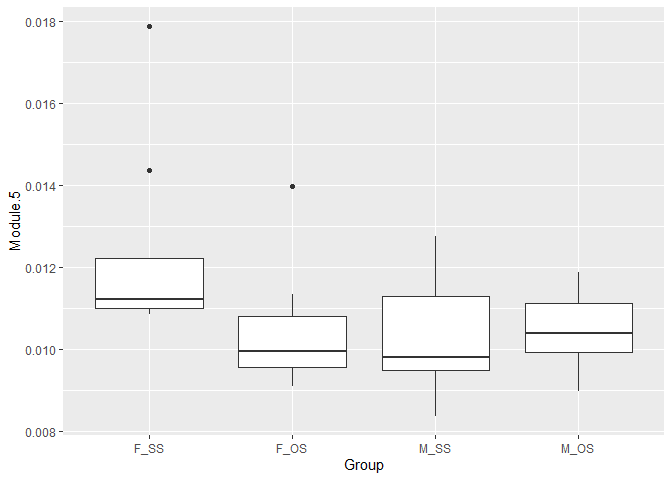<!-- --><!-- --><!-- --><!-- -->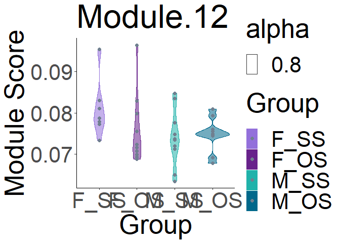<!-- -->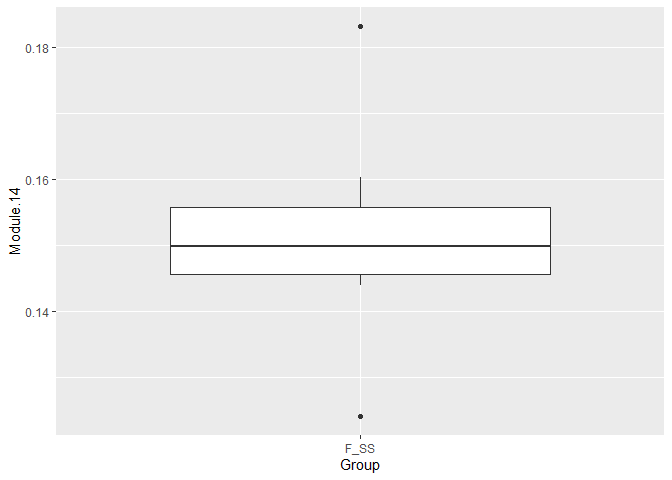<!-- --><!-- -->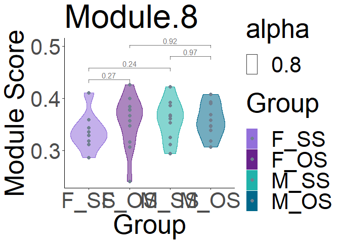<!-- --><!-- -->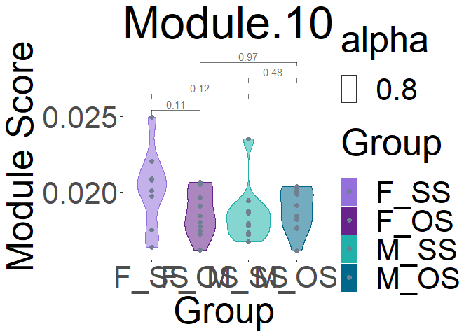<!-- --><!-- --><!-- -->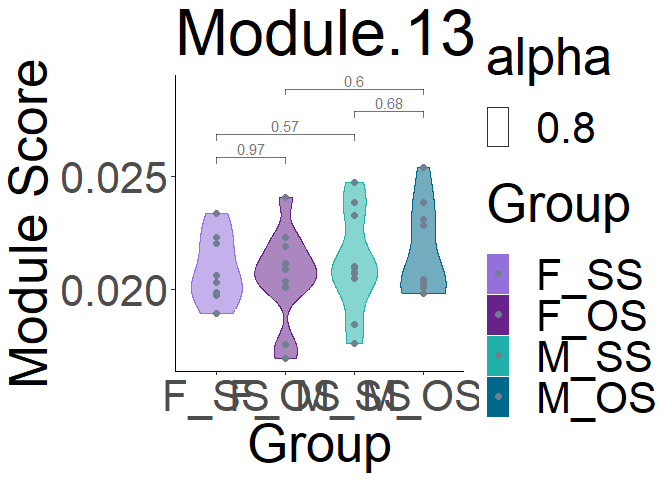<!-- -->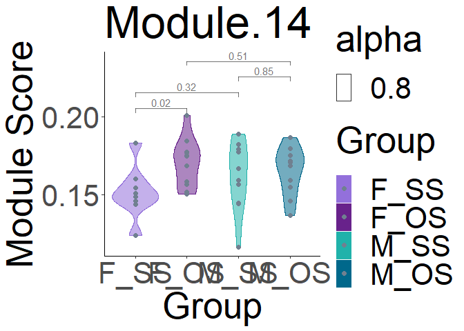<!-- --><!-- --><!-- --><!-- --><!-- --><!-- --><!-- -->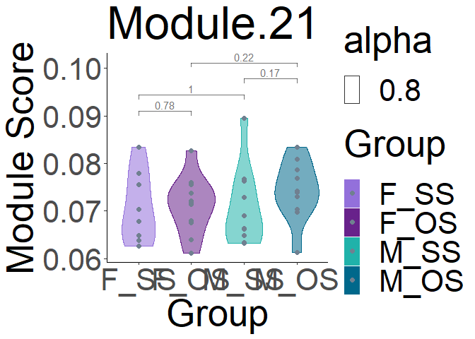<!-- -->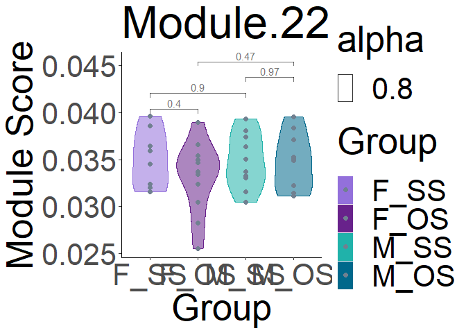<!-- --><!-- -->

``` r
setwd("output/")
for (mod in "Module.6") {
  corr_plot(merged_data, color = "deeppink4", font_size = 20, save = FALSE)
}
```

    ## [1] 0.16724
    ## [1] 0.2423802

    ## `geom_smooth()` using formula = 'y ~ x'

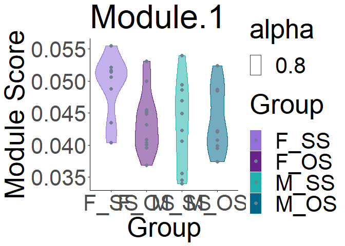<!-- -->

``` r
for (mod in "Module.11") {
  corr_plot(merged_data, color = "chartreuse4", font_size = 20, save = FALSE)
}
```

    ## [1] 0.06466089
    ## [1] 0.09716929

    ## `geom_smooth()` using formula = 'y ~ x'

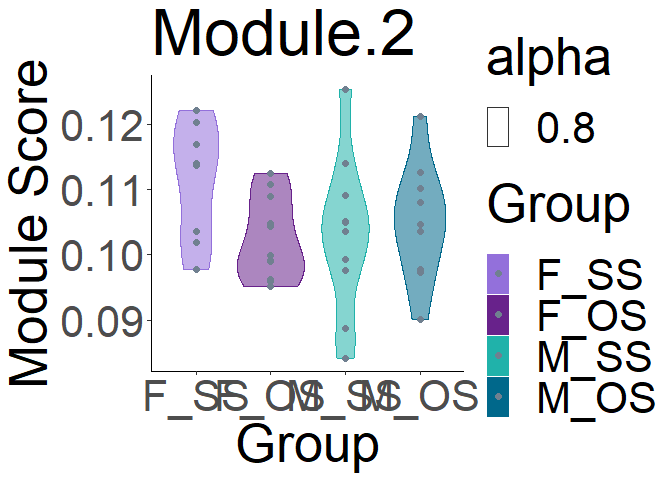<!-- -->

``` r
plt_list <- list()
for (mod in modules) {
  p <- corr_plot_bypair(merged_data, font_size = 8)
  plt_list[[mod]] <- p
}
```

    ## `geom_smooth()` using formula = 'y ~ x'

<!-- -->

    ## `geom_smooth()` using formula = 'y ~ x'

<!-- -->

    ## `geom_smooth()` using formula = 'y ~ x'

<!-- -->

    ## `geom_smooth()` using formula = 'y ~ x'

<!-- -->

    ## `geom_smooth()` using formula = 'y ~ x'

<!-- -->

    ## `geom_smooth()` using formula = 'y ~ x'

<!-- -->

    ## `geom_smooth()` using formula = 'y ~ x'

<!-- -->

    ## `geom_smooth()` using formula = 'y ~ x'

<!-- -->

    ## `geom_smooth()` using formula = 'y ~ x'

<!-- -->

    ## `geom_smooth()` using formula = 'y ~ x'

<!-- -->

    ## `geom_smooth()` using formula = 'y ~ x'

<!-- -->

    ## `geom_smooth()` using formula = 'y ~ x'

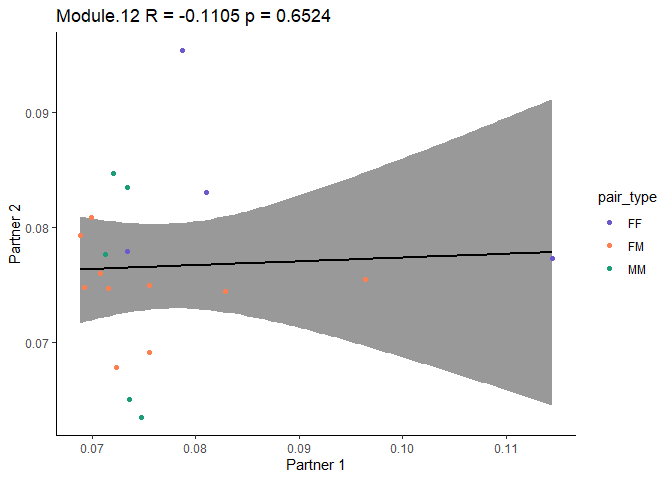<!-- -->

    ## `geom_smooth()` using formula = 'y ~ x'

<!-- -->

    ## `geom_smooth()` using formula = 'y ~ x'

<!-- -->

    ## `geom_smooth()` using formula = 'y ~ x'

<!-- -->

    ## `geom_smooth()` using formula = 'y ~ x'

<!-- -->

    ## `geom_smooth()` using formula = 'y ~ x'

<!-- -->

    ## `geom_smooth()` using formula = 'y ~ x'

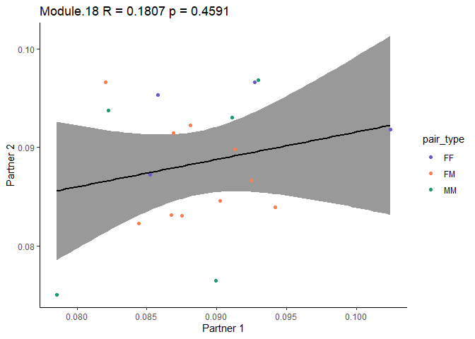<!-- -->

    ## `geom_smooth()` using formula = 'y ~ x'

<!-- -->

    ## `geom_smooth()` using formula = 'y ~ x'

<!-- -->

    ## `geom_smooth()` using formula = 'y ~ x'

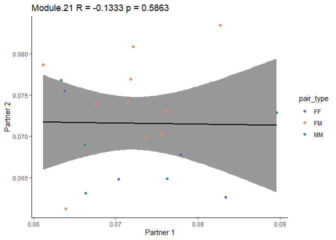<!-- -->

    ## `geom_smooth()` using formula = 'y ~ x'

<!-- -->

    ## `geom_smooth()` using formula = 'y ~ x'

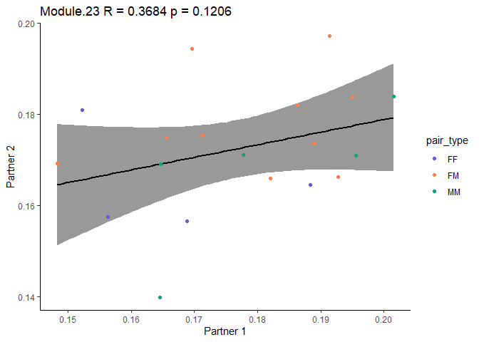<!-- -->

``` r
all_plt <- grid.arrange(grobs = plt_list, nrow = 6)
```

    ## `geom_smooth()` using formula = 'y ~ x'
    ## `geom_smooth()` using formula = 'y ~ x'
    ## `geom_smooth()` using formula = 'y ~ x'
    ## `geom_smooth()` using formula = 'y ~ x'
    ## `geom_smooth()` using formula = 'y ~ x'
    ## `geom_smooth()` using formula = 'y ~ x'
    ## `geom_smooth()` using formula = 'y ~ x'
    ## `geom_smooth()` using formula = 'y ~ x'
    ## `geom_smooth()` using formula = 'y ~ x'
    ## `geom_smooth()` using formula = 'y ~ x'
    ## `geom_smooth()` using formula = 'y ~ x'
    ## `geom_smooth()` using formula = 'y ~ x'
    ## `geom_smooth()` using formula = 'y ~ x'
    ## `geom_smooth()` using formula = 'y ~ x'
    ## `geom_smooth()` using formula = 'y ~ x'
    ## `geom_smooth()` using formula = 'y ~ x'
    ## `geom_smooth()` using formula = 'y ~ x'
    ## `geom_smooth()` using formula = 'y ~ x'
    ## `geom_smooth()` using formula = 'y ~ x'
    ## `geom_smooth()` using formula = 'y ~ x'
    ## `geom_smooth()` using formula = 'y ~ x'
    ## `geom_smooth()` using formula = 'y ~ x'
    ## `geom_smooth()` using formula = 'y ~ x'

<!-- -->

``` r
# setwd("output/")
# ggsave("all_module_corrs.pdf", all_plt, width = 16, height = 16, units = "in")
```

``` r
all_dists_df <- make_dist_df(pairs, type, fake_real, dist, Module)
plt_list <- list()
for (mod in modules) {
    mod_dist_df <- get_rank_distances(merged_data)
    all_dists_df <- rbind(all_dists_df, mod_dist_df)
    
    p <- plot_rank_group(mod_dist_df)
    plt_list[[mod]] <- p
  }
```

<!-- -->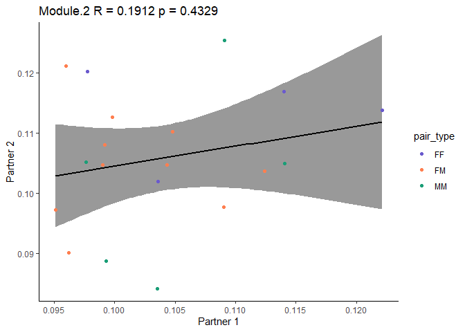<!-- --><!-- --><!-- --><!-- -->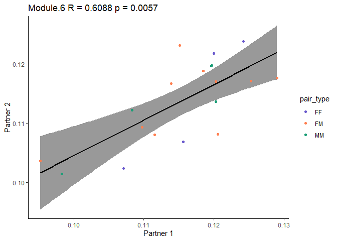<!-- --><!-- -->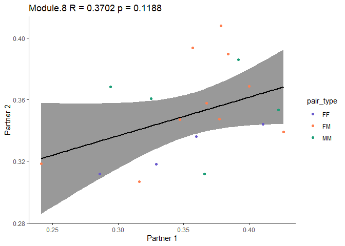<!-- --><!-- --><!-- -->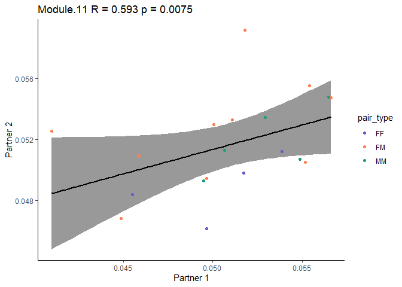<!-- --><!-- --><!-- --><!-- --><!-- --><!-- --><!-- --><!-- --><!-- --><!-- --><!-- -->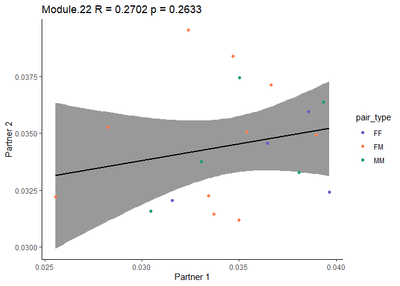<!-- --><!-- -->

``` r
plot_rank(all_dists_df)
```

<!-- --><!-- -->

``` r
all_plt <- grid.arrange(grobs = plt_list, nrow = 6)
```

<!-- -->

``` r
# setwd("output/")
# ggsave("all_module_dists.pdf", all_plt, width = 18, height = 18, units = "in")
```

euclidean distances between partners

``` r
fake_pairs <- get_fake_pairs(merged_data)

all_euclidean_dists <- data.frame()
for (mod in modules) {
  mod_euclidean_dists <- get_euclidean_dists(SCT_norm, mod_genes, metadata)
  all_euclidean_dists <- rbind(all_euclidean_dists, mod_euclidean_dists)
}
```

    ## [1] "Module.1"
    ## 
    ##  Wilcoxon rank sum test with continuity correction
    ## 
    ## data:  fake_df$dist and real_df$dist
    ## W = 8431, p-value = 0.02688
    ## alternative hypothesis: true location shift is not equal to 0
    ## 
    ## [1] "Module.2"
    ## 
    ##  Wilcoxon rank sum test with continuity correction
    ## 
    ## data:  fake_df$dist and real_df$dist
    ## W = 8394, p-value = 0.02995
    ## alternative hypothesis: true location shift is not equal to 0
    ## 
    ## [1] "Module.3"
    ## 
    ##  Wilcoxon rank sum test with continuity correction
    ## 
    ## data:  fake_df$dist and real_df$dist
    ## W = 7105, p-value = 0.4873
    ## alternative hypothesis: true location shift is not equal to 0
    ## 
    ## [1] "Module.4"
    ## 
    ##  Wilcoxon rank sum test with continuity correction
    ## 
    ## data:  fake_df$dist and real_df$dist
    ## W = 7082, p-value = 0.504
    ## alternative hypothesis: true location shift is not equal to 0
    ## 
    ## [1] "Module.5"
    ## 
    ##  Wilcoxon rank sum test with continuity correction
    ## 
    ## data:  fake_df$dist and real_df$dist
    ## W = 9374, p-value = 0.0009907
    ## alternative hypothesis: true location shift is not equal to 0
    ## 
    ## [1] "Module.6"
    ## 
    ##  Wilcoxon rank sum test with continuity correction
    ## 
    ## data:  fake_df$dist and real_df$dist
    ## W = 9781, p-value = 0.0001704
    ## alternative hypothesis: true location shift is not equal to 0
    ## 
    ## [1] "Module.7"
    ## 
    ##  Wilcoxon rank sum test with continuity correction
    ## 
    ## data:  fake_df$dist and real_df$dist
    ## W = 7777, p-value = 0.1431
    ## alternative hypothesis: true location shift is not equal to 0
    ## 
    ## [1] "Module.8"
    ## 
    ##  Wilcoxon rank sum test with continuity correction
    ## 
    ## data:  fake_df$dist and real_df$dist
    ## W = 9228, p-value = 0.001772
    ## alternative hypothesis: true location shift is not equal to 0
    ## 
    ## [1] "Module.9"
    ## 
    ##  Wilcoxon rank sum test with continuity correction
    ## 
    ## data:  fake_df$dist and real_df$dist
    ## W = 8118, p-value = 0.06363
    ## alternative hypothesis: true location shift is not equal to 0
    ## 
    ## [1] "Module.10"
    ## 
    ##  Wilcoxon rank sum test with continuity correction
    ## 
    ## data:  fake_df$dist and real_df$dist
    ## W = 7144, p-value = 0.4598
    ## alternative hypothesis: true location shift is not equal to 0
    ## 
    ## [1] "Module.11"
    ## 
    ##  Wilcoxon rank sum test with continuity correction
    ## 
    ## data:  fake_df$dist and real_df$dist
    ## W = 8803, p-value = 0.00831
    ## alternative hypothesis: true location shift is not equal to 0
    ## 
    ## [1] "Module.12"
    ## 
    ##  Wilcoxon rank sum test with continuity correction
    ## 
    ## data:  fake_df$dist and real_df$dist
    ## W = 7869, p-value = 0.1165
    ## alternative hypothesis: true location shift is not equal to 0
    ## 
    ## [1] "Module.13"
    ## 
    ##  Wilcoxon rank sum test with continuity correction
    ## 
    ## data:  fake_df$dist and real_df$dist
    ## W = 6904, p-value = 0.6424
    ## alternative hypothesis: true location shift is not equal to 0
    ## 
    ## [1] "Module.14"
    ## 
    ##  Wilcoxon rank sum test with continuity correction
    ## 
    ## data:  fake_df$dist and real_df$dist
    ## W = 6632, p-value = 0.8785
    ## alternative hypothesis: true location shift is not equal to 0
    ## 
    ## [1] "Module.15"
    ## 
    ##  Wilcoxon rank sum test with continuity correction
    ## 
    ## data:  fake_df$dist and real_df$dist
    ## W = 8005, p-value = 0.08447
    ## alternative hypothesis: true location shift is not equal to 0
    ## 
    ## [1] "Module.16"
    ## 
    ##  Wilcoxon rank sum test with continuity correction
    ## 
    ## data:  fake_df$dist and real_df$dist
    ## W = 7822, p-value = 0.1296
    ## alternative hypothesis: true location shift is not equal to 0
    ## 
    ## [1] "Module.17"
    ## 
    ##  Wilcoxon rank sum test with continuity correction
    ## 
    ## data:  fake_df$dist and real_df$dist
    ## W = 7427, p-value = 0.2876
    ## alternative hypothesis: true location shift is not equal to 0
    ## 
    ## [1] "Module.18"
    ## 
    ##  Wilcoxon rank sum test with continuity correction
    ## 
    ## data:  fake_df$dist and real_df$dist
    ## W = 9297, p-value = 0.001351
    ## alternative hypothesis: true location shift is not equal to 0
    ## 
    ## [1] "Module.19"
    ## 
    ##  Wilcoxon rank sum test with continuity correction
    ## 
    ## data:  fake_df$dist and real_df$dist
    ## W = 8083, p-value = 0.06958
    ## alternative hypothesis: true location shift is not equal to 0
    ## 
    ## [1] "Module.20"
    ## 
    ##  Wilcoxon rank sum test with continuity correction
    ## 
    ## data:  fake_df$dist and real_df$dist
    ## W = 8325, p-value = 0.03646
    ## alternative hypothesis: true location shift is not equal to 0
    ## 
    ## [1] "Module.21"
    ## 
    ##  Wilcoxon rank sum test with continuity correction
    ## 
    ## data:  fake_df$dist and real_df$dist
    ## W = 7511, p-value = 0.2462
    ## alternative hypothesis: true location shift is not equal to 0
    ## 
    ## [1] "Module.22"
    ## 
    ##  Wilcoxon rank sum test with continuity correction
    ## 
    ## data:  fake_df$dist and real_df$dist
    ## W = 7861, p-value = 0.1187
    ## alternative hypothesis: true location shift is not equal to 0
    ## 
    ## [1] "Module.23"
    ## 
    ##  Wilcoxon rank sum test with continuity correction
    ## 
    ## data:  fake_df$dist and real_df$dist
    ## W = 8580, p-value = 0.01713
    ## alternative hypothesis: true location shift is not equal to 0

plot euclidean distances

``` r
setwd("output/")

plt_list <- list()
for (mod in modules) {
  p <- plot_euclidean_dists(all_euclidean_dists, save = FALSE)
  plt_list[[mod]] <- p

}
```

<!-- --><!-- --><!-- --><!-- --><!-- --><!-- --><!-- --><!-- --><!-- --><!-- --><!-- --><!-- --><!-- --><!-- --><!-- --><!-- --><!-- --><!-- --><!-- --><!-- --><!-- --><!-- --><!-- -->

``` r
all_plt <- grid.arrange(grobs = plt_list, nrow = 6)
```

<!-- -->

``` r
# ggsave("all_module_euclidean_dists.pdf", all_plt, width = 18, height = 18, units = "in")
```

plot euclidean distances by pair type

``` r
plt_list <- list()
for (mod in modules) {
 p <- plot_euclidean_dists_pairtype(all_euclidean_dists)
 plt_list[[mod]] <- p
}
```

<!-- --><!-- --><!-- --><!-- --><!-- --><!-- --><!-- --><!-- --><!-- --><!-- --><!-- --><!-- --><!-- --><!-- --><!-- --><!-- --><!-- --><!-- --><!-- --><!-- --><!-- --><!-- --><!-- -->

``` r
all_plt <- grid.arrange(grobs = plt_list, nrow = 6)
```

<!-- -->

``` r
# setwd("output/")
# ggsave("all_module_euclidean_dists_by_pairtype.pdf", all_plt, width = 18, height = 18, units = "in")
```

summary stats from hotspot mods

``` r
summs <- mod_genes %>% group_by(Module) %>% summarise(n_genes = n())
```

GLM for module expression

``` r
all_contrasts <- data.frame(contrast = character(), 
                            estimate = numeric(), 
                            SE = numeric(), 
                            df = numeric(), 
                            t.ratio = numeric(), 
                            p.value = numeric(), 
                            Module = character())

for (mod in modules) {
  form <- formula(paste0(mod, "~sex*SS_OS"))
  fit <- glmmTMB(form, data = merged_data)
  print(summary(fit))
  
  ## if you want to simulate and plot residuals
  # simres <- simulateResiduals(fit)
  # plot(simres, title = mod)
  
  EMM <- emmeans(fit, ~ sex*SS_OS)
  coef <- contrast(EMM, "pairwise")[c(1, 2, 5, 6)]
  coef2 <- summary(coef, adjust = "fdr")
  print(coef2)
  mini.df <- coef2 %>% as.data.frame()
  mini.df$Module <- mod
  
  all_contrasts <- rbind(all_contrasts, mini.df)
  
}
```

    ##  Family: gaussian  ( identity )
    ## Formula:          Module.1 ~ sex * SS_OS
    ## Data: merged_data
    ## 
    ##      AIC      BIC   logLik deviance df.resid 
    ##   -212.4   -204.1    111.2   -222.4       34 
    ## 
    ## 
    ## Dispersion estimate for gaussian family (sigma^2): 0.000195 
    ## 
    ## Conditional model:
    ##               Estimate Std. Error z value Pr(>|z|)    
    ## (Intercept)   0.081446   0.004215  19.322  < 2e-16 ***
    ## sexM          0.001096   0.006108   0.179  0.85761    
    ## SS_OSSS       0.016741   0.006496   2.577  0.00996 ** 
    ## sexM:SS_OSSS -0.017098   0.009016  -1.896  0.05790 .  
    ## ---
    ## Signif. codes:  0 '***' 0.001 '**' 0.01 '*' 0.05 '.' 0.1 ' ' 1
    ##  contrast     estimate      SE df t.ratio p.value
    ##  F OS - M OS -0.001096 0.00611 34  -0.179  0.9548
    ##  F OS - F SS -0.016741 0.00650 34  -2.577  0.0427
    ##  M OS - M SS  0.000357 0.00625 34   0.057  0.9548
    ##  F SS - M SS  0.016002 0.00663 34   2.413  0.0427
    ## 
    ## P value adjustment: fdr method for 4 tests 
    ##  Family: gaussian  ( identity )
    ## Formula:          Module.2 ~ sex * SS_OS
    ## Data: merged_data
    ## 
    ##      AIC      BIC   logLik deviance df.resid 
    ##   -178.3   -170.0     94.2   -188.3       34 
    ## 
    ## 
    ## Dispersion estimate for gaussian family (sigma^2): 0.000468 
    ## 
    ## Conditional model:
    ##               Estimate Std. Error z value Pr(>|z|)    
    ## (Intercept)   0.201656   0.006522  30.918   <2e-16 ***
    ## sexM          0.007315   0.009452   0.774   0.4390    
    ## SS_OSSS       0.024026   0.010052   2.390   0.0168 *  
    ## sexM:SS_OSSS -0.025931   0.013951  -1.859   0.0631 .  
    ## ---
    ## Signif. codes:  0 '***' 0.001 '**' 0.01 '*' 0.05 '.' 0.1 ' ' 1
    ##  contrast    estimate      SE df t.ratio p.value
    ##  F OS - M OS -0.00731 0.00945 34  -0.774  0.5925
    ##  F OS - F SS -0.02403 0.01005 34  -2.390  0.0901
    ##  M OS - M SS  0.00190 0.00967 34   0.197  0.8451
    ##  F SS - M SS  0.01862 0.01026 34   1.814  0.1569
    ## 
    ## P value adjustment: fdr method for 4 tests 
    ##  Family: gaussian  ( identity )
    ## Formula:          Module.3 ~ sex * SS_OS
    ## Data: merged_data
    ## 
    ##      AIC      BIC   logLik deviance df.resid 
    ##   -146.7   -138.3     78.3   -156.7       34 
    ## 
    ## 
    ## Dispersion estimate for gaussian family (sigma^2): 0.00105 
    ## 
    ## Conditional model:
    ##               Estimate Std. Error z value Pr(>|z|)    
    ## (Intercept)   0.199427   0.009791  20.369   <2e-16 ***
    ## sexM          0.004114   0.014188   0.290   0.7718    
    ## SS_OSSS       0.028991   0.015088   1.921   0.0547 .  
    ## sexM:SS_OSSS -0.021616   0.020941  -1.032   0.3020    
    ## ---
    ## Signif. codes:  0 '***' 0.001 '**' 0.01 '*' 0.05 '.' 0.1 ' ' 1
    ##  contrast    estimate     SE df t.ratio p.value
    ##  F OS - M OS -0.00411 0.0142 34  -0.290  0.7736
    ##  F OS - F SS -0.02899 0.0151 34  -1.921  0.2524
    ##  M OS - M SS -0.00737 0.0145 34  -0.508  0.7736
    ##  F SS - M SS  0.01750 0.0154 34   1.136  0.5275
    ## 
    ## P value adjustment: fdr method for 4 tests 
    ##  Family: gaussian  ( identity )
    ## Formula:          Module.4 ~ sex * SS_OS
    ## Data: merged_data
    ## 
    ##      AIC      BIC   logLik deviance df.resid 
    ##   -379.6   -371.3    194.8   -389.6       34 
    ## 
    ## 
    ## Dispersion estimate for gaussian family (sigma^2): 2.68e-06 
    ## 
    ## Conditional model:
    ##                Estimate Std. Error z value Pr(>|z|)    
    ## (Intercept)   0.0079929  0.0004940  16.179   <2e-16 ***
    ## sexM         -0.0003581  0.0007159  -0.500   0.6169    
    ## SS_OSSS       0.0017628  0.0007613   2.315   0.0206 *  
    ## sexM:SS_OSSS -0.0013690  0.0010567  -1.296   0.1951    
    ## ---
    ## Signif. codes:  0 '***' 0.001 '**' 0.01 '*' 0.05 '.' 0.1 ' ' 1
    ##  contrast     estimate       SE df t.ratio p.value
    ##  F OS - M OS  0.000358 0.000716 34   0.500  0.6201
    ##  F OS - F SS -0.001763 0.000761 34  -2.315  0.0661
    ##  M OS - M SS -0.000394 0.000733 34  -0.537  0.6201
    ##  F SS - M SS  0.001727 0.000777 34   2.222  0.0661
    ## 
    ## P value adjustment: fdr method for 4 tests 
    ##  Family: gaussian  ( identity )
    ## Formula:          Module.5 ~ sex * SS_OS
    ## Data: merged_data
    ## 
    ##      AIC      BIC   logLik deviance df.resid 
    ##   -340.0   -331.7    175.0   -350.0       34 
    ## 
    ## 
    ## Dispersion estimate for gaussian family (sigma^2): 7.41e-06 
    ## 
    ## Conditional model:
    ##                Estimate Std. Error z value Pr(>|z|)    
    ## (Intercept)   1.682e-02  8.206e-04  20.496  < 2e-16 ***
    ## sexM         -1.147e-05  1.189e-03  -0.010  0.99231    
    ## SS_OSSS       3.384e-03  1.265e-03   2.676  0.00745 ** 
    ## sexM:SS_OSSS -3.551e-03  1.755e-03  -2.023  0.04303 *  
    ## ---
    ## Signif. codes:  0 '***' 0.001 '**' 0.01 '*' 0.05 '.' 0.1 ' ' 1
    ##  contrast     estimate      SE df t.ratio p.value
    ##  F OS - M OS  1.15e-05 0.00119 34   0.010  0.9924
    ##  F OS - F SS -3.38e-03 0.00126 34  -2.676  0.0227
    ##  M OS - M SS  1.67e-04 0.00122 34   0.137  0.9924
    ##  F SS - M SS  3.56e-03 0.00129 34   2.760  0.0227
    ## 
    ## P value adjustment: fdr method for 4 tests 
    ##  Family: gaussian  ( identity )
    ## Formula:          Module.6 ~ sex * SS_OS
    ## Data: merged_data
    ## 
    ##      AIC      BIC   logLik deviance df.resid 
    ##   -192.3   -184.0    101.2   -202.3       34 
    ## 
    ## 
    ## Dispersion estimate for gaussian family (sigma^2): 0.000327 
    ## 
    ## Conditional model:
    ##               Estimate Std. Error z value Pr(>|z|)    
    ## (Intercept)   0.210367   0.005451   38.60   <2e-16 ***
    ## sexM         -0.001195   0.007899   -0.15    0.880    
    ## SS_OSSS       0.001385   0.008400    0.16    0.869    
    ## sexM:SS_OSSS -0.001251   0.011658   -0.11    0.915    
    ## ---
    ## Signif. codes:  0 '***' 0.001 '**' 0.01 '*' 0.05 '.' 0.1 ' ' 1
    ##  contrast     estimate      SE df t.ratio p.value
    ##  F OS - M OS  0.001195 0.00790 34   0.151  0.9869
    ##  F OS - F SS -0.001385 0.00840 34  -0.165  0.9869
    ##  M OS - M SS -0.000134 0.00808 34  -0.017  0.9869
    ##  F SS - M SS  0.002446 0.00857 34   0.285  0.9869
    ## 
    ## P value adjustment: fdr method for 4 tests 
    ##  Family: gaussian  ( identity )
    ## Formula:          Module.7 ~ sex * SS_OS
    ## Data: merged_data
    ## 
    ##      AIC      BIC   logLik deviance df.resid 
    ##   -104.0    -95.7     57.0   -114.0       34 
    ## 
    ## 
    ## Dispersion estimate for gaussian family (sigma^2): 0.00315 
    ## 
    ## Conditional model:
    ##              Estimate Std. Error z value Pr(>|z|)    
    ## (Intercept)   0.51624    0.01692  30.512   <2e-16 ***
    ## sexM         -0.01077    0.02452  -0.439   0.6604    
    ## SS_OSSS      -0.06267    0.02607  -2.404   0.0162 *  
    ## sexM:SS_OSSS  0.05220    0.03619   1.442   0.1492    
    ## ---
    ## Signif. codes:  0 '***' 0.001 '**' 0.01 '*' 0.05 '.' 0.1 ' ' 1
    ##  contrast    estimate     SE df t.ratio p.value
    ##  F OS - M OS   0.0108 0.0245 34   0.439  0.6790
    ##  F OS - F SS   0.0627 0.0261 34   2.404  0.0873
    ##  M OS - M SS   0.0105 0.0251 34   0.417  0.6790
    ##  F SS - M SS  -0.0414 0.0266 34  -1.556  0.2578
    ## 
    ## P value adjustment: fdr method for 4 tests 
    ##  Family: gaussian  ( identity )
    ## Formula:          Module.8 ~ sex * SS_OS
    ## Data: merged_data
    ## 
    ##      AIC      BIC   logLik deviance df.resid 
    ##    -73.1    -64.8     41.6    -83.1       34 
    ## 
    ## 
    ## Dispersion estimate for gaussian family (sigma^2): 0.00695 
    ## 
    ## Conditional model:
    ##              Estimate Std. Error z value Pr(>|z|)    
    ## (Intercept)   0.66845    0.02513  26.600   <2e-16 ***
    ## sexM          0.01100    0.03642   0.302    0.763    
    ## SS_OSSS      -0.02740    0.03873  -0.707    0.479    
    ## sexM:SS_OSSS  0.03223    0.05375   0.600    0.549    
    ## ---
    ## Signif. codes:  0 '***' 0.001 '**' 0.01 '*' 0.05 '.' 0.1 ' ' 1
    ##  contrast    estimate     SE df t.ratio p.value
    ##  F OS - M OS -0.01100 0.0364 34  -0.302  0.8976
    ##  F OS - F SS  0.02740 0.0387 34   0.707  0.8976
    ##  M OS - M SS -0.00483 0.0373 34  -0.130  0.8976
    ##  F SS - M SS -0.04323 0.0395 34  -1.093  0.8976
    ## 
    ## P value adjustment: fdr method for 4 tests 
    ##  Family: gaussian  ( identity )
    ## Formula:          Module.9 ~ sex * SS_OS
    ## Data: merged_data
    ## 
    ##      AIC      BIC   logLik deviance df.resid 
    ##    -86.3    -78.0     48.1    -96.3       34 
    ## 
    ## 
    ## Dispersion estimate for gaussian family (sigma^2): 0.00496 
    ## 
    ## Conditional model:
    ##               Estimate Std. Error z value Pr(>|z|)    
    ## (Intercept)   0.528418   0.021230  24.890   <2e-16 ***
    ## sexM         -0.028824   0.030765  -0.937    0.349    
    ## SS_OSSS      -0.003484   0.032718  -0.106    0.915    
    ## sexM:SS_OSSS  0.013404   0.045410   0.295    0.768    
    ## ---
    ## Signif. codes:  0 '***' 0.001 '**' 0.01 '*' 0.05 '.' 0.1 ' ' 1
    ##  contrast    estimate     SE df t.ratio p.value
    ##  F OS - M OS  0.02882 0.0308 34   0.937  0.9158
    ##  F OS - F SS  0.00348 0.0327 34   0.106  0.9158
    ##  M OS - M SS -0.00992 0.0315 34  -0.315  0.9158
    ##  F SS - M SS  0.01542 0.0334 34   0.462  0.9158
    ## 
    ## P value adjustment: fdr method for 4 tests 
    ##  Family: gaussian  ( identity )
    ## Formula:          Module.10 ~ sex * SS_OS
    ## Data: merged_data
    ## 
    ##      AIC      BIC   logLik deviance df.resid 
    ##   -322.4   -314.1    166.2   -332.4       34 
    ## 
    ## 
    ## Dispersion estimate for gaussian family (sigma^2): 1.16e-05 
    ## 
    ## Conditional model:
    ##                Estimate Std. Error z value Pr(>|z|)    
    ## (Intercept)   0.0309376  0.0010286  30.078   <2e-16 ***
    ## sexM          0.0001205  0.0014906   0.081   0.9356    
    ## SS_OSSS       0.0030920  0.0015852   1.951   0.0511 .  
    ## sexM:SS_OSSS -0.0031705  0.0022001  -1.441   0.1496    
    ## ---
    ## Signif. codes:  0 '***' 0.001 '**' 0.01 '*' 0.05 '.' 0.1 ' ' 1
    ##  contrast     estimate      SE df t.ratio p.value
    ##  F OS - M OS -1.21e-04 0.00149 34  -0.081  0.9593
    ##  F OS - F SS -3.09e-03 0.00159 34  -1.951  0.1360
    ##  M OS - M SS  7.85e-05 0.00153 34   0.051  0.9593
    ##  F SS - M SS  3.05e-03 0.00162 34   1.885  0.1360
    ## 
    ## P value adjustment: fdr method for 4 tests 
    ##  Family: gaussian  ( identity )
    ## Formula:          Module.11 ~ sex * SS_OS
    ## Data: merged_data
    ## 
    ##      AIC      BIC   logLik deviance df.resid 
    ##   -280.0   -271.7    145.0   -290.0       34 
    ## 
    ## 
    ## Dispersion estimate for gaussian family (sigma^2): 3.45e-05 
    ## 
    ## Conditional model:
    ##                Estimate Std. Error z value Pr(>|z|)    
    ## (Intercept)   0.0808045  0.0017717   45.61   <2e-16 ***
    ## sexM          0.0040286  0.0025674    1.57    0.117    
    ## SS_OSSS      -0.0007552  0.0027304   -0.28    0.782    
    ## sexM:SS_OSSS  0.0008420  0.0037895    0.22    0.824    
    ## ---
    ## Signif. codes:  0 '***' 0.001 '**' 0.01 '*' 0.05 '.' 0.1 ' ' 1
    ##  contrast     estimate      SE df t.ratio p.value
    ##  F OS - M OS -4.03e-03 0.00257 34  -1.569  0.2518
    ##  F OS - F SS  7.55e-04 0.00273 34   0.277  0.9738
    ##  M OS - M SS -8.69e-05 0.00263 34  -0.033  0.9738
    ##  F SS - M SS -4.87e-03 0.00279 34  -1.747  0.2518
    ## 
    ## P value adjustment: fdr method for 4 tests 
    ##  Family: gaussian  ( identity )
    ## Formula:          Module.12 ~ sex * SS_OS
    ## Data: merged_data
    ## 
    ##      AIC      BIC   logLik deviance df.resid 
    ##   -202.1   -193.8    106.1   -212.1       34 
    ## 
    ## 
    ## Dispersion estimate for gaussian family (sigma^2): 0.000254 
    ## 
    ## Conditional model:
    ##               Estimate Std. Error z value Pr(>|z|)    
    ## (Intercept)   0.125659   0.004809  26.130   <2e-16 ***
    ## sexM         -0.001832   0.006969  -0.263   0.7927    
    ## SS_OSSS       0.018371   0.007411   2.479   0.0132 *  
    ## sexM:SS_OSSS -0.019426   0.010286  -1.889   0.0589 .  
    ## ---
    ## Signif. codes:  0 '***' 0.001 '**' 0.01 '*' 0.05 '.' 0.1 ' ' 1
    ##  contrast    estimate      SE df t.ratio p.value
    ##  F OS - M OS  0.00183 0.00697 34   0.263  0.8833
    ##  F OS - F SS -0.01837 0.00741 34  -2.479  0.0366
    ##  M OS - M SS  0.00106 0.00713 34   0.148  0.8833
    ##  F SS - M SS  0.02126 0.00757 34   2.810  0.0326
    ## 
    ## P value adjustment: fdr method for 4 tests 
    ##  Family: gaussian  ( identity )
    ## Formula:          Module.13 ~ sex * SS_OS
    ## Data: merged_data
    ## 
    ##      AIC      BIC   logLik deviance df.resid 
    ##   -323.5   -315.2    166.8   -333.5       34 
    ## 
    ## 
    ## Dispersion estimate for gaussian family (sigma^2): 1.13e-05 
    ## 
    ## Conditional model:
    ##                Estimate Std. Error z value Pr(>|z|)    
    ## (Intercept)   0.0337061  0.0010142   33.24   <2e-16 ***
    ## sexM          0.0016985  0.0014697    1.16    0.248    
    ## SS_OSSS       0.0005127  0.0015629    0.33    0.743    
    ## sexM:SS_OSSS -0.0011537  0.0021692   -0.53    0.595    
    ## ---
    ## Signif. codes:  0 '***' 0.001 '**' 0.01 '*' 0.05 '.' 0.1 ' ' 1
    ##  contrast     estimate      SE df t.ratio p.value
    ##  F OS - M OS -0.001698 0.00147 34  -1.156  0.7449
    ##  F OS - F SS -0.000513 0.00156 34  -0.328  0.7449
    ##  M OS - M SS  0.000641 0.00150 34   0.426  0.7449
    ##  F SS - M SS -0.000545 0.00160 34  -0.341  0.7449
    ## 
    ## P value adjustment: fdr method for 4 tests 
    ##  Family: gaussian  ( identity )
    ## Formula:          Module.14 ~ sex * SS_OS
    ## Data: merged_data
    ## 
    ##      AIC      BIC   logLik deviance df.resid 
    ##   -151.8   -143.5     80.9   -161.8       34 
    ## 
    ## 
    ## Dispersion estimate for gaussian family (sigma^2): 0.000923 
    ## 
    ## Conditional model:
    ##               Estimate Std. Error z value Pr(>|z|)    
    ## (Intercept)   0.299414   0.009161   32.68   <2e-16 ***
    ## sexM         -0.010365   0.013275   -0.78   0.4349    
    ## SS_OSSS      -0.036045   0.014118   -2.55   0.0107 *  
    ## sexM:SS_OSSS  0.031140   0.019594    1.59   0.1120    
    ## ---
    ## Signif. codes:  0 '***' 0.001 '**' 0.01 '*' 0.05 '.' 0.1 ' ' 1
    ##  contrast    estimate     SE df t.ratio p.value
    ##  F OS - M OS  0.01037 0.0133 34   0.781  0.5871
    ##  F OS - F SS  0.03605 0.0141 34   2.553  0.0613
    ##  M OS - M SS  0.00491 0.0136 34   0.361  0.7203
    ##  F SS - M SS -0.02077 0.0144 34  -1.442  0.3172
    ## 
    ## P value adjustment: fdr method for 4 tests 
    ##  Family: gaussian  ( identity )
    ## Formula:          Module.15 ~ sex * SS_OS
    ## Data: merged_data
    ## 
    ##      AIC      BIC   logLik deviance df.resid 
    ##    -73.9    -65.6     41.9    -83.9       34 
    ## 
    ## 
    ## Dispersion estimate for gaussian family (sigma^2): 0.00682 
    ## 
    ## Conditional model:
    ##              Estimate Std. Error z value Pr(>|z|)    
    ## (Intercept)   0.55098    0.02489  22.134   <2e-16 ***
    ## sexM         -0.01266    0.03607  -0.351    0.726    
    ## SS_OSSS       0.05749    0.03836   1.499    0.134    
    ## sexM:SS_OSSS -0.03723    0.05324  -0.699    0.484    
    ## ---
    ## Signif. codes:  0 '***' 0.001 '**' 0.01 '*' 0.05 '.' 0.1 ' ' 1
    ##  contrast    estimate     SE df t.ratio p.value
    ##  F OS - M OS   0.0127 0.0361 34   0.351  0.7277
    ##  F OS - F SS  -0.0575 0.0384 34  -1.499  0.4226
    ##  M OS - M SS  -0.0203 0.0369 34  -0.549  0.7277
    ##  F SS - M SS   0.0499 0.0392 34   1.274  0.4226
    ## 
    ## P value adjustment: fdr method for 4 tests 
    ##  Family: gaussian  ( identity )
    ## Formula:          Module.16 ~ sex * SS_OS
    ## Data: merged_data
    ## 
    ##      AIC      BIC   logLik deviance df.resid 
    ##   -273.5   -265.2    141.8   -283.5       34 
    ## 
    ## 
    ## Dispersion estimate for gaussian family (sigma^2): 4.07e-05 
    ## 
    ## Conditional model:
    ##                Estimate Std. Error z value Pr(>|z|)    
    ## (Intercept)   0.0955266  0.0019246   49.64   <2e-16 ***
    ## sexM         -0.0001027  0.0027890   -0.04    0.971    
    ## SS_OSSS      -0.0005040  0.0029659   -0.17    0.865    
    ## sexM:SS_OSSS -0.0006222  0.0041165   -0.15    0.880    
    ## ---
    ## Signif. codes:  0 '***' 0.001 '**' 0.01 '*' 0.05 '.' 0.1 ' ' 1
    ##  contrast    estimate      SE df t.ratio p.value
    ##  F OS - M OS 0.000103 0.00279 34   0.037  0.9709
    ##  F OS - F SS 0.000504 0.00297 34   0.170  0.9709
    ##  M OS - M SS 0.001126 0.00285 34   0.395  0.9709
    ##  F SS - M SS 0.000725 0.00303 34   0.239  0.9709
    ## 
    ## P value adjustment: fdr method for 4 tests 
    ##  Family: gaussian  ( identity )
    ## Formula:          Module.17 ~ sex * SS_OS
    ## Data: merged_data
    ## 
    ##      AIC      BIC   logLik deviance df.resid 
    ##   -255.2   -246.9    132.6   -265.2       34 
    ## 
    ## 
    ## Dispersion estimate for gaussian family (sigma^2): 6.52e-05 
    ## 
    ## Conditional model:
    ##               Estimate Std. Error z value Pr(>|z|)    
    ## (Intercept)   0.103474   0.002434   42.51   <2e-16 ***
    ## sexM          0.004780   0.003528    1.36   0.1754    
    ## SS_OSSS       0.007772   0.003751    2.07   0.0383 *  
    ## sexM:SS_OSSS -0.006706   0.005207   -1.29   0.1978    
    ## ---
    ## Signif. codes:  0 '***' 0.001 '**' 0.01 '*' 0.05 '.' 0.1 ' ' 1
    ##  contrast    estimate      SE df t.ratio p.value
    ##  F OS - M OS -0.00478 0.00353 34  -1.355  0.3686
    ##  F OS - F SS -0.00777 0.00375 34  -2.072  0.1838
    ##  M OS - M SS -0.00107 0.00361 34  -0.295  0.7696
    ##  F SS - M SS  0.00193 0.00383 34   0.503  0.7696
    ## 
    ## P value adjustment: fdr method for 4 tests 
    ##  Family: gaussian  ( identity )
    ## Formula:          Module.18 ~ sex * SS_OS
    ## Data: merged_data
    ## 
    ##      AIC      BIC   logLik deviance df.resid 
    ##   -241.2   -232.9    125.6   -251.2       34 
    ## 
    ## 
    ## Dispersion estimate for gaussian family (sigma^2): 9.33e-05 
    ## 
    ## Conditional model:
    ##               Estimate Std. Error z value Pr(>|z|)    
    ## (Intercept)   0.143252   0.002913   49.18   <2e-16 ***
    ## sexM         -0.001055   0.004221   -0.25    0.803    
    ## SS_OSSS       0.007081   0.004489    1.58    0.115    
    ## sexM:SS_OSSS -0.007296   0.006231   -1.17    0.242    
    ## ---
    ## Signif. codes:  0 '***' 0.001 '**' 0.01 '*' 0.05 '.' 0.1 ' ' 1
    ##  contrast     estimate      SE df t.ratio p.value
    ##  F OS - M OS  0.001055 0.00422 34   0.250  0.9606
    ##  F OS - F SS -0.007081 0.00449 34  -1.577  0.2480
    ##  M OS - M SS  0.000215 0.00432 34   0.050  0.9606
    ##  F SS - M SS  0.008350 0.00458 34   1.822  0.2480
    ## 
    ## P value adjustment: fdr method for 4 tests 
    ##  Family: gaussian  ( identity )
    ## Formula:          Module.19 ~ sex * SS_OS
    ## Data: merged_data
    ## 
    ##      AIC      BIC   logLik deviance df.resid 
    ##   -241.4   -233.1    125.7   -251.4       34 
    ## 
    ## 
    ## Dispersion estimate for gaussian family (sigma^2): 9.29e-05 
    ## 
    ## Conditional model:
    ##               Estimate Std. Error z value Pr(>|z|)    
    ## (Intercept)   0.149485   0.002906   51.44   <2e-16 ***
    ## sexM          0.003426   0.004211    0.81   0.4159    
    ## SS_OSSS       0.008757   0.004478    1.96   0.0505 .  
    ## sexM:SS_OSSS -0.011757   0.006215   -1.89   0.0585 .  
    ## ---
    ## Signif. codes:  0 '***' 0.001 '**' 0.01 '*' 0.05 '.' 0.1 ' ' 1
    ##  contrast    estimate      SE df t.ratio p.value
    ##  F OS - M OS -0.00343 0.00421 34  -0.814  0.4911
    ##  F OS - F SS -0.00876 0.00448 34  -1.955  0.1544
    ##  M OS - M SS  0.00300 0.00431 34   0.696  0.4911
    ##  F SS - M SS  0.00833 0.00457 34   1.822  0.1544
    ## 
    ## P value adjustment: fdr method for 4 tests 
    ##  Family: gaussian  ( identity )
    ## Formula:          Module.20 ~ sex * SS_OS
    ## Data: merged_data
    ## 
    ##      AIC      BIC   logLik deviance df.resid 
    ##    -86.4    -78.1     48.2    -96.4       34 
    ## 
    ## 
    ## Dispersion estimate for gaussian family (sigma^2): 0.00494 
    ## 
    ## Conditional model:
    ##               Estimate Std. Error z value Pr(>|z|)    
    ## (Intercept)   0.770599   0.021200   36.35   <2e-16 ***
    ## sexM          0.017296   0.030722    0.56    0.573    
    ## SS_OSSS      -0.025509   0.032672   -0.78    0.435    
    ## sexM:SS_OSSS  0.004902   0.045346    0.11    0.914    
    ## ---
    ## Signif. codes:  0 '***' 0.001 '**' 0.01 '*' 0.05 '.' 0.1 ' ' 1
    ##  contrast    estimate     SE df t.ratio p.value
    ##  F OS - M OS  -0.0173 0.0307 34  -0.563  0.5771
    ##  F OS - F SS   0.0255 0.0327 34   0.781  0.5771
    ##  M OS - M SS   0.0206 0.0314 34   0.655  0.5771
    ##  F SS - M SS  -0.0222 0.0334 34  -0.666  0.5771
    ## 
    ## P value adjustment: fdr method for 4 tests 
    ##  Family: gaussian  ( identity )
    ## Formula:          Module.21 ~ sex * SS_OS
    ## Data: merged_data
    ## 
    ##      AIC      BIC   logLik deviance df.resid 
    ##   -226.8   -218.5    118.4   -236.8       34 
    ## 
    ## 
    ## Dispersion estimate for gaussian family (sigma^2): 0.000135 
    ## 
    ## Conditional model:
    ##               Estimate Std. Error z value Pr(>|z|)    
    ## (Intercept)   0.122067   0.003505   34.82   <2e-16 ***
    ## sexM          0.004925   0.005080    0.97    0.332    
    ## SS_OSSS      -0.001685   0.005402   -0.31    0.755    
    ## sexM:SS_OSSS -0.003741   0.007498   -0.50    0.618    
    ## ---
    ## Signif. codes:  0 '***' 0.001 '**' 0.01 '*' 0.05 '.' 0.1 ' ' 1
    ##  contrast    estimate      SE df t.ratio p.value
    ##  F OS - M OS -0.00493 0.00508 34  -0.970  0.6782
    ##  F OS - F SS  0.00169 0.00540 34   0.312  0.8313
    ##  M OS - M SS  0.00543 0.00520 34   1.044  0.6782
    ##  F SS - M SS -0.00118 0.00551 34  -0.215  0.8313
    ## 
    ## P value adjustment: fdr method for 4 tests 
    ##  Family: gaussian  ( identity )
    ## Formula:          Module.22 ~ sex * SS_OS
    ## Data: merged_data
    ## 
    ##      AIC      BIC   logLik deviance df.resid 
    ##   -220.1   -211.8    115.0   -230.1       34 
    ## 
    ## 
    ## Dispersion estimate for gaussian family (sigma^2): 0.000161 
    ## 
    ## Conditional model:
    ##               Estimate Std. Error z value Pr(>|z|)    
    ## (Intercept)   0.075804   0.003820  19.844   <2e-16 ***
    ## sexM          0.003143   0.005536   0.568    0.570    
    ## SS_OSSS       0.006121   0.005887   1.040    0.298    
    ## sexM:SS_OSSS -0.002577   0.008171  -0.315    0.752    
    ## ---
    ## Signif. codes:  0 '***' 0.001 '**' 0.01 '*' 0.05 '.' 0.1 ' ' 1
    ##  contrast     estimate      SE df t.ratio p.value
    ##  F OS - M OS -0.003143 0.00554 34  -0.568  0.7653
    ##  F OS - F SS -0.006121 0.00589 34  -1.040  0.7653
    ##  M OS - M SS -0.003545 0.00567 34  -0.626  0.7653
    ##  F SS - M SS -0.000566 0.00601 34  -0.094  0.9255
    ## 
    ## P value adjustment: fdr method for 4 tests 
    ##  Family: gaussian  ( identity )
    ## Formula:          Module.23 ~ sex * SS_OS
    ## Data: merged_data
    ## 
    ##      AIC      BIC   logLik deviance df.resid 
    ##   -173.2   -164.9     91.6   -183.2       34 
    ## 
    ## 
    ## Dispersion estimate for gaussian family (sigma^2): 0.000534 
    ## 
    ## Conditional model:
    ##               Estimate Std. Error z value Pr(>|z|)    
    ## (Intercept)   0.307117   0.006965   44.09   <2e-16 ***
    ## sexM         -0.003635   0.010094   -0.36   0.7188    
    ## SS_OSSS      -0.025983   0.010734   -2.42   0.0155 *  
    ## sexM:SS_OSSS  0.019165   0.014898    1.29   0.1983    
    ## ---
    ## Signif. codes:  0 '***' 0.001 '**' 0.01 '*' 0.05 '.' 0.1 ' ' 1
    ##  contrast    estimate     SE df t.ratio p.value
    ##  F OS - M OS  0.00363 0.0101 34   0.360  0.7210
    ##  F OS - F SS  0.02598 0.0107 34   2.421  0.0840
    ##  M OS - M SS  0.00682 0.0103 34   0.660  0.6850
    ##  F SS - M SS -0.01553 0.0110 34  -1.417  0.3310
    ## 
    ## P value adjustment: fdr method for 4 tests

``` r
# setwd("output/")
# write.csv(all_contrasts, "all_glm_posthocs_module_expr.csv")
```

stats for rank distances between groups

``` r
all_contrasts_dists <- data.frame(contrast = character(), 
                            estimate = numeric(), 
                            SE = numeric(), 
                            df = numeric(), 
                            t.ratio = numeric(), 
                            p.value = numeric(), 
                            Module = character())

for (mod in modules) {
  mod_df <- all_dists_df %>% filter(Module == mod)
  fit <- glmmTMB(dist~type, data = mod_df)
  print(summary(fit))
  
  # simres <- simulateResiduals(fit)
  # plot(simres, title = mod)

  EMM <- emmeans(fit, ~ type)
  coef <- contrast(EMM, "pairwise")
  coef2 <- summary(coef, adjust = "fdr") #[["sex*SSOS"]])
  print(coef2)
  mini.df <- coef2 %>% as.data.frame()
  mini.df$Module <- mod
  
  all_contrasts_dists <- rbind(all_contrasts_dists, mini.df)
  
}
```

    ##  Family: gaussian  ( identity )
    ## Formula:          dist ~ type
    ## Data: mod_df
    ## 
    ##      AIC      BIC   logLik deviance df.resid 
    ##    146.2    150.0    -69.1    138.2       15 
    ## 
    ## 
    ## Dispersion estimate for gaussian family (sigma^2): 84.4 
    ## 
    ## Conditional model:
    ##             Estimate Std. Error z value Pr(>|z|)   
    ## (Intercept)   13.000      4.595   2.829  0.00466 **
    ## typeFM_real   -1.200      5.436  -0.221  0.82530   
    ## typeMM_real   -4.200      6.164  -0.681  0.49566   
    ## ---
    ## Signif. codes:  0 '***' 0.001 '**' 0.01 '*' 0.05 '.' 0.1 ' ' 1
    ##  contrast          estimate   SE df t.ratio p.value
    ##  FF_real - FM_real      1.2 5.44 15   0.221  0.8283
    ##  FF_real - MM_real      4.2 6.16 15   0.681  0.8283
    ##  FM_real - MM_real      3.0 5.03 15   0.596  0.8283
    ## 
    ## P value adjustment: fdr method for 3 tests 
    ##  Family: gaussian  ( identity )
    ## Formula:          dist ~ type
    ## Data: mod_df
    ## 
    ##      AIC      BIC   logLik deviance df.resid 
    ##    141.9    145.7    -67.0    133.9       15 
    ## 
    ## 
    ## Dispersion estimate for gaussian family (sigma^2): 67.5 
    ## 
    ## Conditional model:
    ##             Estimate Std. Error z value Pr(>|z|)  
    ## (Intercept)    9.750      4.106   2.374   0.0176 *
    ## typeFM_real    1.450      4.859   0.298   0.7654  
    ## typeMM_real    2.850      5.509   0.517   0.6049  
    ## ---
    ## Signif. codes:  0 '***' 0.001 '**' 0.01 '*' 0.05 '.' 0.1 ' ' 1
    ##  contrast          estimate   SE df t.ratio p.value
    ##  FF_real - FM_real    -1.45 4.86 15  -0.298  0.7695
    ##  FF_real - MM_real    -2.85 5.51 15  -0.517  0.7695
    ##  FM_real - MM_real    -1.40 4.50 15  -0.311  0.7695
    ## 
    ## P value adjustment: fdr method for 3 tests 
    ##  Family: gaussian  ( identity )
    ## Formula:          dist ~ type
    ## Data: mod_df
    ## 
    ##      AIC      BIC   logLik deviance df.resid 
    ##    137.5    141.3    -64.7    129.5       15 
    ## 
    ## 
    ## Dispersion estimate for gaussian family (sigma^2): 53.4 
    ## 
    ## Conditional model:
    ##             Estimate Std. Error z value Pr(>|z|)    
    ## (Intercept)   16.000      3.653   4.380 1.18e-05 ***
    ## typeFM_real   -4.000      4.322  -0.926    0.355    
    ## typeMM_real   -6.000      4.901  -1.224    0.221    
    ## ---
    ## Signif. codes:  0 '***' 0.001 '**' 0.01 '*' 0.05 '.' 0.1 ' ' 1
    ##  contrast          estimate   SE df t.ratio p.value
    ##  FF_real - FM_real        4 4.32 15   0.926  0.5540
    ##  FF_real - MM_real        6 4.90 15   1.224  0.5540
    ##  FM_real - MM_real        2 4.00 15   0.500  0.6244
    ## 
    ## P value adjustment: fdr method for 3 tests 
    ##  Family: gaussian  ( identity )
    ## Formula:          dist ~ type
    ## Data: mod_df
    ## 
    ##      AIC      BIC   logLik deviance df.resid 
    ##    139.6    143.4    -65.8    131.6       15 
    ## 
    ## 
    ## Dispersion estimate for gaussian family (sigma^2): 59.8 
    ## 
    ## Conditional model:
    ##             Estimate Std. Error z value Pr(>|z|)   
    ## (Intercept)   12.250      3.865   3.169  0.00153 **
    ## typeFM_real    1.950      4.574   0.426  0.66985   
    ## typeMM_real    4.150      5.186   0.800  0.42358   
    ## ---
    ## Signif. codes:  0 '***' 0.001 '**' 0.01 '*' 0.05 '.' 0.1 ' ' 1
    ##  contrast          estimate   SE df t.ratio p.value
    ##  FF_real - FM_real    -1.95 4.57 15  -0.426  0.6759
    ##  FF_real - MM_real    -4.15 5.19 15  -0.800  0.6759
    ##  FM_real - MM_real    -2.20 4.23 15  -0.520  0.6759
    ## 
    ## P value adjustment: fdr method for 3 tests 
    ##  Family: gaussian  ( identity )
    ## Formula:          dist ~ type
    ## Data: mod_df
    ## 
    ##      AIC      BIC   logLik deviance df.resid 
    ##    138.3    142.1    -65.1    130.3       15 
    ## 
    ## 
    ## Dispersion estimate for gaussian family (sigma^2): 55.7 
    ## 
    ## Conditional model:
    ##             Estimate Std. Error z value Pr(>|z|)    
    ## (Intercept)   12.500      3.731   3.350 0.000807 ***
    ## typeFM_real    2.600      4.415   0.589 0.555883    
    ## typeMM_real    0.500      5.006   0.100 0.920436    
    ## ---
    ## Signif. codes:  0 '***' 0.001 '**' 0.01 '*' 0.05 '.' 0.1 ' ' 1
    ##  contrast          estimate   SE df t.ratio p.value
    ##  FF_real - FM_real     -2.6 4.41 15  -0.589  0.9218
    ##  FF_real - MM_real     -0.5 5.01 15  -0.100  0.9218
    ##  FM_real - MM_real      2.1 4.09 15   0.514  0.9218
    ## 
    ## P value adjustment: fdr method for 3 tests 
    ##  Family: gaussian  ( identity )
    ## Formula:          dist ~ type
    ## Data: mod_df
    ## 
    ##      AIC      BIC   logLik deviance df.resid 
    ##    124.7    128.5    -58.3    116.7       15 
    ## 
    ## 
    ## Dispersion estimate for gaussian family (sigma^2): 27.2 
    ## 
    ## Conditional model:
    ##             Estimate Std. Error z value Pr(>|z|)  
    ## (Intercept)    5.250      2.609   2.013   0.0442 *
    ## typeFM_real    3.350      3.086   1.085   0.2778  
    ## typeMM_real   -2.250      3.500  -0.643   0.5203  
    ## ---
    ## Signif. codes:  0 '***' 0.001 '**' 0.01 '*' 0.05 '.' 0.1 ' ' 1
    ##  contrast          estimate   SE df t.ratio p.value
    ##  FF_real - FM_real    -3.35 3.09 15  -1.085  0.4423
    ##  FF_real - MM_real     2.25 3.50 15   0.643  0.5300
    ##  FM_real - MM_real     5.60 2.86 15   1.960  0.2066
    ## 
    ## P value adjustment: fdr method for 3 tests 
    ##  Family: gaussian  ( identity )
    ## Formula:          dist ~ type
    ## Data: mod_df
    ## 
    ##      AIC      BIC   logLik deviance df.resid 
    ##    139.3    143.1    -65.6    131.3       15 
    ## 
    ## 
    ## Dispersion estimate for gaussian family (sigma^2): 58.6 
    ## 
    ## Conditional model:
    ##             Estimate Std. Error z value Pr(>|z|)    
    ## (Intercept)   13.250      3.829   3.461 0.000538 ***
    ## typeFM_real   -2.650      4.530  -0.585 0.558548    
    ## typeMM_real    0.950      5.136   0.185 0.853268    
    ## ---
    ## Signif. codes:  0 '***' 0.001 '**' 0.01 '*' 0.05 '.' 0.1 ' ' 1
    ##  contrast          estimate   SE df t.ratio p.value
    ##  FF_real - FM_real     2.65 4.53 15   0.585  0.8509
    ##  FF_real - MM_real    -0.95 5.14 15  -0.185  0.8557
    ##  FM_real - MM_real    -3.60 4.19 15  -0.858  0.8509
    ## 
    ## P value adjustment: fdr method for 3 tests 
    ##  Family: gaussian  ( identity )
    ## Formula:          dist ~ type
    ## Data: mod_df
    ## 
    ##      AIC      BIC   logLik deviance df.resid 
    ##    134.8    138.6    -63.4    126.8       15 
    ## 
    ## 
    ## Dispersion estimate for gaussian family (sigma^2): 46.4 
    ## 
    ## Conditional model:
    ##             Estimate Std. Error z value Pr(>|z|)  
    ## (Intercept)    7.750      3.406   2.276   0.0229 *
    ## typeFM_real    0.450      4.030   0.112   0.9111  
    ## typeMM_real    6.850      4.569   1.499   0.1338  
    ## ---
    ## Signif. codes:  0 '***' 0.001 '**' 0.01 '*' 0.05 '.' 0.1 ' ' 1
    ##  contrast          estimate   SE df t.ratio p.value
    ##  FF_real - FM_real    -0.45 4.03 15  -0.112  0.9126
    ##  FF_real - MM_real    -6.85 4.57 15  -1.499  0.2319
    ##  FM_real - MM_real    -6.40 3.73 15  -1.715  0.2319
    ## 
    ## P value adjustment: fdr method for 3 tests 
    ##  Family: gaussian  ( identity )
    ## Formula:          dist ~ type
    ## Data: mod_df
    ## 
    ##      AIC      BIC   logLik deviance df.resid 
    ##    140.5    144.3    -66.3    132.5       15 
    ## 
    ## 
    ## Dispersion estimate for gaussian family (sigma^2): 62.6 
    ## 
    ## Conditional model:
    ##             Estimate Std. Error z value Pr(>|z|)  
    ## (Intercept)    7.250      3.956   1.833   0.0668 .
    ## typeFM_real    4.350      4.680   0.929   0.3527  
    ## typeMM_real    6.750      5.307   1.272   0.2034  
    ## ---
    ## Signif. codes:  0 '***' 0.001 '**' 0.01 '*' 0.05 '.' 0.1 ' ' 1
    ##  contrast          estimate   SE df t.ratio p.value
    ##  FF_real - FM_real    -4.35 4.68 15  -0.929  0.5511
    ##  FF_real - MM_real    -6.75 5.31 15  -1.272  0.5511
    ##  FM_real - MM_real    -2.40 4.33 15  -0.554  0.5878
    ## 
    ## P value adjustment: fdr method for 3 tests 
    ##  Family: gaussian  ( identity )
    ## Formula:          dist ~ type
    ## Data: mod_df
    ## 
    ##      AIC      BIC   logLik deviance df.resid 
    ##    144.0    147.8    -68.0    136.0       15 
    ## 
    ## 
    ## Dispersion estimate for gaussian family (sigma^2): 75.3 
    ## 
    ## Conditional model:
    ##             Estimate Std. Error z value Pr(>|z|)   
    ## (Intercept)   11.750      4.339   2.708  0.00677 **
    ## typeFM_real   -3.150      5.135  -0.614  0.53955   
    ## typeMM_real   -2.750      5.822  -0.472  0.63668   
    ## ---
    ## Signif. codes:  0 '***' 0.001 '**' 0.01 '*' 0.05 '.' 0.1 ' ' 1
    ##  contrast          estimate   SE df t.ratio p.value
    ##  FF_real - FM_real     3.15 5.13 15   0.613  0.9340
    ##  FF_real - MM_real     2.75 5.82 15   0.472  0.9340
    ##  FM_real - MM_real    -0.40 4.75 15  -0.084  0.9340
    ## 
    ## P value adjustment: fdr method for 3 tests 
    ##  Family: gaussian  ( identity )
    ## Formula:          dist ~ type
    ## Data: mod_df
    ## 
    ##      AIC      BIC   logLik deviance df.resid 
    ##    128.1    131.8    -60.0    120.1       15 
    ## 
    ## 
    ## Dispersion estimate for gaussian family (sigma^2): 32.5 
    ## 
    ## Conditional model:
    ##             Estimate Std. Error z value Pr(>|z|)  
    ## (Intercept)    7.250      2.851   2.543    0.011 *
    ## typeFM_real    3.750      3.373   1.112    0.266  
    ## typeMM_real   -1.450      3.824  -0.379    0.705  
    ## ---
    ## Signif. codes:  0 '***' 0.001 '**' 0.01 '*' 0.05 '.' 0.1 ' ' 1
    ##  contrast          estimate   SE df t.ratio p.value
    ##  FF_real - FM_real    -3.75 3.37 15  -1.112  0.4256
    ##  FF_real - MM_real     1.45 3.82 15   0.379  0.7099
    ##  FM_real - MM_real     5.20 3.12 15   1.665  0.3498
    ## 
    ## P value adjustment: fdr method for 3 tests 
    ##  Family: gaussian  ( identity )
    ## Formula:          dist ~ type
    ## Data: mod_df
    ## 
    ##      AIC      BIC   logLik deviance df.resid 
    ##    127.7    131.4    -59.8    119.7       15 
    ## 
    ## 
    ## Dispersion estimate for gaussian family (sigma^2): 31.8 
    ## 
    ## Conditional model:
    ##             Estimate Std. Error z value Pr(>|z|)    
    ## (Intercept)   10.000      2.821   3.545 0.000393 ***
    ## typeFM_real    4.100      3.338   1.228 0.219357    
    ## typeMM_real    7.000      3.785   1.849 0.064404 .  
    ## ---
    ## Signif. codes:  0 '***' 0.001 '**' 0.01 '*' 0.05 '.' 0.1 ' ' 1
    ##  contrast          estimate   SE df t.ratio p.value
    ##  FF_real - FM_real     -4.1 3.34 15  -1.228  0.3574
    ##  FF_real - MM_real     -7.0 3.79 15  -1.849  0.2526
    ##  FM_real - MM_real     -2.9 3.09 15  -0.938  0.3629
    ## 
    ## P value adjustment: fdr method for 3 tests 
    ##  Family: gaussian  ( identity )
    ## Formula:          dist ~ type
    ## Data: mod_df
    ## 
    ##      AIC      BIC   logLik deviance df.resid 
    ##    142.3    146.1    -67.1    134.3       15 
    ## 
    ## 
    ## Dispersion estimate for gaussian family (sigma^2): 68.7 
    ## 
    ## Conditional model:
    ##             Estimate Std. Error z value Pr(>|z|)   
    ## (Intercept)  12.0000     4.1448   2.895  0.00379 **
    ## typeFM_real  -0.2001     4.9041  -0.041  0.96746   
    ## typeMM_real  -1.0000     5.5608  -0.180  0.85729   
    ## ---
    ## Signif. codes:  0 '***' 0.001 '**' 0.01 '*' 0.05 '.' 0.1 ' ' 1
    ##  contrast          estimate   SE df t.ratio p.value
    ##  FF_real - FM_real      0.2 4.90 15   0.041  0.9680
    ##  FF_real - MM_real      1.0 5.56 15   0.180  0.9680
    ##  FM_real - MM_real      0.8 4.54 15   0.176  0.9680
    ## 
    ## P value adjustment: fdr method for 3 tests 
    ##  Family: gaussian  ( identity )
    ## Formula:          dist ~ type
    ## Data: mod_df
    ## 
    ##      AIC      BIC   logLik deviance df.resid 
    ##    143.9    147.7    -67.9    135.9       15 
    ## 
    ## 
    ## Dispersion estimate for gaussian family (sigma^2): 74.7 
    ## 
    ## Conditional model:
    ##             Estimate Std. Error z value Pr(>|z|)   
    ## (Intercept)   12.250      4.322   2.834  0.00459 **
    ## typeFM_real   -0.950      5.114  -0.186  0.85263   
    ## typeMM_real    4.950      5.799   0.854  0.39329   
    ## ---
    ## Signif. codes:  0 '***' 0.001 '**' 0.01 '*' 0.05 '.' 0.1 ' ' 1
    ##  contrast          estimate   SE df t.ratio p.value
    ##  FF_real - FM_real     0.95 5.11 15   0.186  0.8551
    ##  FF_real - MM_real    -4.95 5.80 15  -0.854  0.6101
    ##  FM_real - MM_real    -5.90 4.73 15  -1.246  0.6101
    ## 
    ## P value adjustment: fdr method for 3 tests 
    ##  Family: gaussian  ( identity )
    ## Formula:          dist ~ type
    ## Data: mod_df
    ## 
    ##      AIC      BIC   logLik deviance df.resid 
    ##    137.8    141.5    -64.9    129.8       15 
    ## 
    ## 
    ## Dispersion estimate for gaussian family (sigma^2): 54.1 
    ## 
    ## Conditional model:
    ##             Estimate Std. Error z value Pr(>|z|)  
    ## (Intercept)    8.500      3.679   2.311   0.0209 *
    ## typeFM_real    0.100      4.353   0.023   0.9817  
    ## typeMM_real    4.100      4.936   0.831   0.4062  
    ## ---
    ## Signif. codes:  0 '***' 0.001 '**' 0.01 '*' 0.05 '.' 0.1 ' ' 1
    ##  contrast          estimate   SE df t.ratio p.value
    ##  FF_real - FM_real     -0.1 4.35 15  -0.023  0.9820
    ##  FF_real - MM_real     -4.1 4.94 15  -0.831  0.6288
    ##  FM_real - MM_real     -4.0 4.03 15  -0.993  0.6288
    ## 
    ## P value adjustment: fdr method for 3 tests 
    ##  Family: gaussian  ( identity )
    ## Formula:          dist ~ type
    ## Data: mod_df
    ## 
    ##      AIC      BIC   logLik deviance df.resid 
    ##    141.9    145.7    -67.0    133.9       15 
    ## 
    ## 
    ## Dispersion estimate for gaussian family (sigma^2): 67.3 
    ## 
    ## Conditional model:
    ##             Estimate Std. Error z value Pr(>|z|)  
    ## (Intercept)   10.000      4.103   2.438   0.0148 *
    ## typeFM_real    1.400      4.854   0.288   0.7730  
    ## typeMM_real    9.800      5.504   1.780   0.0750 .
    ## ---
    ## Signif. codes:  0 '***' 0.001 '**' 0.01 '*' 0.05 '.' 0.1 ' ' 1
    ##  contrast          estimate   SE df t.ratio p.value
    ##  FF_real - FM_real     -1.4 4.85 15  -0.288  0.7770
    ##  FF_real - MM_real     -9.8 5.50 15  -1.780  0.1429
    ##  FM_real - MM_real     -8.4 4.49 15  -1.869  0.1429
    ## 
    ## P value adjustment: fdr method for 3 tests 
    ##  Family: gaussian  ( identity )
    ## Formula:          dist ~ type
    ## Data: mod_df
    ## 
    ##      AIC      BIC   logLik deviance df.resid 
    ##    141.9    145.6    -66.9    133.9       15 
    ## 
    ## 
    ## Dispersion estimate for gaussian family (sigma^2): 67.2 
    ## 
    ## Conditional model:
    ##             Estimate Std. Error z value Pr(>|z|)    
    ## (Intercept)   18.250      4.098   4.454 8.43e-06 ***
    ## typeFM_real   -7.550      4.848  -1.557    0.119    
    ## typeMM_real   -5.650      5.497  -1.028    0.304    
    ## ---
    ## Signif. codes:  0 '***' 0.001 '**' 0.01 '*' 0.05 '.' 0.1 ' ' 1
    ##  contrast          estimate   SE df t.ratio p.value
    ##  FF_real - FM_real     7.55 4.85 15   1.557  0.4208
    ##  FF_real - MM_real     5.65 5.50 15   1.028  0.4805
    ##  FM_real - MM_real    -1.90 4.49 15  -0.423  0.6781
    ## 
    ## P value adjustment: fdr method for 3 tests 
    ##  Family: gaussian  ( identity )
    ## Formula:          dist ~ type
    ## Data: mod_df
    ## 
    ##      AIC      BIC   logLik deviance df.resid 
    ##    143.6    147.4    -67.8    135.6       15 
    ## 
    ## 
    ## Dispersion estimate for gaussian family (sigma^2): 73.6 
    ## 
    ## Conditional model:
    ##             Estimate Std. Error z value Pr(>|z|)   
    ## (Intercept)   12.000      4.291   2.797  0.00516 **
    ## typeFM_real    0.500      5.077   0.098  0.92155   
    ## typeMM_real    0.200      5.757   0.035  0.97228   
    ## ---
    ## Signif. codes:  0 '***' 0.001 '**' 0.01 '*' 0.05 '.' 0.1 ' ' 1
    ##  contrast          estimate   SE df t.ratio p.value
    ##  FF_real - FM_real     -0.5 5.08 15  -0.098  0.9727
    ##  FF_real - MM_real     -0.2 5.76 15  -0.035  0.9727
    ##  FM_real - MM_real      0.3 4.70 15   0.064  0.9727
    ## 
    ## P value adjustment: fdr method for 3 tests 
    ##  Family: gaussian  ( identity )
    ## Formula:          dist ~ type
    ## Data: mod_df
    ## 
    ##      AIC      BIC   logLik deviance df.resid 
    ##    144.1    147.9    -68.0    136.1       15 
    ## 
    ## 
    ## Dispersion estimate for gaussian family (sigma^2): 75.6 
    ## 
    ## Conditional model:
    ##             Estimate Std. Error z value Pr(>|z|)   
    ## (Intercept)   12.000      4.346   2.761  0.00576 **
    ## typeFM_real    0.400      5.143   0.078  0.93800   
    ## typeMM_real    2.400      5.831   0.412  0.68064   
    ## ---
    ## Signif. codes:  0 '***' 0.001 '**' 0.01 '*' 0.05 '.' 0.1 ' ' 1
    ##  contrast          estimate   SE df t.ratio p.value
    ##  FF_real - FM_real     -0.4 5.14 15  -0.078  0.9390
    ##  FF_real - MM_real     -2.4 5.83 15  -0.412  0.9390
    ##  FM_real - MM_real     -2.0 4.76 15  -0.420  0.9390
    ## 
    ## P value adjustment: fdr method for 3 tests 
    ##  Family: gaussian  ( identity )
    ## Formula:          dist ~ type
    ## Data: mod_df
    ## 
    ##      AIC      BIC   logLik deviance df.resid 
    ##    136.4    140.2    -64.2    128.4       15 
    ## 
    ## 
    ## Dispersion estimate for gaussian family (sigma^2): 50.4 
    ## 
    ## Conditional model:
    ##             Estimate Std. Error z value Pr(>|z|)  
    ## (Intercept)    6.250      3.550   1.760   0.0783 .
    ## typeFM_real    5.350      4.201   1.274   0.2028  
    ## typeMM_real    7.950      4.763   1.669   0.0951 .
    ## ---
    ## Signif. codes:  0 '***' 0.001 '**' 0.01 '*' 0.05 '.' 0.1 ' ' 1
    ##  contrast          estimate   SE df t.ratio p.value
    ##  FF_real - FM_real    -5.35 4.20 15  -1.274  0.3333
    ##  FF_real - MM_real    -7.95 4.76 15  -1.669  0.3333
    ##  FM_real - MM_real    -2.60 3.89 15  -0.669  0.5140
    ## 
    ## P value adjustment: fdr method for 3 tests 
    ##  Family: gaussian  ( identity )
    ## Formula:          dist ~ type
    ## Data: mod_df
    ## 
    ##      AIC      BIC   logLik deviance df.resid 
    ##    142.0    145.8    -67.0    134.0       15 
    ## 
    ## 
    ## Dispersion estimate for gaussian family (sigma^2): 67.8 
    ## 
    ## Conditional model:
    ##             Estimate Std. Error z value Pr(>|z|)    
    ## (Intercept)   20.500      4.118   4.978 6.41e-07 ***
    ## typeFM_real  -10.000      4.872  -2.052   0.0401 *  
    ## typeMM_real   -6.100      5.525  -1.104   0.2695    
    ## ---
    ## Signif. codes:  0 '***' 0.001 '**' 0.01 '*' 0.05 '.' 0.1 ' ' 1
    ##  contrast          estimate   SE df t.ratio p.value
    ##  FF_real - FM_real     10.0 4.87 15   2.052  0.1740
    ##  FF_real - MM_real      6.1 5.52 15   1.104  0.4009
    ##  FM_real - MM_real     -3.9 4.51 15  -0.865  0.4009
    ## 
    ## P value adjustment: fdr method for 3 tests 
    ##  Family: gaussian  ( identity )
    ## Formula:          dist ~ type
    ## Data: mod_df
    ## 
    ##      AIC      BIC   logLik deviance df.resid 
    ##    129.8    133.6    -60.9    121.8       15 
    ## 
    ## 
    ## Dispersion estimate for gaussian family (sigma^2): 35.7 
    ## 
    ## Conditional model:
    ##             Estimate Std. Error z value Pr(>|z|)   
    ## (Intercept)    8.750      2.988   2.929   0.0034 **
    ## typeFM_real    3.450      3.535   0.976   0.3291   
    ## typeMM_real   -1.750      4.008  -0.437   0.6624   
    ## ---
    ## Signif. codes:  0 '***' 0.001 '**' 0.01 '*' 0.05 '.' 0.1 ' ' 1
    ##  contrast          estimate   SE df t.ratio p.value
    ##  FF_real - FM_real    -3.45 3.53 15  -0.976  0.5168
    ##  FF_real - MM_real     1.75 4.01 15   0.437  0.6686
    ##  FM_real - MM_real     5.20 3.27 15   1.589  0.3988
    ## 
    ## P value adjustment: fdr method for 3 tests 
    ##  Family: gaussian  ( identity )
    ## Formula:          dist ~ type
    ## Data: mod_df
    ## 
    ##      AIC      BIC   logLik deviance df.resid 
    ##    135.0    138.8    -63.5    127.0       15 
    ## 
    ## 
    ## Dispersion estimate for gaussian family (sigma^2): 46.8 
    ## 
    ## Conditional model:
    ##             Estimate Std. Error z value Pr(>|z|)    
    ## (Intercept)   13.500      3.419   3.948 7.88e-05 ***
    ## typeFM_real   -1.900      4.046  -0.470    0.639    
    ## typeMM_real   -3.900      4.588  -0.850    0.395    
    ## ---
    ## Signif. codes:  0 '***' 0.001 '**' 0.01 '*' 0.05 '.' 0.1 ' ' 1
    ##  contrast          estimate   SE df t.ratio p.value
    ##  FF_real - FM_real      1.9 4.05 15   0.470  0.6454
    ##  FF_real - MM_real      3.9 4.59 15   0.850  0.6454
    ##  FM_real - MM_real      2.0 3.75 15   0.534  0.6454
    ## 
    ## P value adjustment: fdr method for 3 tests

``` r
# setwd("output/")
# write.csv(all_contrasts_dists, "glm_posthocs_rank_group_comparisons.csv")
```

wilcox.test for euclidean dists

``` r
all_euclidean_stats <- data.frame()
for (mod in modules) {
  mod_test <- all_euclidean_dists %>% filter(Module == mod)
  mod_wilcox <- wilcox.test(dist ~ fake_real, data = mod_test)
  wilcox_df <- data.frame(Module = mod,
                          W = mod_wilcox$statistic[1],
                          p.value = mod_wilcox$p.value,
                          test = "wilcoxon test")
  all_euclidean_stats <- rbind(all_euclidean_stats, wilcox_df)
}
```

``` r
# setwd("output/")
# write.csv(all_euclidean_stats, "euclidean_dists_fakereal_wilcoxtest.csv")
```

all module correlations stats

``` r
corr_stats_df <- data.frame()
for (mod in modules) {
  mod_df <- merged_data %>% pivot_wider(id_cols = "pair", names_from = "color", values_from = mod)
  mod_cor <- rcorr(mod_df$O, mod_df$B, type = "spearman")
  mod_corr_stats <- data.frame(Module = mod,
                               Rho = mod_cor$r[2],
                               p.value = mod_cor$P[2],
                               test = "Spearman Correlation")
  corr_stats_df <- rbind(corr_stats_df, mod_corr_stats)
}
```

``` r
# setwd("output/")
# write.csv(corr_stats_df, "module_partner_corrs_stats.csv")
```

``` r
sessionInfo()
```

    ## R version 4.2.2 (2022-10-31 ucrt)
    ## Platform: x86_64-w64-mingw32/x64 (64-bit)
    ## Running under: Windows 10 x64 (build 22621)
    ## 
    ## Matrix products: default
    ## 
    ## locale:
    ## [1] LC_COLLATE=English_United States.utf8 
    ## [2] LC_CTYPE=English_United States.utf8   
    ## [3] LC_MONETARY=English_United States.utf8
    ## [4] LC_NUMERIC=C                          
    ## [5] LC_TIME=English_United States.utf8    
    ## 
    ## attached base packages:
    ## [1] grid      stats     graphics  grDevices utils     datasets  methods  
    ## [8] base     
    ## 
    ## other attached packages:
    ##  [1] SeuratObject_4.1.3    Seurat_4.3.0          emmeans_1.8.5        
    ##  [4] DHARMa_0.4.6          glmmTMB_1.1.8         ggpubr_0.6.0         
    ##  [7] stringr_1.5.0         FactoMineR_2.8        ggcorrplot_0.1.4     
    ## [10] corrr_0.4.4           Hmisc_5.0-1           corrplot_0.92        
    ## [13] ComplexHeatmap_2.14.0 palettetown_0.1.1     viridis_0.6.2        
    ## [16] viridisLite_0.4.1     ivmte_1.4.0           RColorBrewer_1.1-3   
    ## [19] gridExtra_2.3         reshape2_1.4.4        pheatmap_1.0.12      
    ## [22] ggplot2_3.4.2         cowplot_1.1.1         svMisc_1.2.3         
    ## [25] tidyr_1.3.0           dplyr_1.1.1          
    ## 
    ## loaded via a namespace (and not attached):
    ##   [1] utf8_1.2.3             spatstat.explore_3.1-0 reticulate_1.28       
    ##   [4] tidyselect_1.2.0       lme4_1.1-33            htmlwidgets_1.6.2     
    ##   [7] Rtsne_0.16             munsell_0.5.0          codetools_0.2-19      
    ##  [10] ica_1.0-3              DT_0.27                future_1.32.0         
    ##  [13] miniUI_0.1.1.1         withr_2.5.0            spatstat.random_3.1-4 
    ##  [16] colorspace_2.1-0       progressr_0.13.0       highr_0.10            
    ##  [19] knitr_1.42             rstudioapi_0.14        leaps_3.1             
    ##  [22] stats4_4.2.2           ROCR_1.0-11            ggsignif_0.6.4        
    ##  [25] tensor_1.5             listenv_0.9.0          labeling_0.4.2        
    ##  [28] polyclip_1.10-4        farver_2.1.1           coda_0.19-4           
    ##  [31] parallelly_1.35.0      vctrs_0.6.1            generics_0.1.3        
    ##  [34] TH.data_1.1-2          xfun_0.38              R6_2.5.1              
    ##  [37] doParallel_1.0.17      clue_0.3-64            spatstat.utils_3.0-2  
    ##  [40] promises_1.2.0.1       scales_1.2.1           multcomp_1.4-23       
    ##  [43] nnet_7.3-18            gtable_0.3.3           multcompView_0.1-9    
    ##  [46] globals_0.16.2         goftest_1.2-3          sandwich_3.0-2        
    ##  [49] rlang_1.1.1            scatterplot3d_0.3-44   GlobalOptions_0.1.2   
    ##  [52] splines_4.2.2          rstatix_0.7.2          TMB_1.9.10            
    ##  [55] lazyeval_0.2.2         spatstat.geom_3.1-0    broom_1.0.4           
    ##  [58] checkmate_2.1.0        yaml_2.3.7             abind_1.4-5           
    ##  [61] backports_1.4.1        httpuv_1.6.9           tools_4.2.2           
    ##  [64] ellipsis_0.3.2         BiocGenerics_0.44.0    ggridges_0.5.4        
    ##  [67] Rcpp_1.0.10            plyr_1.8.8             base64enc_0.1-3       
    ##  [70] purrr_1.0.1            deldir_1.0-6           rpart_4.1.19          
    ##  [73] pbapply_1.7-0          GetoptLong_1.0.5       S4Vectors_0.36.2      
    ##  [76] zoo_1.8-12             ggrepel_0.9.3          cluster_2.1.4         
    ##  [79] magrittr_2.0.3         data.table_1.14.6      scattermore_0.8       
    ##  [82] circlize_0.4.15        lmtest_0.9-40          RANN_2.6.1            
    ##  [85] mvtnorm_1.1-3          fitdistrplus_1.1-8     matrixStats_0.63.0    
    ##  [88] patchwork_1.1.2        mime_0.12              evaluate_0.20         
    ##  [91] xtable_1.8-4           IRanges_2.32.0         shape_1.4.6           
    ##  [94] compiler_4.2.2         tibble_3.2.1           KernSmooth_2.23-20    
    ##  [97] crayon_1.5.2           minqa_1.2.5            htmltools_0.5.5       
    ## [100] mgcv_1.8-42            later_1.3.0            Formula_1.2-5         
    ## [103] MASS_7.3-58.3          boot_1.3-28.1          Matrix_1.6-1          
    ## [106] car_3.1-2              cli_3.6.0              parallel_4.2.2        
    ## [109] igraph_1.4.2           pkgconfig_2.0.3        flashClust_1.01-2     
    ## [112] numDeriv_2016.8-1.1    foreign_0.8-84         sp_1.6-0              
    ## [115] plotly_4.10.1          spatstat.sparse_3.0-1  foreach_1.5.2         
    ## [118] estimability_1.4.1     digest_0.6.31          sctransform_0.3.5     
    ## [121] RcppAnnoy_0.0.20       spatstat.data_3.0-1    rmarkdown_2.25        
    ## [124] leiden_0.4.3           htmlTable_2.4.1        uwot_0.1.14           
    ## [127] shiny_1.7.4            rjson_0.2.21           nloptr_2.0.3          
    ## [130] lifecycle_1.0.3        nlme_3.1-162           jsonlite_1.8.4        
    ## [133] carData_3.0-5          fansi_1.0.4            pillar_1.9.0          
    ## [136] lattice_0.21-8         fastmap_1.1.1          httr_1.4.5            
    ## [139] survival_3.5-5         glue_1.6.2             png_0.1-8             
    ## [142] iterators_1.0.14       stringi_1.7.12         irlba_2.3.5.1         
    ## [145] future.apply_1.10.0

Add a new chunk by clicking the *Insert Chunk* button on the toolbar or
by pressing *Ctrl+Alt+I*.

When you save the notebook, an HTML file containing the code and output
will be saved alongside it (click the *Preview* button or press
*Ctrl+Shift+K* to preview the HTML file).

The preview shows you a rendered HTML copy of the contents of the
editor. Consequently, unlike *Knit*, *Preview* does not run any R code
chunks. Instead, the output of the chunk when it was last run in the
editor is displayed.
