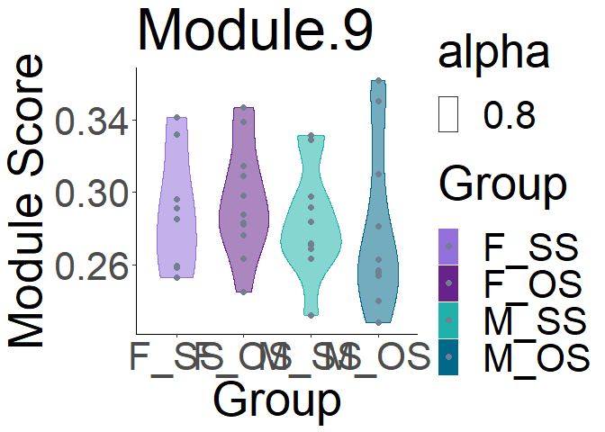
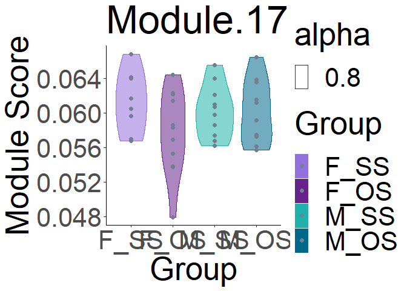
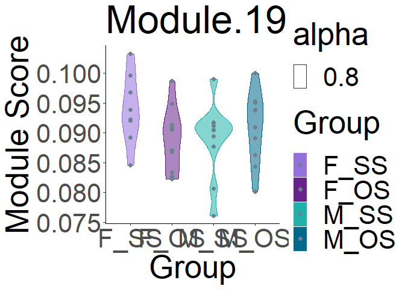
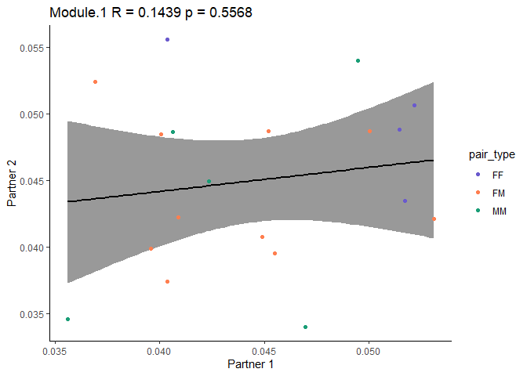
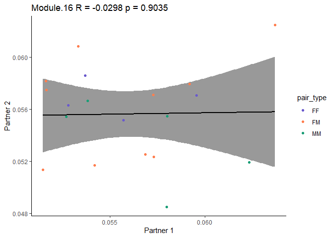
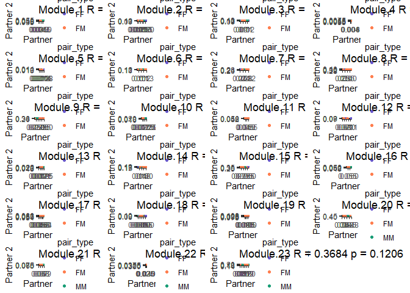
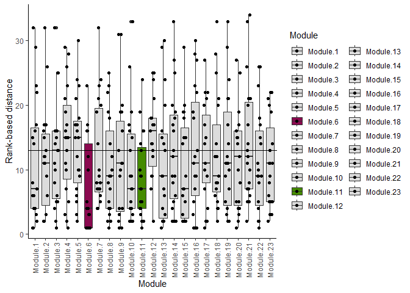
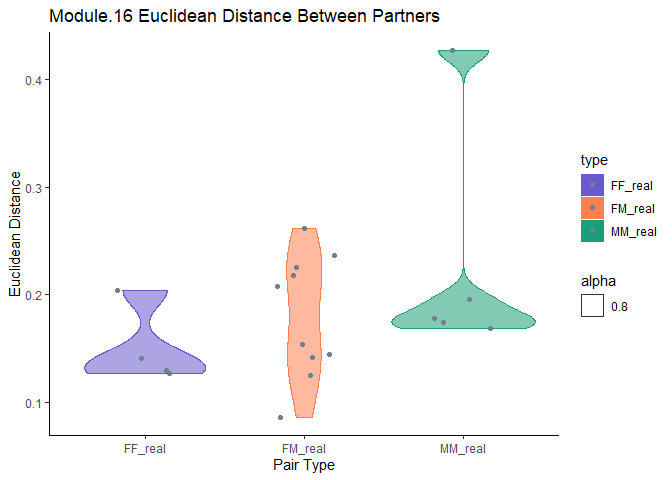
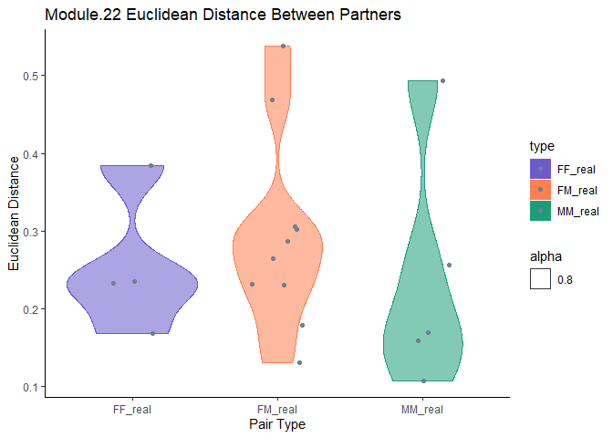

Hotspot for paper
================
Liza Brusman
2024-10-29

``` r
library(dplyr)
library(tidyr)
library(svMisc)
library(cowplot)
library(ggplot2)
library(pheatmap)
library(reshape2)
library(gridExtra)
library(RColorBrewer)
library(ivmte)
library(viridis)
library(palettetown)
library(ComplexHeatmap)
library(corrplot)
library(Hmisc)
library(corrr)
library(ggcorrplot)
library(FactoMineR)
library(stringr)
library(ggpubr)
library(ComplexHeatmap)
library(glmmTMB)
library(DHARMa)
library(emmeans)
library(Seurat)
source("hotspot.R")
```

import module data and metadata

``` r
all_cells <- read.csv("docs/ani_mod_scores_allcells_lognorm_counts.csv") %>% filter(animal != "4967")

metadata <- read.csv("../../docs/seq_beh_metadata.csv") %>% process_metadata() %>% group_level()
```

merge meta and module data

``` r
merged_data <- merge(all_cells, metadata, on = "animal")
```

``` r
modules <- get_modules(merged_data)

modules <- c()
for (i in 1:23) {
  mod_num <- paste0("Module.", i)
  modules <- modules %>% append(mod_num)
}
```

get which genes are in which module

``` r
mod_genes <- read.csv("docs/new_clusts_hotspot-gene-modules.csv")
```

import seurat object

``` r
SCT_norm <- readRDS("../seurat_clustering/output/SCT_norm.rds")
```

outlier test for modules 5 and 12 (and Module 14 to check for new
significance) <https://statsandr.com/blog/outliers-detection-in-r/>

``` r
ggplot(merged_data, aes(x = Group, y = Module.5)) + geom_boxplot()
```

<!-- -->

``` r
out <- boxplot.stats(merged_data$Module.5)$out
out_ind <- which(merged_data$Module.5 %in% c(out))
out_ind
```

    ## [1] 15 20 22

``` r
#try outlier test using percentiles
lower_bound <- quantile(merged_data$Module.5, 0.025)
lower_bound
```

    ##        2.5% 
    ## 0.008785572

``` r
upper_bound <- quantile(merged_data$Module.5, 0.975)
upper_bound
```

    ##      97.5% 
    ## 0.01453385

``` r
#for just SS females
SS_F <- merged_data %>% filter(Group == "F_SS")
ggplot(SS_F, aes(x = Group, y = Module.5)) + geom_boxplot()
```

<!-- -->

``` r
out <- boxplot.stats(SS_F$Module.5)$out
out_ind <- which(SS_F$Module.5 %in% c(out))
out_ind
```

    ## [1] 5

``` r
#try outlier test using percentiles
lower_bound <- quantile(SS_F$Module.5, 0.025)
lower_bound
```

    ##       2.5% 
    ## 0.01087455

``` r
upper_bound <- quantile(SS_F$Module.5, 0.975)
upper_bound
```

    ##      97.5% 
    ## 0.01724762

``` r
print("Module.5")
```

    ## [1] "Module.5"

``` r
for_mod5 <- merged_data %>% filter(Module.5 != out)

my_comparisons <- list(c("F_SS", "F_OS"),
                         c("F_SS", "M_SS"),
                         c("M_SS", "M_OS"),
                         c("F_OS", "M_OS"))
plt <- ggplot(for_mod5, aes_string(x = "Group", y = "Module.5", color = "Group",
                                 fill = "Group", alpha = 0.8)) +
    geom_violin(lwd = 0.5) +
    geom_point(position = position_dodge(width = 0.75),
               color = "slategrey", size = 2, alpha = 1) +
    # stat_compare_means(comparisons = my_comparisons,
    #                    paired = FALSE, method = "wilcox.test") +

    scale_fill_manual(values = c("F_SS" = "mediumpurple",
                                 "F_OS" = "darkorchid4",
                                 "M_SS" = "lightseagreen",
                                 "M_OS" = "deepskyblue4")) +
    scale_color_manual(values = c("F_SS" = "mediumpurple",
                                  "F_OS" = "darkorchid4",
                                  "M_SS" = "lightseagreen",
                                  "M_OS" = "deepskyblue4")) +

    ylab("Module Score") +
    ggtitle("Module.5") +
    theme_classic() +
    theme(text = element_text(size = 40))
  print(plt)
```

<!-- -->

``` r
fit <- glmmTMB(Module.5~Group, data = for_mod5)
print(summary(fit))
```

    ##  Family: gaussian  ( identity )
    ## Formula:          Module.5 ~ Group
    ## Data: for_mod5
    ## 
    ##      AIC      BIC   logLik deviance df.resid 
    ##   -392.8   -384.6    201.4   -402.8       33 
    ## 
    ## 
    ## Dispersion estimate for gaussian family (sigma^2): 1.46e-06 
    ## 
    ## Conditional model:
    ##               Estimate Std. Error z value Pr(>|z|)    
    ## (Intercept)  0.0115841  0.0004565  25.376   <2e-16 ***
    ## GroupF_OS   -0.0011267  0.0005839  -1.929   0.0537 .  
    ## GroupM_SS   -0.0012597  0.0005952  -2.116   0.0343 *  
    ## GroupM_OS   -0.0011599  0.0005952  -1.949   0.0513 .  
    ## ---
    ## Signif. codes:  0 '***' 0.001 '**' 0.01 '*' 0.05 '.' 0.1 ' ' 1

``` r
  # simres <- simulateResiduals(fit)
  # plot(simres, title = mod)

EMM <- emmeans(fit, ~ Group)
coef <- contrast(EMM, "pairwise")[c(1, 2, 5, 6)]
coef2 <- summary(coef, adjust = "fdr") #[["sex*SSOS"]])
print(coef2)
```

    ##  contrast     estimate       SE df t.ratio p.value
    ##  F_SS - F_OS  1.13e-03 0.000584 33   1.929  0.1246
    ##  F_SS - M_SS  1.26e-03 0.000595 33   2.116  0.1246
    ##  F_OS - M_OS  3.32e-05 0.000528 33   0.063  0.9502
    ##  M_SS - M_OS -9.97e-05 0.000540 33  -0.185  0.9502
    ## 
    ## P value adjustment: fdr method for 4 tests

``` r
##for moudle.12
print("Module.12")
```

    ## [1] "Module.12"

``` r
#for just SS females
SS_F <- merged_data %>% filter(Group == "F_SS")
ggplot(SS_F, aes(x = Group, y = Module.12)) + geom_boxplot()
```

<!-- -->

``` r
out <- boxplot.stats(SS_F$Module.12)$out
out_ind <- which(SS_F$Module.12 %in% c(out))
out_ind
```

    ## [1] 5

``` r
#try outlier test using percentiles
lower_bound <- quantile(SS_F$Module.12, 0.025)
lower_bound
```

    ##       2.5% 
    ## 0.07407496

``` r
upper_bound <- quantile(SS_F$Module.12, 0.975)
upper_bound
```

    ##     97.5% 
    ## 0.1111612

``` r
for_mod12 <- merged_data %>% filter(Module.12 != out)

my_comparisons <- list(c("F_SS", "F_OS"),
                         c("F_SS", "M_SS"),
                         c("M_SS", "M_OS"),
                         c("F_OS", "M_OS"))
plt <- ggplot(for_mod12, aes_string(x = "Group", y = "Module.12", color = "Group",
                                 fill = "Group", alpha = 0.8)) +
    geom_violin(lwd = 0.5) +
    geom_point(position = position_dodge(width = 0.75),
               color = "slategrey", size = 2, alpha = 1) +
    # stat_compare_means(comparisons = my_comparisons,
                       # paired = FALSE, method = "wilcox.test") +

    scale_fill_manual(values = c("F_SS" = "mediumpurple",
                                 "F_OS" = "darkorchid4",
                                 "M_SS" = "lightseagreen",
                                 "M_OS" = "deepskyblue4")) +
    scale_color_manual(values = c("F_SS" = "mediumpurple",
                                  "F_OS" = "darkorchid4",
                                  "M_SS" = "lightseagreen",
                                  "M_OS" = "deepskyblue4")) +

    ylab("Module Score") +
    ggtitle("Module.12") +
    theme_classic() +
    theme(text = element_text(size = 40))
  print(plt)
```

<!-- -->

``` r
fit <- glmmTMB(Module.12~Group, data = for_mod12)
print(summary(fit))
```

    ##  Family: gaussian  ( identity )
    ## Formula:          Module.12 ~ Group
    ## Data: for_mod12
    ## 
    ##      AIC      BIC   logLik deviance df.resid 
    ##   -266.8   -258.6    138.4   -276.8       33 
    ## 
    ## 
    ## Dispersion estimate for gaussian family (sigma^2): 4.02e-05 
    ## 
    ## Conditional model:
    ##              Estimate Std. Error z value Pr(>|z|)    
    ## (Intercept)  0.080966   0.002396   33.79   <2e-16 ***
    ## GroupF_OS   -0.005221   0.003065   -1.70   0.0885 .  
    ## GroupM_SS   -0.007011   0.003124   -2.24   0.0248 *  
    ## GroupM_OS   -0.006226   0.003124   -1.99   0.0462 *  
    ## ---
    ## Signif. codes:  0 '***' 0.001 '**' 0.01 '*' 0.05 '.' 0.1 ' ' 1

``` r
  # simres <- simulateResiduals(fit)
  # plot(simres, title = mod)

EMM <- emmeans(fit, ~ Group)
coef <- contrast(EMM, "pairwise")[c(1, 2, 5, 6)]
coef2 <- summary(coef, adjust = "fdr") #[["sex*SSOS"]])
print(coef2)
```

    ##  contrast     estimate      SE df t.ratio p.value
    ##  F_SS - F_OS  0.005221 0.00306 33   1.703  0.1958
    ##  F_SS - M_SS  0.007011 0.00312 33   2.244  0.1266
    ##  F_OS - M_OS  0.001006 0.00277 33   0.363  0.7837
    ##  M_SS - M_OS -0.000785 0.00283 33  -0.277  0.7837
    ## 
    ## P value adjustment: fdr method for 4 tests

``` r
##just look for Module-14
print("Module.14")
```

    ## [1] "Module.14"

``` r
#for just SS females
SS_F <- merged_data %>% filter(Group == "F_SS")
ggplot(SS_F, aes(x = Group, y = Module.14)) + geom_boxplot()
```

<!-- -->

``` r
out <- boxplot.stats(SS_F$Module.14)$out
out_ind <- which(SS_F$Module.14 %in% c(out))
out_ind
```

    ## [1] 5 7

``` r
#try outlier test using percentiles
lower_bound <- quantile(SS_F$Module.14, 0.025)
lower_bound
```

    ##      2.5% 
    ## 0.1275934

``` r
upper_bound <- quantile(SS_F$Module.14, 0.975)
upper_bound
```

    ##     97.5% 
    ## 0.1791689

``` r
for_mod14 <- merged_data %>% filter(!Module.14 %in% out)

my_comparisons <- list(c("F_SS", "F_OS"),
                         c("F_SS", "M_SS"),
                         c("M_SS", "M_OS"),
                         c("F_OS", "M_OS"))
plt <- ggplot(for_mod14, aes_string(x = "Group", y = "Module.14", color = "Group",
                                 fill = "Group", alpha = 0.8)) +
    geom_violin(lwd = 0.5) +
    geom_point(position = position_dodge(width = 0.75),
               color = "slategrey", size = 2, alpha = 1) +
    # stat_compare_means(comparisons = my_comparisons,
                       # paired = FALSE, method = "wilcox.test") +

    scale_fill_manual(values = c("F_SS" = "mediumpurple",
                                 "F_OS" = "darkorchid4",
                                 "M_SS" = "lightseagreen",
                                 "M_OS" = "deepskyblue4")) +
    scale_color_manual(values = c("F_SS" = "mediumpurple",
                                  "F_OS" = "darkorchid4",
                                  "M_SS" = "lightseagreen",
                                  "M_OS" = "deepskyblue4")) +

    ylab("Module Score") +
    ggtitle("Module.14") +
    theme_classic() +
    theme(text = element_text(size = 40))
  print(plt)
```

<!-- -->

``` r
fit <- glmmTMB(Module.14~Group, data = for_mod14)
print(summary(fit))
```

    ##  Family: gaussian  ( identity )
    ## Formula:          Module.14 ~ Group
    ## Data: for_mod14
    ## 
    ##      AIC      BIC   logLik deviance df.resid 
    ##   -192.6   -184.6    101.3   -202.6       32 
    ## 
    ## 
    ## Dispersion estimate for gaussian family (sigma^2): 0.000245 
    ## 
    ## Conditional model:
    ##             Estimate Std. Error z value Pr(>|z|)    
    ## (Intercept) 0.150707   0.006391  23.582   <2e-16 ***
    ## GroupF_OS   0.019908   0.007945   2.506   0.0122 *  
    ## GroupM_SS   0.010956   0.008084   1.355   0.1753    
    ## GroupM_OS   0.014312   0.008084   1.770   0.0767 .  
    ## ---
    ## Signif. codes:  0 '***' 0.001 '**' 0.01 '*' 0.05 '.' 0.1 ' ' 1

``` r
  # simres <- simulateResiduals(fit)
  # plot(simres, title = mod)

EMM <- emmeans(fit, ~ Group)
coef <- contrast(EMM, "pairwise")[c(1, 2, 5, 6)]
coef2 <- summary(coef, adjust = "fdr") #[["sex*SSOS"]])
print(coef2)
```

    ##  contrast    estimate      SE df t.ratio p.value
    ##  F_SS - F_OS -0.01991 0.00794 32  -2.506  0.0700
    ##  F_SS - M_SS -0.01096 0.00808 32  -1.355  0.3696
    ##  F_OS - M_OS  0.00560 0.00684 32   0.818  0.5590
    ##  M_SS - M_OS -0.00336 0.00700 32  -0.479  0.6350
    ## 
    ## P value adjustment: fdr method for 4 tests

``` r
for (mod in modules) {
  violin(merged_data, save = FALSE)
}
```

<!-- --><!-- --><!-- --><!-- --><!-- --><!-- --><!-- --><!-- --><!-- --><!-- --><!-- --><!-- --><!-- --><!-- --><!-- --><!-- --><!-- --><!-- --><!-- --><!-- --><!-- --><!-- --><!-- -->

correlation plots

``` r
setwd("output/")
for (mod in "Module.6") {
  corr_plot(merged_data, color = "deeppink4", font_size = 20, save = FALSE)
}
```

    ## `geom_smooth()` using formula = 'y ~ x'

<!-- -->

``` r
for (mod in "Module.11") {
  corr_plot(merged_data, color = "chartreuse4", font_size = 20, save = FALSE)
}
```

    ## `geom_smooth()` using formula = 'y ~ x'

<!-- -->
facet corr plots for easier manipulation in illustrator

``` r
plt_list <- list()
for (mod in modules) {
  p <- corr_plot_bypair(merged_data, font_size = 8)
  plt_list[[mod]] <- p
}
```

    ## `geom_smooth()` using formula = 'y ~ x'

<!-- -->

    ## `geom_smooth()` using formula = 'y ~ x'

<!-- -->

    ## `geom_smooth()` using formula = 'y ~ x'

<!-- -->

    ## `geom_smooth()` using formula = 'y ~ x'

<!-- -->

    ## `geom_smooth()` using formula = 'y ~ x'

<!-- -->

    ## `geom_smooth()` using formula = 'y ~ x'

<!-- -->

    ## `geom_smooth()` using formula = 'y ~ x'

<!-- -->

    ## `geom_smooth()` using formula = 'y ~ x'

<!-- -->

    ## `geom_smooth()` using formula = 'y ~ x'

<!-- -->

    ## `geom_smooth()` using formula = 'y ~ x'

<!-- -->

    ## `geom_smooth()` using formula = 'y ~ x'

<!-- -->

    ## `geom_smooth()` using formula = 'y ~ x'

<!-- -->

    ## `geom_smooth()` using formula = 'y ~ x'

<!-- -->

    ## `geom_smooth()` using formula = 'y ~ x'

<!-- -->

    ## `geom_smooth()` using formula = 'y ~ x'

<!-- -->

    ## `geom_smooth()` using formula = 'y ~ x'

<!-- -->

    ## `geom_smooth()` using formula = 'y ~ x'

<!-- -->

    ## `geom_smooth()` using formula = 'y ~ x'

<!-- -->

    ## `geom_smooth()` using formula = 'y ~ x'

<!-- -->

    ## `geom_smooth()` using formula = 'y ~ x'

<!-- -->

    ## `geom_smooth()` using formula = 'y ~ x'

<!-- -->

    ## `geom_smooth()` using formula = 'y ~ x'

<!-- -->

    ## `geom_smooth()` using formula = 'y ~ x'

<!-- -->

``` r
all_plt <- grid.arrange(grobs = plt_list, nrow = 6)
```

    ## `geom_smooth()` using formula = 'y ~ x'
    ## `geom_smooth()` using formula = 'y ~ x'
    ## `geom_smooth()` using formula = 'y ~ x'
    ## `geom_smooth()` using formula = 'y ~ x'
    ## `geom_smooth()` using formula = 'y ~ x'
    ## `geom_smooth()` using formula = 'y ~ x'
    ## `geom_smooth()` using formula = 'y ~ x'
    ## `geom_smooth()` using formula = 'y ~ x'
    ## `geom_smooth()` using formula = 'y ~ x'
    ## `geom_smooth()` using formula = 'y ~ x'
    ## `geom_smooth()` using formula = 'y ~ x'
    ## `geom_smooth()` using formula = 'y ~ x'
    ## `geom_smooth()` using formula = 'y ~ x'
    ## `geom_smooth()` using formula = 'y ~ x'
    ## `geom_smooth()` using formula = 'y ~ x'
    ## `geom_smooth()` using formula = 'y ~ x'
    ## `geom_smooth()` using formula = 'y ~ x'
    ## `geom_smooth()` using formula = 'y ~ x'
    ## `geom_smooth()` using formula = 'y ~ x'
    ## `geom_smooth()` using formula = 'y ~ x'
    ## `geom_smooth()` using formula = 'y ~ x'
    ## `geom_smooth()` using formula = 'y ~ x'
    ## `geom_smooth()` using formula = 'y ~ x'

<!-- -->

``` r
# setwd("output/")
# ggsave("all_module_corrs.pdf", all_plt, width = 16, height = 16, units = "in")
```

make a plot of all between-partner rank distances separated by pair type

``` r
all_dists_df <- make_dist_df(pairs, type, fake_real, dist, Module)
plt_list <- list()
for (mod in modules) {
    mod_dist_df <- get_rank_distances(merged_data)
    all_dists_df <- rbind(all_dists_df, mod_dist_df)
    
    p <- plot_rank_group(mod_dist_df)
    plt_list[[mod]] <- p
  }
```

<!-- --><!-- --><!-- --><!-- --><!-- --><!-- --><!-- --><!-- --><!-- --><!-- --><!-- --><!-- --><!-- --><!-- --><!-- --><!-- --><!-- --><!-- --><!-- --><!-- --><!-- --><!-- --><!-- -->

``` r
plot_rank(all_dists_df)
```

<!-- --><!-- -->

``` r
all_plt <- grid.arrange(grobs = plt_list, nrow = 6)
```

<!-- -->

``` r
# setwd("output/")
# ggsave("all_module_dists.pdf", all_plt, width = 18, height = 18, units = "in")
```

euclidean distances between partners and all non-partner pairs

``` r
fake_pairs <- get_fake_pairs(merged_data)

all_euclidean_dists <- data.frame()
for (mod in modules) {
  mod_euclidean_dists <- get_euclidean_dists(SCT_norm, mod_genes, metadata)
  all_euclidean_dists <- rbind(all_euclidean_dists, mod_euclidean_dists)
}
```

    ## [1] "Module.1"
    ## 
    ##  Wilcoxon rank sum test with continuity correction
    ## 
    ## data:  fake_df$dist and real_df$dist
    ## W = 8431, p-value = 0.02688
    ## alternative hypothesis: true location shift is not equal to 0
    ## 
    ## [1] "Module.2"
    ## 
    ##  Wilcoxon rank sum test with continuity correction
    ## 
    ## data:  fake_df$dist and real_df$dist
    ## W = 8394, p-value = 0.02995
    ## alternative hypothesis: true location shift is not equal to 0
    ## 
    ## [1] "Module.3"
    ## 
    ##  Wilcoxon rank sum test with continuity correction
    ## 
    ## data:  fake_df$dist and real_df$dist
    ## W = 7105, p-value = 0.4873
    ## alternative hypothesis: true location shift is not equal to 0
    ## 
    ## [1] "Module.4"
    ## 
    ##  Wilcoxon rank sum test with continuity correction
    ## 
    ## data:  fake_df$dist and real_df$dist
    ## W = 7082, p-value = 0.504
    ## alternative hypothesis: true location shift is not equal to 0
    ## 
    ## [1] "Module.5"
    ## 
    ##  Wilcoxon rank sum test with continuity correction
    ## 
    ## data:  fake_df$dist and real_df$dist
    ## W = 9374, p-value = 0.0009907
    ## alternative hypothesis: true location shift is not equal to 0
    ## 
    ## [1] "Module.6"
    ## 
    ##  Wilcoxon rank sum test with continuity correction
    ## 
    ## data:  fake_df$dist and real_df$dist
    ## W = 9781, p-value = 0.0001704
    ## alternative hypothesis: true location shift is not equal to 0
    ## 
    ## [1] "Module.7"
    ## 
    ##  Wilcoxon rank sum test with continuity correction
    ## 
    ## data:  fake_df$dist and real_df$dist
    ## W = 7777, p-value = 0.1431
    ## alternative hypothesis: true location shift is not equal to 0
    ## 
    ## [1] "Module.8"
    ## 
    ##  Wilcoxon rank sum test with continuity correction
    ## 
    ## data:  fake_df$dist and real_df$dist
    ## W = 9228, p-value = 0.001772
    ## alternative hypothesis: true location shift is not equal to 0
    ## 
    ## [1] "Module.9"
    ## 
    ##  Wilcoxon rank sum test with continuity correction
    ## 
    ## data:  fake_df$dist and real_df$dist
    ## W = 8118, p-value = 0.06363
    ## alternative hypothesis: true location shift is not equal to 0
    ## 
    ## [1] "Module.10"
    ## 
    ##  Wilcoxon rank sum test with continuity correction
    ## 
    ## data:  fake_df$dist and real_df$dist
    ## W = 7144, p-value = 0.4598
    ## alternative hypothesis: true location shift is not equal to 0
    ## 
    ## [1] "Module.11"
    ## 
    ##  Wilcoxon rank sum test with continuity correction
    ## 
    ## data:  fake_df$dist and real_df$dist
    ## W = 8803, p-value = 0.00831
    ## alternative hypothesis: true location shift is not equal to 0
    ## 
    ## [1] "Module.12"
    ## 
    ##  Wilcoxon rank sum test with continuity correction
    ## 
    ## data:  fake_df$dist and real_df$dist
    ## W = 7869, p-value = 0.1165
    ## alternative hypothesis: true location shift is not equal to 0
    ## 
    ## [1] "Module.13"
    ## 
    ##  Wilcoxon rank sum test with continuity correction
    ## 
    ## data:  fake_df$dist and real_df$dist
    ## W = 6904, p-value = 0.6424
    ## alternative hypothesis: true location shift is not equal to 0
    ## 
    ## [1] "Module.14"
    ## 
    ##  Wilcoxon rank sum test with continuity correction
    ## 
    ## data:  fake_df$dist and real_df$dist
    ## W = 6632, p-value = 0.8785
    ## alternative hypothesis: true location shift is not equal to 0
    ## 
    ## [1] "Module.15"
    ## 
    ##  Wilcoxon rank sum test with continuity correction
    ## 
    ## data:  fake_df$dist and real_df$dist
    ## W = 8005, p-value = 0.08447
    ## alternative hypothesis: true location shift is not equal to 0
    ## 
    ## [1] "Module.16"
    ## 
    ##  Wilcoxon rank sum test with continuity correction
    ## 
    ## data:  fake_df$dist and real_df$dist
    ## W = 7822, p-value = 0.1296
    ## alternative hypothesis: true location shift is not equal to 0
    ## 
    ## [1] "Module.17"
    ## 
    ##  Wilcoxon rank sum test with continuity correction
    ## 
    ## data:  fake_df$dist and real_df$dist
    ## W = 7427, p-value = 0.2876
    ## alternative hypothesis: true location shift is not equal to 0
    ## 
    ## [1] "Module.18"
    ## 
    ##  Wilcoxon rank sum test with continuity correction
    ## 
    ## data:  fake_df$dist and real_df$dist
    ## W = 9297, p-value = 0.001351
    ## alternative hypothesis: true location shift is not equal to 0
    ## 
    ## [1] "Module.19"
    ## 
    ##  Wilcoxon rank sum test with continuity correction
    ## 
    ## data:  fake_df$dist and real_df$dist
    ## W = 8083, p-value = 0.06958
    ## alternative hypothesis: true location shift is not equal to 0
    ## 
    ## [1] "Module.20"
    ## 
    ##  Wilcoxon rank sum test with continuity correction
    ## 
    ## data:  fake_df$dist and real_df$dist
    ## W = 8325, p-value = 0.03646
    ## alternative hypothesis: true location shift is not equal to 0
    ## 
    ## [1] "Module.21"
    ## 
    ##  Wilcoxon rank sum test with continuity correction
    ## 
    ## data:  fake_df$dist and real_df$dist
    ## W = 7511, p-value = 0.2462
    ## alternative hypothesis: true location shift is not equal to 0
    ## 
    ## [1] "Module.22"
    ## 
    ##  Wilcoxon rank sum test with continuity correction
    ## 
    ## data:  fake_df$dist and real_df$dist
    ## W = 7861, p-value = 0.1187
    ## alternative hypothesis: true location shift is not equal to 0
    ## 
    ## [1] "Module.23"
    ## 
    ##  Wilcoxon rank sum test with continuity correction
    ## 
    ## data:  fake_df$dist and real_df$dist
    ## W = 8580, p-value = 0.01713
    ## alternative hypothesis: true location shift is not equal to 0

plot euclidean distances

``` r
setwd("output/")

plt_list <- list()
for (mod in modules) {
  p <- plot_euclidean_dists(all_euclidean_dists, save = FALSE)
  plt_list[[mod]] <- p

}
```

<!-- --><!-- --><!-- --><!-- --><!-- --><!-- --><!-- --><!-- --><!-- --><!-- --><!-- --><!-- --><!-- --><!-- --><!-- --><!-- --><!-- --><!-- --><!-- --><!-- --><!-- --><!-- --><!-- -->

``` r
all_plt <- grid.arrange(grobs = plt_list, nrow = 6)
```

<!-- -->

``` r
# ggsave("all_module_euclidean_dists.pdf", all_plt, width = 18, height = 18, units = "in")
```

plot euclidean distances by pair type

``` r
plt_list <- list()
for (mod in modules) {
 p <- plot_euclidean_dists_pairtype(all_euclidean_dists)
 plt_list[[mod]] <- p
}
```

<!-- --><!-- --><!-- --><!-- --><!-- --><!-- --><!-- --><!-- --><!-- --><!-- --><!-- --><!-- --><!-- --><!-- --><!-- --><!-- --><!-- --><!-- --><!-- --><!-- --><!-- --><!-- --><!-- -->

``` r
all_plt <- grid.arrange(grobs = plt_list, nrow = 6)
```

<!-- -->

``` r
# setwd("output/")
# ggsave("all_module_euclidean_dists_by_pairtype.pdf", all_plt, width = 18, height = 18, units = "in")
```

summary stats from hotspot mods

``` r
summs <- mod_genes %>% group_by(Module) %>% summarise(n_genes = n())
```

GLM for module expression by sex and SS_OS

``` r
all_contrasts <- data.frame(contrast = character(), 
                            estimate = numeric(), 
                            SE = numeric(), 
                            df = numeric(), 
                            t.ratio = numeric(), 
                            p.value = numeric(), 
                            Module = character())

for (mod in modules) {
  form <- formula(paste0(mod, "~sex*SS_OS"))
  fit <- glmmTMB(form, data = merged_data)
  print(summary(fit))
  
  ## if you want to simulate and plot residuals
  # simres <- simulateResiduals(fit)
  # plot(simres, title = mod)
  
  EMM <- emmeans(fit, ~ sex*SS_OS)
  coef <- contrast(EMM, "pairwise")[c(1, 2, 5, 6)]
  coef2 <- summary(coef, adjust = "fdr")
  print(coef2)
  mini.df <- coef2 %>% as.data.frame()
  mini.df$Module <- mod
  
  all_contrasts <- rbind(all_contrasts, mini.df)
  
}
```

    ##  Family: gaussian  ( identity )
    ## Formula:          Module.1 ~ sex * SS_OS
    ## Data: merged_data
    ## 
    ##      AIC      BIC   logLik deviance df.resid 
    ##   -289.2   -280.9    149.6   -299.2       34 
    ## 
    ## 
    ## Dispersion estimate for gaussian family (sigma^2): 2.73e-05 
    ## 
    ## Conditional model:
    ##                Estimate Std. Error z value Pr(>|z|)    
    ## (Intercept)   0.0436022  0.0015742  27.698   <2e-16 ***
    ## sexM          0.0004203  0.0022812   0.184   0.8538    
    ## SS_OSSS       0.0056711  0.0024260   2.338   0.0194 *  
    ## sexM:SS_OSSS -0.0065816  0.0033671  -1.955   0.0506 .  
    ## ---
    ## Signif. codes:  0 '***' 0.001 '**' 0.01 '*' 0.05 '.' 0.1 ' ' 1
    ##  contrast     estimate      SE df t.ratio p.value
    ##  F OS - M OS -0.000420 0.00228 34  -0.184  0.8549
    ##  F OS - F SS -0.005671 0.00243 34  -2.338  0.0509
    ##  M OS - M SS  0.000911 0.00233 34   0.390  0.8549
    ##  F SS - M SS  0.006161 0.00248 34   2.488  0.0509
    ## 
    ## P value adjustment: fdr method for 4 tests 
    ##  Family: gaussian  ( identity )
    ## Formula:          Module.2 ~ sex * SS_OS
    ## Data: merged_data
    ## 
    ##      AIC      BIC   logLik deviance df.resid 
    ##   -249.8   -241.5    129.9   -259.8       34 
    ## 
    ## 
    ## Dispersion estimate for gaussian family (sigma^2): 7.49e-05 
    ## 
    ## Conditional model:
    ##               Estimate Std. Error z value Pr(>|z|)    
    ## (Intercept)   0.102433   0.002610   39.25   <2e-16 ***
    ## sexM          0.002594   0.003782    0.69   0.4928    
    ## SS_OSSS       0.008858   0.004022    2.20   0.0276 *  
    ## sexM:SS_OSSS -0.010665   0.005582   -1.91   0.0560 .  
    ## ---
    ## Signif. codes:  0 '***' 0.001 '**' 0.01 '*' 0.05 '.' 0.1 ' ' 1
    ##  contrast    estimate      SE df t.ratio p.value
    ##  F OS - M OS -0.00259 0.00378 34  -0.686  0.6436
    ##  F OS - F SS -0.00886 0.00402 34  -2.203  0.1150
    ##  M OS - M SS  0.00181 0.00387 34   0.467  0.6436
    ##  F SS - M SS  0.00807 0.00411 34   1.966  0.1150
    ## 
    ## P value adjustment: fdr method for 4 tests 
    ##  Family: gaussian  ( identity )
    ## Formula:          Module.3 ~ sex * SS_OS
    ## Data: merged_data
    ## 
    ##      AIC      BIC   logLik deviance df.resid 
    ##   -224.1   -215.8    117.1   -234.1       34 
    ## 
    ## 
    ## Dispersion estimate for gaussian family (sigma^2): 0.000145 
    ## 
    ## Conditional model:
    ##               Estimate Std. Error z value Pr(>|z|)    
    ## (Intercept)   0.101262   0.003627  27.921   <2e-16 ***
    ## sexM          0.001218   0.005256   0.232   0.8168    
    ## SS_OSSS       0.010489   0.005589   1.877   0.0606 .  
    ## sexM:SS_OSSS -0.009196   0.007757  -1.185   0.2358    
    ## ---
    ## Signif. codes:  0 '***' 0.001 '**' 0.01 '*' 0.05 '.' 0.1 ' ' 1
    ##  contrast    estimate      SE df t.ratio p.value
    ##  F OS - M OS -0.00122 0.00526 34  -0.232  0.8181
    ##  F OS - F SS -0.01049 0.00559 34  -1.877  0.2767
    ##  M OS - M SS -0.00129 0.00538 34  -0.240  0.8181
    ##  F SS - M SS  0.00798 0.00571 34   1.398  0.3421
    ## 
    ## P value adjustment: fdr method for 4 tests 
    ##  Family: gaussian  ( identity )
    ## Formula:          Module.4 ~ sex * SS_OS
    ## Data: merged_data
    ## 
    ##      AIC      BIC   logLik deviance df.resid 
    ##   -423.1   -414.8    216.6   -433.1       34 
    ## 
    ## 
    ## Dispersion estimate for gaussian family (sigma^2): 8.79e-07 
    ## 
    ## Conditional model:
    ##                Estimate Std. Error z value Pr(>|z|)    
    ## (Intercept)   0.0051163  0.0002827  18.097   <2e-16 ***
    ## sexM         -0.0002086  0.0004097  -0.509   0.6107    
    ## SS_OSSS       0.0010634  0.0004357   2.441   0.0147 *  
    ## sexM:SS_OSSS -0.0008368  0.0006047  -1.384   0.1664    
    ## ---
    ## Signif. codes:  0 '***' 0.001 '**' 0.01 '*' 0.05 '.' 0.1 ' ' 1
    ##  contrast     estimate       SE df t.ratio p.value
    ##  F OS - M OS  0.000209 0.000410 34   0.509  0.6140
    ##  F OS - F SS -0.001063 0.000436 34  -2.441  0.0494
    ##  M OS - M SS -0.000227 0.000419 34  -0.540  0.6140
    ##  F SS - M SS  0.001045 0.000445 34   2.350  0.0494
    ## 
    ## P value adjustment: fdr method for 4 tests 
    ##  Family: gaussian  ( identity )
    ## Formula:          Module.5 ~ sex * SS_OS
    ## Data: merged_data
    ## 
    ##      AIC      BIC   logLik deviance df.resid 
    ##   -385.6   -377.2    197.8   -395.6       34 
    ## 
    ## 
    ## Dispersion estimate for gaussian family (sigma^2): 2.31e-06 
    ## 
    ## Conditional model:
    ##                Estimate Std. Error z value Pr(>|z|)    
    ## (Intercept)   1.046e-02  4.578e-04  22.844  < 2e-16 ***
    ## sexM         -3.321e-05  6.634e-04  -0.050  0.96007    
    ## SS_OSSS       1.911e-03  7.055e-04   2.709  0.00674 ** 
    ## sexM:SS_OSSS -2.011e-03  9.791e-04  -2.054  0.03999 *  
    ## ---
    ## Signif. codes:  0 '***' 0.001 '**' 0.01 '*' 0.05 '.' 0.1 ' ' 1
    ##  contrast     estimate       SE df t.ratio p.value
    ##  F OS - M OS  3.32e-05 0.000663 34   0.050  0.9604
    ##  F OS - F SS -1.91e-03 0.000705 34  -2.709  0.0210
    ##  M OS - M SS  9.97e-05 0.000679 34   0.147  0.9604
    ##  F SS - M SS  2.04e-03 0.000720 34   2.839  0.0210
    ## 
    ## P value adjustment: fdr method for 4 tests 
    ##  Family: gaussian  ( identity )
    ## Formula:          Module.6 ~ sex * SS_OS
    ## Data: merged_data
    ## 
    ##      AIC      BIC   logLik deviance df.resid 
    ##   -256.7   -248.3    133.3   -266.7       34 
    ## 
    ## 
    ## Dispersion estimate for gaussian family (sigma^2): 6.28e-05 
    ## 
    ## Conditional model:
    ##                Estimate Std. Error z value Pr(>|z|)    
    ## (Intercept)   0.1146339  0.0023898   47.97   <2e-16 ***
    ## sexM         -0.0006935  0.0034632   -0.20    0.841    
    ## SS_OSSS       0.0005805  0.0036830    0.16    0.875    
    ## sexM:SS_OSSS -0.0012341  0.0051117   -0.24    0.809    
    ## ---
    ## Signif. codes:  0 '***' 0.001 '**' 0.01 '*' 0.05 '.' 0.1 ' ' 1
    ##  contrast     estimate      SE df t.ratio p.value
    ##  F OS - M OS  0.000693 0.00346 34   0.200  0.8757
    ##  F OS - F SS -0.000580 0.00368 34  -0.158  0.8757
    ##  M OS - M SS  0.000654 0.00354 34   0.184  0.8757
    ##  F SS - M SS  0.001928 0.00376 34   0.513  0.8757
    ## 
    ## P value adjustment: fdr method for 4 tests 
    ##  Family: gaussian  ( identity )
    ## Formula:          Module.7 ~ sex * SS_OS
    ## Data: merged_data
    ## 
    ##      AIC      BIC   logLik deviance df.resid 
    ##   -154.5   -146.2     82.3   -164.5       34 
    ## 
    ## 
    ## Dispersion estimate for gaussian family (sigma^2): 0.000862 
    ## 
    ## Conditional model:
    ##               Estimate Std. Error z value Pr(>|z|)    
    ## (Intercept)   0.281123   0.008854   31.75   <2e-16 ***
    ## sexM         -0.005742   0.012831   -0.45   0.6545    
    ## SS_OSSS      -0.033291   0.013645   -2.44   0.0147 *  
    ## sexM:SS_OSSS  0.026859   0.018938    1.42   0.1561    
    ## ---
    ## Signif. codes:  0 '***' 0.001 '**' 0.01 '*' 0.05 '.' 0.1 ' ' 1
    ##  contrast    estimate     SE df t.ratio p.value
    ##  F OS - M OS  0.00574 0.0128 34   0.448  0.6573
    ##  F OS - F SS  0.03329 0.0136 34   2.440  0.0802
    ##  M OS - M SS  0.00643 0.0131 34   0.490  0.6573
    ##  F SS - M SS -0.02112 0.0139 34  -1.516  0.2775
    ## 
    ## P value adjustment: fdr method for 4 tests 
    ##  Family: gaussian  ( identity )
    ## Formula:          Module.8 ~ sex * SS_OS
    ## Data: merged_data
    ## 
    ##      AIC      BIC   logLik deviance df.resid 
    ##   -132.8   -124.5     71.4   -142.8       34 
    ## 
    ## 
    ## Dispersion estimate for gaussian family (sigma^2): 0.0015 
    ## 
    ## Conditional model:
    ##               Estimate Std. Error z value Pr(>|z|)    
    ## (Intercept)   0.354680   0.011695  30.328   <2e-16 ***
    ## sexM          0.002952   0.016948   0.174    0.862    
    ## SS_OSSS      -0.017782   0.018023  -0.987    0.324    
    ## sexM:SS_OSSS  0.018072   0.025015   0.722    0.470    
    ## ---
    ## Signif. codes:  0 '***' 0.001 '**' 0.01 '*' 0.05 '.' 0.1 ' ' 1
    ##  contrast    estimate     SE df t.ratio p.value
    ##  F OS - M OS -0.00295 0.0169 34  -0.174  0.9867
    ##  F OS - F SS  0.01778 0.0180 34   0.987  0.6616
    ##  M OS - M SS -0.00029 0.0173 34  -0.017  0.9867
    ##  F SS - M SS -0.02102 0.0184 34  -1.143  0.6616
    ## 
    ## P value adjustment: fdr method for 4 tests 
    ##  Family: gaussian  ( identity )
    ## Formula:          Module.9 ~ sex * SS_OS
    ## Data: merged_data
    ## 
    ##      AIC      BIC   logLik deviance df.resid 
    ##   -143.8   -135.5     76.9   -153.8       34 
    ## 
    ## 
    ## Dispersion estimate for gaussian family (sigma^2): 0.00113 
    ## 
    ## Conditional model:
    ##               Estimate Std. Error z value Pr(>|z|)    
    ## (Intercept)   0.295001   0.010152  29.057   <2e-16 ***
    ## sexM         -0.014869   0.014712  -1.011    0.312    
    ## SS_OSSS      -0.005510   0.015646  -0.352    0.725    
    ## sexM:SS_OSSS  0.009382   0.021715   0.432    0.666    
    ## ---
    ## Signif. codes:  0 '***' 0.001 '**' 0.01 '*' 0.05 '.' 0.1 ' ' 1
    ##  contrast    estimate     SE df t.ratio p.value
    ##  F OS - M OS  0.01487 0.0147 34   1.011  0.7986
    ##  F OS - F SS  0.00551 0.0156 34   0.352  0.7986
    ##  M OS - M SS -0.00387 0.0151 34  -0.257  0.7986
    ##  F SS - M SS  0.00549 0.0160 34   0.344  0.7986
    ## 
    ## P value adjustment: fdr method for 4 tests 
    ##  Family: gaussian  ( identity )
    ## Formula:          Module.10 ~ sex * SS_OS
    ## Data: merged_data
    ## 
    ##      AIC      BIC   logLik deviance df.resid 
    ##   -373.3   -365.0    191.6   -383.3       34 
    ## 
    ## 
    ## Dispersion estimate for gaussian family (sigma^2): 3.16e-06 
    ## 
    ## Conditional model:
    ##                Estimate Std. Error z value Pr(>|z|)    
    ## (Intercept)   0.0186482  0.0005358   34.80   <2e-16 ***
    ## sexM          0.0000994  0.0007764    0.13    0.898    
    ## SS_OSSS       0.0016255  0.0008257    1.97    0.049 *  
    ## sexM:SS_OSSS -0.0018030  0.0011460   -1.57    0.116    
    ## ---
    ## Signif. codes:  0 '***' 0.001 '**' 0.01 '*' 0.05 '.' 0.1 ' ' 1
    ##  contrast     estimate       SE df t.ratio p.value
    ##  F OS - M OS -9.94e-05 0.000776 34  -0.128  0.8989
    ##  F OS - F SS -1.63e-03 0.000826 34  -1.969  0.1144
    ##  M OS - M SS  1.78e-04 0.000795 34   0.223  0.8989
    ##  F SS - M SS  1.70e-03 0.000843 34   2.021  0.1144
    ## 
    ## P value adjustment: fdr method for 4 tests 
    ##  Family: gaussian  ( identity )
    ## Formula:          Module.11 ~ sex * SS_OS
    ## Data: merged_data
    ## 
    ##      AIC      BIC   logLik deviance df.resid 
    ##   -323.0   -314.7    166.5   -333.0       34 
    ## 
    ## 
    ## Dispersion estimate for gaussian family (sigma^2): 1.15e-05 
    ## 
    ## Conditional model:
    ##                Estimate Std. Error z value Pr(>|z|)    
    ## (Intercept)   0.0503157  0.0010210   49.28   <2e-16 ***
    ## sexM          0.0022806  0.0014796    1.54    0.123    
    ## SS_OSSS      -0.0007644  0.0015735   -0.49    0.627    
    ## sexM:SS_OSSS  0.0005658  0.0021839    0.26    0.796    
    ## ---
    ## Signif. codes:  0 '***' 0.001 '**' 0.01 '*' 0.05 '.' 0.1 ' ' 1
    ##  contrast     estimate      SE df t.ratio p.value
    ##  F OS - M OS -0.002281 0.00148 34  -1.541  0.2650
    ##  F OS - F SS  0.000764 0.00157 34   0.486  0.8403
    ##  M OS - M SS  0.000199 0.00151 34   0.131  0.8964
    ##  F SS - M SS -0.002846 0.00161 34  -1.772  0.2650
    ## 
    ## P value adjustment: fdr method for 4 tests 
    ##  Family: gaussian  ( identity )
    ## Formula:          Module.12 ~ sex * SS_OS
    ## Data: merged_data
    ## 
    ##      AIC      BIC   logLik deviance df.resid 
    ##   -255.7   -247.4    132.8   -265.7       34 
    ## 
    ## 
    ## Dispersion estimate for gaussian family (sigma^2): 6.44e-05 
    ## 
    ## Conditional model:
    ##               Estimate Std. Error z value Pr(>|z|)    
    ## (Intercept)   0.075745   0.002420  31.302   <2e-16 ***
    ## sexM         -0.001006   0.003507  -0.287   0.7743    
    ## SS_OSSS       0.009415   0.003729   2.525   0.0116 *  
    ## sexM:SS_OSSS -0.010199   0.005176  -1.971   0.0488 *  
    ## ---
    ## Signif. codes:  0 '***' 0.001 '**' 0.01 '*' 0.05 '.' 0.1 ' ' 1
    ##  contrast     estimate      SE df t.ratio p.value
    ##  F OS - M OS  0.001006 0.00351 34   0.287  0.8283
    ##  F OS - F SS -0.009415 0.00373 34  -2.525  0.0328
    ##  M OS - M SS  0.000785 0.00359 34   0.219  0.8283
    ##  F SS - M SS  0.011205 0.00381 34   2.943  0.0233
    ## 
    ## P value adjustment: fdr method for 4 tests 
    ##  Family: gaussian  ( identity )
    ## Formula:          Module.13 ~ sex * SS_OS
    ## Data: merged_data
    ## 
    ##      AIC      BIC   logLik deviance df.resid 
    ##   -368.9   -360.6    189.4   -378.9       34 
    ## 
    ## 
    ## Dispersion estimate for gaussian family (sigma^2): 3.54e-06 
    ## 
    ## Conditional model:
    ##                Estimate Std. Error z value Pr(>|z|)    
    ## (Intercept)   0.0206036  0.0005669   36.34   <2e-16 ***
    ## sexM          0.0010203  0.0008216    1.24    0.214    
    ## SS_OSSS       0.0003053  0.0008737    0.35    0.727    
    ## sexM:SS_OSSS -0.0007401  0.0012126   -0.61    0.542    
    ## ---
    ## Signif. codes:  0 '***' 0.001 '**' 0.01 '*' 0.05 '.' 0.1 ' ' 1
    ##  contrast     estimate       SE df t.ratio p.value
    ##  F OS - M OS -0.001020 0.000822 34  -1.242  0.7553
    ##  F OS - F SS -0.000305 0.000874 34  -0.349  0.7553
    ##  M OS - M SS  0.000435 0.000841 34   0.517  0.7553
    ##  F SS - M SS -0.000280 0.000892 34  -0.314  0.7553
    ## 
    ## P value adjustment: fdr method for 4 tests 
    ##  Family: gaussian  ( identity )
    ## Formula:          Module.14 ~ sex * SS_OS
    ## Data: merged_data
    ## 
    ##      AIC      BIC   logLik deviance df.resid 
    ##   -198.7   -190.4    104.4   -208.7       34 
    ## 
    ## 
    ## Dispersion estimate for gaussian family (sigma^2): 0.000278 
    ## 
    ## Conditional model:
    ##               Estimate Std. Error z value Pr(>|z|)    
    ## (Intercept)   0.170615   0.005023   33.97   <2e-16 ***
    ## sexM         -0.005597   0.007279   -0.77   0.4420    
    ## SS_OSSS      -0.019172   0.007741   -2.48   0.0133 *  
    ## sexM:SS_OSSS  0.015817   0.010744    1.47   0.1410    
    ## ---
    ## Signif. codes:  0 '***' 0.001 '**' 0.01 '*' 0.05 '.' 0.1 ' ' 1
    ##  contrast    estimate      SE df t.ratio p.value
    ##  F OS - M OS  0.00560 0.00728 34   0.769  0.5964
    ##  F OS - F SS  0.01917 0.00774 34   2.477  0.0736
    ##  M OS - M SS  0.00336 0.00745 34   0.450  0.6553
    ##  F SS - M SS -0.01022 0.00790 34  -1.293  0.4092
    ## 
    ## P value adjustment: fdr method for 4 tests 
    ##  Family: gaussian  ( identity )
    ## Formula:          Module.15 ~ sex * SS_OS
    ## Data: merged_data
    ## 
    ##      AIC      BIC   logLik deviance df.resid 
    ##   -137.8   -129.5     73.9   -147.8       34 
    ## 
    ## 
    ## Dispersion estimate for gaussian family (sigma^2): 0.00132 
    ## 
    ## Conditional model:
    ##               Estimate Std. Error z value Pr(>|z|)    
    ## (Intercept)   0.293517   0.010961  26.778   <2e-16 ***
    ## sexM         -0.005133   0.015884  -0.323    0.747    
    ## SS_OSSS       0.020112   0.016892   1.191    0.234    
    ## sexM:SS_OSSS -0.013145   0.023445  -0.561    0.575    
    ## ---
    ## Signif. codes:  0 '***' 0.001 '**' 0.01 '*' 0.05 '.' 0.1 ' ' 1
    ##  contrast    estimate     SE df t.ratio p.value
    ##  F OS - M OS  0.00513 0.0159 34   0.323  0.7485
    ##  F OS - F SS -0.02011 0.0169 34  -1.191  0.5933
    ##  M OS - M SS -0.00697 0.0163 34  -0.429  0.7485
    ##  F SS - M SS  0.01828 0.0172 34   1.060  0.5933
    ## 
    ## P value adjustment: fdr method for 4 tests 
    ##  Family: gaussian  ( identity )
    ## Formula:          Module.16 ~ sex * SS_OS
    ## Data: merged_data
    ## 
    ##      AIC      BIC   logLik deviance df.resid 
    ##   -320.2   -311.8    165.1   -330.2       34 
    ## 
    ## 
    ## Dispersion estimate for gaussian family (sigma^2): 1.23e-05 
    ## 
    ## Conditional model:
    ##                Estimate Std. Error z value Pr(>|z|)    
    ## (Intercept)   5.618e-02  1.059e-03   53.07   <2e-16 ***
    ## sexM          8.420e-06  1.534e-03    0.01    0.996    
    ## SS_OSSS      -7.005e-05  1.631e-03   -0.04    0.966    
    ## sexM:SS_OSSS -8.425e-04  2.264e-03   -0.37    0.710    
    ## ---
    ## Signif. codes:  0 '***' 0.001 '**' 0.01 '*' 0.05 '.' 0.1 ' ' 1
    ##  contrast     estimate      SE df t.ratio p.value
    ##  F OS - M OS -8.42e-06 0.00153 34  -0.005  0.9957
    ##  F OS - F SS  7.01e-05 0.00163 34   0.043  0.9957
    ##  M OS - M SS  9.13e-04 0.00157 34   0.581  0.9957
    ##  F SS - M SS  8.34e-04 0.00167 34   0.501  0.9957
    ## 
    ## P value adjustment: fdr method for 4 tests 
    ##  Family: gaussian  ( identity )
    ## Formula:          Module.17 ~ sex * SS_OS
    ## Data: merged_data
    ## 
    ##      AIC      BIC   logLik deviance df.resid 
    ##   -316.4   -308.1    163.2   -326.4       34 
    ## 
    ## 
    ## Dispersion estimate for gaussian family (sigma^2): 1.36e-05 
    ## 
    ## Conditional model:
    ##               Estimate Std. Error z value Pr(>|z|)    
    ## (Intercept)   0.057729   0.001110   51.99   <2e-16 ***
    ## sexM          0.002529   0.001609    1.57   0.1160    
    ## SS_OSSS       0.003605   0.001711    2.11   0.0352 *  
    ## sexM:SS_OSSS -0.003647   0.002375   -1.54   0.1247    
    ## ---
    ## Signif. codes:  0 '***' 0.001 '**' 0.01 '*' 0.05 '.' 0.1 ' ' 1
    ##  contrast     estimate      SE df t.ratio p.value
    ##  F OS - M OS -2.53e-03 0.00161 34  -1.572  0.2505
    ##  F OS - F SS -3.60e-03 0.00171 34  -2.106  0.1705
    ##  M OS - M SS  4.21e-05 0.00165 34   0.026  0.9798
    ##  F SS - M SS  1.12e-03 0.00175 34   0.640  0.7021
    ## 
    ## P value adjustment: fdr method for 4 tests 
    ##  Family: gaussian  ( identity )
    ## Formula:          Module.18 ~ sex * SS_OS
    ## Data: merged_data
    ## 
    ##      AIC      BIC   logLik deviance df.resid 
    ##   -284.9   -276.6    147.5   -294.9       34 
    ## 
    ## 
    ## Dispersion estimate for gaussian family (sigma^2): 3.04e-05 
    ## 
    ## Conditional model:
    ##                Estimate Std. Error z value Pr(>|z|)    
    ## (Intercept)   0.0880448  0.0016634   52.93   <2e-16 ***
    ## sexM         -0.0006609  0.0024105   -0.27    0.784    
    ## SS_OSSS       0.0041038  0.0025635    1.60    0.109    
    ## sexM:SS_OSSS -0.0044968  0.0035579   -1.26    0.206    
    ## ---
    ## Signif. codes:  0 '***' 0.001 '**' 0.01 '*' 0.05 '.' 0.1 ' ' 1
    ##  contrast     estimate      SE df t.ratio p.value
    ##  F OS - M OS  0.000661 0.00241 34   0.274  0.8744
    ##  F OS - F SS -0.004104 0.00256 34  -1.601  0.2373
    ##  M OS - M SS  0.000393 0.00247 34   0.159  0.8744
    ##  F SS - M SS  0.005158 0.00262 34   1.971  0.2277
    ## 
    ## P value adjustment: fdr method for 4 tests 
    ##  Family: gaussian  ( identity )
    ## Formula:          Module.19 ~ sex * SS_OS
    ## Data: merged_data
    ## 
    ##      AIC      BIC   logLik deviance df.resid 
    ##   -284.8   -276.5    147.4   -294.8       34 
    ## 
    ## 
    ## Dispersion estimate for gaussian family (sigma^2): 3.05e-05 
    ## 
    ## Conditional model:
    ##               Estimate Std. Error z value Pr(>|z|)    
    ## (Intercept)   0.088998   0.001666   53.41   <2e-16 ***
    ## sexM          0.001872   0.002415    0.78   0.4382    
    ## SS_OSSS       0.004944   0.002568    1.93   0.0542 .  
    ## sexM:SS_OSSS -0.006982   0.003564   -1.96   0.0501 .  
    ## ---
    ## Signif. codes:  0 '***' 0.001 '**' 0.01 '*' 0.05 '.' 0.1 ' ' 1
    ##  contrast    estimate      SE df t.ratio p.value
    ##  F OS - M OS -0.00187 0.00241 34  -0.775  0.4436
    ##  F OS - F SS -0.00494 0.00257 34  -1.925  0.1252
    ##  M OS - M SS  0.00204 0.00247 34   0.825  0.4436
    ##  F SS - M SS  0.00511 0.00262 34   1.949  0.1252
    ## 
    ## P value adjustment: fdr method for 4 tests 
    ##  Family: gaussian  ( identity )
    ## Formula:          Module.20 ~ sex * SS_OS
    ## Data: merged_data
    ## 
    ##      AIC      BIC   logLik deviance df.resid 
    ##   -147.8   -139.5     78.9   -157.8       34 
    ## 
    ## 
    ## Dispersion estimate for gaussian family (sigma^2): 0.00102 
    ## 
    ## Conditional model:
    ##               Estimate Std. Error z value Pr(>|z|)    
    ## (Intercept)   0.410772   0.009648   42.58   <2e-16 ***
    ## sexM          0.007882   0.013981    0.56    0.573    
    ## SS_OSSS      -0.012934   0.014868   -0.87    0.384    
    ## sexM:SS_OSSS  0.003311   0.020635    0.16    0.873    
    ## ---
    ## Signif. codes:  0 '***' 0.001 '**' 0.01 '*' 0.05 '.' 0.1 ' ' 1
    ##  contrast    estimate     SE df t.ratio p.value
    ##  F OS - M OS -0.00788 0.0140 34  -0.564  0.5766
    ##  F OS - F SS  0.01293 0.0149 34   0.870  0.5766
    ##  M OS - M SS  0.00962 0.0143 34   0.672  0.5766
    ##  F SS - M SS -0.01119 0.0152 34  -0.737  0.5766
    ## 
    ## P value adjustment: fdr method for 4 tests 
    ##  Family: gaussian  ( identity )
    ## Formula:          Module.21 ~ sex * SS_OS
    ## Data: merged_data
    ## 
    ##      AIC      BIC   logLik deviance df.resid 
    ##   -270.4   -262.1    140.2   -280.4       34 
    ## 
    ## 
    ## Dispersion estimate for gaussian family (sigma^2): 4.41e-05 
    ## 
    ## Conditional model:
    ##                Estimate Std. Error z value Pr(>|z|)    
    ## (Intercept)   0.0712615  0.0020029   35.58   <2e-16 ***
    ## sexM          0.0029740  0.0029025    1.02    0.306    
    ## SS_OSSS      -0.0005013  0.0030867   -0.16    0.871    
    ## sexM:SS_OSSS -0.0028933  0.0042840   -0.68    0.499    
    ## ---
    ## Signif. codes:  0 '***' 0.001 '**' 0.01 '*' 0.05 '.' 0.1 ' ' 1
    ##  contrast     estimate      SE df t.ratio p.value
    ##  F OS - M OS -2.97e-03 0.00290 34  -1.025  0.6255
    ##  F OS - F SS  5.01e-04 0.00309 34   0.162  0.9797
    ##  M OS - M SS  3.39e-03 0.00297 34   1.143  0.6255
    ##  F SS - M SS -8.08e-05 0.00315 34  -0.026  0.9797
    ## 
    ## P value adjustment: fdr method for 4 tests 
    ##  Family: gaussian  ( identity )
    ## Formula:          Module.22 ~ sex * SS_OS
    ## Data: merged_data
    ## 
    ##      AIC      BIC   logLik deviance df.resid 
    ##   -330.7   -322.4    170.4   -340.7       34 
    ## 
    ## 
    ## Dispersion estimate for gaussian family (sigma^2): 9.41e-06 
    ## 
    ## Conditional model:
    ##                Estimate Std. Error z value Pr(>|z|)    
    ## (Intercept)   0.0331286  0.0009248   35.82   <2e-16 ***
    ## sexM          0.0016017  0.0013401    1.20    0.232    
    ## SS_OSSS       0.0020200  0.0014251    1.42    0.156    
    ## sexM:SS_OSSS -0.0019171  0.0019780   -0.97    0.332    
    ## ---
    ## Signif. codes:  0 '***' 0.001 '**' 0.01 '*' 0.05 '.' 0.1 ' ' 1
    ##  contrast     estimate      SE df t.ratio p.value
    ##  F OS - M OS -0.001602 0.00134 34  -1.195  0.4805
    ##  F OS - F SS -0.002020 0.00143 34  -1.417  0.4805
    ##  M OS - M SS -0.000103 0.00137 34  -0.075  0.9406
    ##  F SS - M SS  0.000315 0.00145 34   0.217  0.9406
    ## 
    ## P value adjustment: fdr method for 4 tests 
    ##  Family: gaussian  ( identity )
    ## Formula:          Module.23 ~ sex * SS_OS
    ## Data: merged_data
    ## 
    ##      AIC      BIC   logLik deviance df.resid 
    ##   -214.9   -206.6    112.5   -224.9       34 
    ## 
    ## 
    ## Dispersion estimate for gaussian family (sigma^2): 0.000183 
    ## 
    ## Conditional model:
    ##               Estimate Std. Error z value Pr(>|z|)    
    ## (Intercept)   0.180163   0.004080   44.16   <2e-16 ***
    ## sexM         -0.001913   0.005913   -0.32   0.7463    
    ## SS_OSSS      -0.014519   0.006288   -2.31   0.0209 *  
    ## sexM:SS_OSSS  0.010157   0.008727    1.16   0.2445    
    ## ---
    ## Signif. codes:  0 '***' 0.001 '**' 0.01 '*' 0.05 '.' 0.1 ' ' 1
    ##  contrast    estimate      SE df t.ratio p.value
    ##  F OS - M OS  0.00191 0.00591 34   0.324  0.7483
    ##  F OS - F SS  0.01452 0.00629 34   2.309  0.1086
    ##  M OS - M SS  0.00436 0.00605 34   0.721  0.6346
    ##  F SS - M SS -0.00824 0.00642 34  -1.284  0.4155
    ## 
    ## P value adjustment: fdr method for 4 tests

``` r
# setwd("output/")
# write.csv(all_contrasts, "all_glm_posthocs_module_expr.csv")
```

stats for rank distances between groups

``` r
all_contrasts_dists <- data.frame(contrast = character(), 
                            estimate = numeric(), 
                            SE = numeric(), 
                            df = numeric(), 
                            t.ratio = numeric(), 
                            p.value = numeric(), 
                            Module = character())

for (mod in modules) {
  mod_df <- all_dists_df %>% filter(Module == mod)
  fit <- glmmTMB(dist~type, data = mod_df)
  print(summary(fit))
  
  # simres <- simulateResiduals(fit)
  # plot(simres, title = mod)

  EMM <- emmeans(fit, ~ type)
  coef <- contrast(EMM, "pairwise")
  coef2 <- summary(coef, adjust = "fdr") #[["sex*SSOS"]])
  print(coef2)
  mini.df <- coef2 %>% as.data.frame()
  mini.df$Module <- mod
  
  all_contrasts_dists <- rbind(all_contrasts_dists, mini.df)
  
}
```

    ##  Family: gaussian  ( identity )
    ## Formula:          dist ~ type
    ## Data: mod_df
    ## 
    ##      AIC      BIC   logLik deviance df.resid 
    ##    146.9    150.7    -69.5    138.9       15 
    ## 
    ## 
    ## Dispersion estimate for gaussian family (sigma^2): 87.6 
    ## 
    ## Conditional model:
    ##             Estimate Std. Error z value Pr(>|z|)   
    ## (Intercept)   12.750      4.680   2.724  0.00645 **
    ## typeFM_real   -1.450      5.538  -0.262  0.79345   
    ## typeMM_real   -2.750      6.279  -0.438  0.66143   
    ## ---
    ## Signif. codes:  0 '***' 0.001 '**' 0.01 '*' 0.05 '.' 0.1 ' ' 1
    ##  contrast          estimate   SE df t.ratio p.value
    ##  FF_real - FM_real     1.45 5.54 15   0.262  0.8033
    ##  FF_real - MM_real     2.75 6.28 15   0.438  0.8033
    ##  FM_real - MM_real     1.30 5.13 15   0.254  0.8033
    ## 
    ## P value adjustment: fdr method for 3 tests 
    ##  Family: gaussian  ( identity )
    ## Formula:          dist ~ type
    ## Data: mod_df
    ## 
    ##      AIC      BIC   logLik deviance df.resid 
    ##    140.2    144.0    -66.1    132.2       15 
    ## 
    ## 
    ## Dispersion estimate for gaussian family (sigma^2): 61.7 
    ## 
    ## Conditional model:
    ##             Estimate Std. Error z value Pr(>|z|)  
    ## (Intercept)    9.000      3.928   2.291   0.0219 *
    ## typeFM_real    2.400      4.647   0.516   0.6055  
    ## typeMM_real    4.000      5.269   0.759   0.4478  
    ## ---
    ## Signif. codes:  0 '***' 0.001 '**' 0.01 '*' 0.05 '.' 0.1 ' ' 1
    ##  contrast          estimate   SE df t.ratio p.value
    ##  FF_real - FM_real     -2.4 4.65 15  -0.516  0.7152
    ##  FF_real - MM_real     -4.0 5.27 15  -0.759  0.7152
    ##  FM_real - MM_real     -1.6 4.30 15  -0.372  0.7152
    ## 
    ## P value adjustment: fdr method for 3 tests 
    ##  Family: gaussian  ( identity )
    ## Formula:          dist ~ type
    ## Data: mod_df
    ## 
    ##      AIC      BIC   logLik deviance df.resid 
    ##    140.2    144.0    -66.1    132.2       15 
    ## 
    ## 
    ## Dispersion estimate for gaussian family (sigma^2): 61.6 
    ## 
    ## Conditional model:
    ##             Estimate Std. Error z value Pr(>|z|)    
    ## (Intercept)   15.250      3.923   3.887 0.000101 ***
    ## typeFM_real   -2.550      4.642  -0.549 0.582755    
    ## typeMM_real   -5.450      5.263  -1.035 0.300445    
    ## ---
    ## Signif. codes:  0 '***' 0.001 '**' 0.01 '*' 0.05 '.' 0.1 ' ' 1
    ##  contrast          estimate   SE df t.ratio p.value
    ##  FF_real - FM_real     2.55 4.64 15   0.549  0.5908
    ##  FF_real - MM_real     5.45 5.26 15   1.035  0.5908
    ##  FM_real - MM_real     2.90 4.30 15   0.675  0.5908
    ## 
    ## P value adjustment: fdr method for 3 tests 
    ##  Family: gaussian  ( identity )
    ## Formula:          dist ~ type
    ## Data: mod_df
    ## 
    ##      AIC      BIC   logLik deviance df.resid 
    ##    140.9    144.7    -66.5    132.9       15 
    ## 
    ## 
    ## Dispersion estimate for gaussian family (sigma^2): 63.9 
    ## 
    ## Conditional model:
    ##             Estimate Std. Error z value Pr(>|z|)   
    ## (Intercept)   12.250      3.997   3.064  0.00218 **
    ## typeFM_real    1.250      4.730   0.264  0.79156   
    ## typeMM_real    6.150      5.363   1.147  0.25150   
    ## ---
    ## Signif. codes:  0 '***' 0.001 '**' 0.01 '*' 0.05 '.' 0.1 ' ' 1
    ##  contrast          estimate   SE df t.ratio p.value
    ##  FF_real - FM_real    -1.25 4.73 15  -0.264  0.7952
    ##  FF_real - MM_real    -6.15 5.36 15  -1.147  0.4211
    ##  FM_real - MM_real    -4.90 4.38 15  -1.119  0.4211
    ## 
    ## P value adjustment: fdr method for 3 tests 
    ##  Family: gaussian  ( identity )
    ## Formula:          dist ~ type
    ## Data: mod_df
    ## 
    ##      AIC      BIC   logLik deviance df.resid 
    ##    137.6    141.4    -64.8    129.6       15 
    ## 
    ## 
    ## Dispersion estimate for gaussian family (sigma^2): 53.7 
    ## 
    ## Conditional model:
    ##             Estimate Std. Error z value Pr(>|z|)   
    ## (Intercept)   11.500      3.662   3.140  0.00169 **
    ## typeFM_real    2.900      4.333   0.669  0.50336   
    ## typeMM_real    2.500      4.914   0.509  0.61090   
    ## ---
    ## Signif. codes:  0 '***' 0.001 '**' 0.01 '*' 0.05 '.' 0.1 ' ' 1
    ##  contrast          estimate   SE df t.ratio p.value
    ##  FF_real - FM_real     -2.9 4.33 15  -0.669  0.9219
    ##  FF_real - MM_real     -2.5 4.91 15  -0.509  0.9219
    ##  FM_real - MM_real      0.4 4.01 15   0.100  0.9219
    ## 
    ## P value adjustment: fdr method for 3 tests 
    ##  Family: gaussian  ( identity )
    ## Formula:          dist ~ type
    ## Data: mod_df
    ## 
    ##      AIC      BIC   logLik deviance df.resid 
    ##    132.7    136.5    -62.4    124.7       15 
    ## 
    ## 
    ## Dispersion estimate for gaussian family (sigma^2): 41.5 
    ## 
    ## Conditional model:
    ##             Estimate Std. Error z value Pr(>|z|)
    ## (Intercept)    5.000      3.223   1.552    0.121
    ## typeFM_real    4.700      3.813   1.233    0.218
    ## typeMM_real   -0.400      4.324  -0.092    0.926
    ##  contrast          estimate   SE df t.ratio p.value
    ##  FF_real - FM_real     -4.7 3.81 15  -1.233  0.3550
    ##  FF_real - MM_real      0.4 4.32 15   0.093  0.9275
    ##  FM_real - MM_real      5.1 3.53 15   1.445  0.3550
    ## 
    ## P value adjustment: fdr method for 3 tests 
    ##  Family: gaussian  ( identity )
    ## Formula:          dist ~ type
    ## Data: mod_df
    ## 
    ##      AIC      BIC   logLik deviance df.resid 
    ##    141.0    144.8    -66.5    133.0       15 
    ## 
    ## 
    ## Dispersion estimate for gaussian family (sigma^2): 64.4 
    ## 
    ## Conditional model:
    ##             Estimate Std. Error z value Pr(>|z|)    
    ## (Intercept)   13.750      4.011   3.428 0.000608 ***
    ## typeFM_real   -2.850      4.746  -0.600 0.548177    
    ## typeMM_real   -0.150      5.382  -0.028 0.977763    
    ## ---
    ## Signif. codes:  0 '***' 0.001 '**' 0.01 '*' 0.05 '.' 0.1 ' ' 1
    ##  contrast          estimate   SE df t.ratio p.value
    ##  FF_real - FM_real     2.85 4.75 15   0.600  0.8357
    ##  FF_real - MM_real     0.15 5.38 15   0.028  0.9781
    ##  FM_real - MM_real    -2.70 4.39 15  -0.614  0.8357
    ## 
    ## P value adjustment: fdr method for 3 tests 
    ##  Family: gaussian  ( identity )
    ## Formula:          dist ~ type
    ## Data: mod_df
    ## 
    ##      AIC      BIC   logLik deviance df.resid 
    ##    135.9    139.7    -63.9    127.9       15 
    ## 
    ## 
    ## Dispersion estimate for gaussian family (sigma^2): 49.1 
    ## 
    ## Conditional model:
    ##             Estimate Std. Error z value Pr(>|z|)   
    ## (Intercept)    9.750      3.502   2.784  0.00536 **
    ## typeFM_real   -1.350      4.143  -0.326  0.74456   
    ## typeMM_real    5.050      4.698   1.075  0.28242   
    ## ---
    ## Signif. codes:  0 '***' 0.001 '**' 0.01 '*' 0.05 '.' 0.1 ' ' 1
    ##  contrast          estimate   SE df t.ratio p.value
    ##  FF_real - FM_real     1.35 4.14 15   0.326  0.7491
    ##  FF_real - MM_real    -5.05 4.70 15  -1.075  0.4491
    ##  FM_real - MM_real    -6.40 3.84 15  -1.668  0.3479
    ## 
    ## P value adjustment: fdr method for 3 tests 
    ##  Family: gaussian  ( identity )
    ## Formula:          dist ~ type
    ## Data: mod_df
    ## 
    ##      AIC      BIC   logLik deviance df.resid 
    ##    144.5    148.3    -68.2    136.5       15 
    ## 
    ## 
    ## Dispersion estimate for gaussian family (sigma^2): 77.1 
    ## 
    ## Conditional model:
    ##             Estimate Std. Error z value Pr(>|z|)
    ## (Intercept)    6.500      4.392   1.480    0.139
    ## typeFM_real    6.500      5.196   1.251    0.211
    ## typeMM_real    6.700      5.892   1.137    0.255
    ##  contrast          estimate   SE df t.ratio p.value
    ##  FF_real - FM_real     -6.5 5.20 15  -1.251  0.4100
    ##  FF_real - MM_real     -6.7 5.89 15  -1.137  0.4100
    ##  FM_real - MM_real     -0.2 4.81 15  -0.042  0.9674
    ## 
    ## P value adjustment: fdr method for 3 tests 
    ##  Family: gaussian  ( identity )
    ## Formula:          dist ~ type
    ## Data: mod_df
    ## 
    ##      AIC      BIC   logLik deviance df.resid 
    ##    143.0    146.8    -67.5    135.0       15 
    ## 
    ## 
    ## Dispersion estimate for gaussian family (sigma^2): 71.3 
    ## 
    ## Conditional model:
    ##             Estimate Std. Error z value Pr(>|z|)   
    ## (Intercept)   12.000      4.221   2.843  0.00447 **
    ## typeFM_real   -2.600      4.995  -0.520  0.60270   
    ## typeMM_real   -1.000      5.664  -0.177  0.85985   
    ## ---
    ## Signif. codes:  0 '***' 0.001 '**' 0.01 '*' 0.05 '.' 0.1 ' ' 1
    ##  contrast          estimate   SE df t.ratio p.value
    ##  FF_real - FM_real      2.6 4.99 15   0.521  0.8622
    ##  FF_real - MM_real      1.0 5.66 15   0.177  0.8622
    ##  FM_real - MM_real     -1.6 4.62 15  -0.346  0.8622
    ## 
    ## P value adjustment: fdr method for 3 tests 
    ##  Family: gaussian  ( identity )
    ## Formula:          dist ~ type
    ## Data: mod_df
    ## 
    ##      AIC      BIC   logLik deviance df.resid 
    ##    129.6    133.4    -60.8    121.6       15 
    ## 
    ## 
    ## Dispersion estimate for gaussian family (sigma^2): 35.2 
    ## 
    ## Conditional model:
    ##             Estimate Std. Error z value Pr(>|z|)  
    ## (Intercept)    7.500      2.966   2.528   0.0115 *
    ## typeFM_real    3.400      3.510   0.969   0.3327  
    ## typeMM_real   -1.300      3.980  -0.327   0.7439  
    ## ---
    ## Signif. codes:  0 '***' 0.001 '**' 0.01 '*' 0.05 '.' 0.1 ' ' 1
    ##  contrast          estimate   SE df t.ratio p.value
    ##  FF_real - FM_real     -3.4 3.51 15  -0.969  0.5221
    ##  FF_real - MM_real      1.3 3.98 15   0.327  0.7484
    ##  FM_real - MM_real      4.7 3.25 15   1.446  0.5059
    ## 
    ## P value adjustment: fdr method for 3 tests 
    ##  Family: gaussian  ( identity )
    ## Formula:          dist ~ type
    ## Data: mod_df
    ## 
    ##      AIC      BIC   logLik deviance df.resid 
    ##    129.1    132.9    -60.6    121.1       15 
    ## 
    ## 
    ## Dispersion estimate for gaussian family (sigma^2): 34.4 
    ## 
    ## Conditional model:
    ##             Estimate Std. Error z value Pr(>|z|)    
    ## (Intercept)    9.750      2.933   3.325 0.000885 ***
    ## typeFM_real    4.950      3.470   1.427 0.153721    
    ## typeMM_real    9.050      3.935   2.300 0.021443 *  
    ## ---
    ## Signif. codes:  0 '***' 0.001 '**' 0.01 '*' 0.05 '.' 0.1 ' ' 1
    ##  contrast          estimate   SE df t.ratio p.value
    ##  FF_real - FM_real    -4.95 3.47 15  -1.427  0.2213
    ##  FF_real - MM_real    -9.05 3.93 15  -2.300  0.1087
    ##  FM_real - MM_real    -4.10 3.21 15  -1.276  0.2213
    ## 
    ## P value adjustment: fdr method for 3 tests 
    ##  Family: gaussian  ( identity )
    ## Formula:          dist ~ type
    ## Data: mod_df
    ## 
    ##      AIC      BIC   logLik deviance df.resid 
    ##    145.6    149.4    -68.8    137.6       15 
    ## 
    ## 
    ## Dispersion estimate for gaussian family (sigma^2): 81.7 
    ## 
    ## Conditional model:
    ##             Estimate Std. Error z value Pr(>|z|)  
    ## (Intercept)    9.250      4.520   2.046   0.0407 *
    ## typeFM_real    2.650      5.348   0.496   0.6203  
    ## typeMM_real    1.150      6.064   0.190   0.8496  
    ## ---
    ## Signif. codes:  0 '***' 0.001 '**' 0.01 '*' 0.05 '.' 0.1 ' ' 1
    ##  contrast          estimate   SE df t.ratio p.value
    ##  FF_real - FM_real    -2.65 5.35 15  -0.495  0.8521
    ##  FF_real - MM_real    -1.15 6.06 15  -0.190  0.8521
    ##  FM_real - MM_real     1.50 4.95 15   0.303  0.8521
    ## 
    ## P value adjustment: fdr method for 3 tests 
    ##  Family: gaussian  ( identity )
    ## Formula:          dist ~ type
    ## Data: mod_df
    ## 
    ##      AIC      BIC   logLik deviance df.resid 
    ##    143.5    147.3    -67.8    135.5       15 
    ## 
    ## 
    ## Dispersion estimate for gaussian family (sigma^2): 73.3 
    ## 
    ## Conditional model:
    ##             Estimate Std. Error z value Pr(>|z|)   
    ## (Intercept)   13.000      4.281   3.037  0.00239 **
    ## typeFM_real   -1.800      5.065  -0.355  0.72232   
    ## typeMM_real    3.600      5.743   0.627  0.53079   
    ## ---
    ## Signif. codes:  0 '***' 0.001 '**' 0.01 '*' 0.05 '.' 0.1 ' ' 1
    ##  contrast          estimate   SE df t.ratio p.value
    ##  FF_real - FM_real      1.8 5.07 15   0.355  0.7273
    ##  FF_real - MM_real     -3.6 5.74 15  -0.627  0.7273
    ##  FM_real - MM_real     -5.4 4.69 15  -1.152  0.7273
    ## 
    ## P value adjustment: fdr method for 3 tests 
    ##  Family: gaussian  ( identity )
    ## Formula:          dist ~ type
    ## Data: mod_df
    ## 
    ##      AIC      BIC   logLik deviance df.resid 
    ##    137.8    141.6    -64.9    129.8       15 
    ## 
    ## 
    ## Dispersion estimate for gaussian family (sigma^2): 54.3 
    ## 
    ## Conditional model:
    ##             Estimate Std. Error z value Pr(>|z|)  
    ## (Intercept)    7.250      3.684   1.968   0.0491 *
    ## typeFM_real    2.050      4.359   0.470   0.6382  
    ## typeMM_real    7.550      4.943   1.527   0.1267  
    ## ---
    ## Signif. codes:  0 '***' 0.001 '**' 0.01 '*' 0.05 '.' 0.1 ' ' 1
    ##  contrast          estimate   SE df t.ratio p.value
    ##  FF_real - FM_real    -2.05 4.36 15  -0.470  0.6449
    ##  FF_real - MM_real    -7.55 4.94 15  -1.527  0.2896
    ##  FM_real - MM_real    -5.50 4.04 15  -1.363  0.2896
    ## 
    ## P value adjustment: fdr method for 3 tests 
    ##  Family: gaussian  ( identity )
    ## Formula:          dist ~ type
    ## Data: mod_df
    ## 
    ##      AIC      BIC   logLik deviance df.resid 
    ##    145.5    149.3    -68.8    137.5       15 
    ## 
    ## 
    ## Dispersion estimate for gaussian family (sigma^2): 81.6 
    ## 
    ## Conditional model:
    ##             Estimate Std. Error z value Pr(>|z|)  
    ## (Intercept)   10.500      4.516   2.325   0.0201 *
    ## typeFM_real    1.500      5.343   0.281   0.7789  
    ## typeMM_real    6.300      6.059   1.040   0.2984  
    ## ---
    ## Signif. codes:  0 '***' 0.001 '**' 0.01 '*' 0.05 '.' 0.1 ' ' 1
    ##  contrast          estimate   SE df t.ratio p.value
    ##  FF_real - FM_real     -1.5 5.34 15  -0.281  0.7827
    ##  FF_real - MM_real     -6.3 6.06 15  -1.040  0.5209
    ##  FM_real - MM_real     -4.8 4.95 15  -0.970  0.5209
    ## 
    ## P value adjustment: fdr method for 3 tests 
    ##  Family: gaussian  ( identity )
    ## Formula:          dist ~ type
    ## Data: mod_df
    ## 
    ##      AIC      BIC   logLik deviance df.resid 
    ##    136.3    140.1    -64.2    128.3       15 
    ## 
    ## 
    ## Dispersion estimate for gaussian family (sigma^2): 50.1 
    ## 
    ## Conditional model:
    ##             Estimate Std. Error z value Pr(>|z|)    
    ## (Intercept)   16.000      3.541   4.519 6.22e-06 ***
    ## typeFM_real   -5.200      4.189  -1.241    0.215    
    ## typeMM_real   -2.600      4.750  -0.547    0.584    
    ## ---
    ## Signif. codes:  0 '***' 0.001 '**' 0.01 '*' 0.05 '.' 0.1 ' ' 1
    ##  contrast          estimate   SE df t.ratio p.value
    ##  FF_real - FM_real      5.2 4.19 15   1.241  0.5922
    ##  FF_real - MM_real      2.6 4.75 15   0.547  0.5922
    ##  FM_real - MM_real     -2.6 3.88 15  -0.670  0.5922
    ## 
    ## P value adjustment: fdr method for 3 tests 
    ##  Family: gaussian  ( identity )
    ## Formula:          dist ~ type
    ## Data: mod_df
    ## 
    ##      AIC      BIC   logLik deviance df.resid 
    ##    143.5    147.3    -67.8    135.5       15 
    ## 
    ## 
    ## Dispersion estimate for gaussian family (sigma^2): 73.3 
    ## 
    ## Conditional model:
    ##             Estimate Std. Error z value Pr(>|z|)  
    ## (Intercept)   11.000      4.281   2.569   0.0102 *
    ## typeFM_real    1.900      5.065   0.375   0.7076  
    ## typeMM_real    2.000      5.744   0.348   0.7277  
    ## ---
    ## Signif. codes:  0 '***' 0.001 '**' 0.01 '*' 0.05 '.' 0.1 ' ' 1
    ##  contrast          estimate   SE df t.ratio p.value
    ##  FF_real - FM_real     -1.9 5.07 15  -0.375  0.9833
    ##  FF_real - MM_real     -2.0 5.74 15  -0.348  0.9833
    ##  FM_real - MM_real     -0.1 4.69 15  -0.021  0.9833
    ## 
    ## P value adjustment: fdr method for 3 tests 
    ##  Family: gaussian  ( identity )
    ## Formula:          dist ~ type
    ## Data: mod_df
    ## 
    ##      AIC      BIC   logLik deviance df.resid 
    ##    146.0    149.8    -69.0    138.0       15 
    ## 
    ## 
    ## Dispersion estimate for gaussian family (sigma^2): 83.7 
    ## 
    ## Conditional model:
    ##             Estimate Std. Error z value Pr(>|z|)   
    ## (Intercept)   12.000      4.575   2.623  0.00872 **
    ## typeFM_real    0.300      5.413   0.055  0.95581   
    ## typeMM_real    1.200      6.138   0.196  0.84500   
    ## ---
    ## Signif. codes:  0 '***' 0.001 '**' 0.01 '*' 0.05 '.' 0.1 ' ' 1
    ##  contrast          estimate   SE df t.ratio p.value
    ##  FF_real - FM_real     -0.3 5.41 15  -0.055  0.9565
    ##  FF_real - MM_real     -1.2 6.14 15  -0.196  0.9565
    ##  FM_real - MM_real     -0.9 5.01 15  -0.180  0.9565
    ## 
    ## P value adjustment: fdr method for 3 tests 
    ##  Family: gaussian  ( identity )
    ## Formula:          dist ~ type
    ## Data: mod_df
    ## 
    ##      AIC      BIC   logLik deviance df.resid 
    ##    136.5    140.2    -64.2    128.5       15 
    ## 
    ## 
    ## Dispersion estimate for gaussian family (sigma^2): 50.5 
    ## 
    ## Conditional model:
    ##             Estimate Std. Error z value Pr(>|z|)  
    ## (Intercept)    8.000      3.555   2.251   0.0244 *
    ## typeFM_real    3.200      4.206   0.761   0.4468  
    ## typeMM_real    6.800      4.769   1.426   0.1539  
    ## ---
    ## Signif. codes:  0 '***' 0.001 '**' 0.01 '*' 0.05 '.' 0.1 ' ' 1
    ##  contrast          estimate   SE df t.ratio p.value
    ##  FF_real - FM_real     -3.2 4.21 15  -0.761  0.4586
    ##  FF_real - MM_real     -6.8 4.77 15  -1.426  0.4586
    ##  FM_real - MM_real     -3.6 3.89 15  -0.924  0.4586
    ## 
    ## P value adjustment: fdr method for 3 tests 
    ##  Family: gaussian  ( identity )
    ## Formula:          dist ~ type
    ## Data: mod_df
    ## 
    ##      AIC      BIC   logLik deviance df.resid 
    ##    141.9    145.7    -67.0    133.9       15 
    ## 
    ## 
    ## Dispersion estimate for gaussian family (sigma^2): 67.4 
    ## 
    ## Conditional model:
    ##             Estimate Std. Error z value Pr(>|z|)    
    ## (Intercept)   21.250      4.105   5.177 2.25e-07 ***
    ## typeFM_real  -10.150      4.857  -2.090   0.0366 *  
    ## typeMM_real   -6.050      5.507  -1.099   0.2719    
    ## ---
    ## Signif. codes:  0 '***' 0.001 '**' 0.01 '*' 0.05 '.' 0.1 ' ' 1
    ##  contrast          estimate   SE df t.ratio p.value
    ##  FF_real - FM_real    10.15 4.86 15   2.090  0.1622
    ##  FF_real - MM_real     6.05 5.51 15   1.099  0.3763
    ##  FM_real - MM_real    -4.10 4.50 15  -0.912  0.3763
    ## 
    ## P value adjustment: fdr method for 3 tests 
    ##  Family: gaussian  ( identity )
    ## Formula:          dist ~ type
    ## Data: mod_df
    ## 
    ##      AIC      BIC   logLik deviance df.resid 
    ##    138.7    142.5    -65.3    130.7       15 
    ## 
    ## 
    ## Dispersion estimate for gaussian family (sigma^2): 56.8 
    ## 
    ## Conditional model:
    ##             Estimate Std. Error z value Pr(>|z|)   
    ## (Intercept)   11.500      3.769   3.051  0.00228 **
    ## typeFM_real    0.800      4.460   0.179  0.85765   
    ## typeMM_real   -2.700      5.057  -0.534  0.59342   
    ## ---
    ## Signif. codes:  0 '***' 0.001 '**' 0.01 '*' 0.05 '.' 0.1 ' ' 1
    ##  contrast          estimate   SE df t.ratio p.value
    ##  FF_real - FM_real     -0.8 4.46 15  -0.179  0.8601
    ##  FF_real - MM_real      2.7 5.06 15   0.534  0.8601
    ##  FM_real - MM_real      3.5 4.13 15   0.848  0.8601
    ## 
    ## P value adjustment: fdr method for 3 tests 
    ##  Family: gaussian  ( identity )
    ## Formula:          dist ~ type
    ## Data: mod_df
    ## 
    ##      AIC      BIC   logLik deviance df.resid 
    ##    133.5    137.3    -62.7    125.5       15 
    ## 
    ## 
    ## Dispersion estimate for gaussian family (sigma^2): 43.3 
    ## 
    ## Conditional model:
    ##             Estimate Std. Error z value Pr(>|z|)    
    ## (Intercept)   13.250      3.289   4.029  5.6e-05 ***
    ## typeFM_real   -2.250      3.891  -0.578    0.563    
    ## typeMM_real   -3.850      4.412  -0.873    0.383    
    ## ---
    ## Signif. codes:  0 '***' 0.001 '**' 0.01 '*' 0.05 '.' 0.1 ' ' 1
    ##  contrast          estimate   SE df t.ratio p.value
    ##  FF_real - FM_real     2.25 3.89 15   0.578  0.6633
    ##  FF_real - MM_real     3.85 4.41 15   0.873  0.6633
    ##  FM_real - MM_real     1.60 3.60 15   0.444  0.6633
    ## 
    ## P value adjustment: fdr method for 3 tests

``` r
# setwd("output/")
# write.csv(all_contrasts_dists, "glm_posthocs_rank_group_comparisons.csv")
```

wilcox.test for euclidean dists

``` r
all_euclidean_stats <- data.frame()
for (mod in modules) {
  mod_test <- all_euclidean_dists %>% filter(Module == mod)
  mod_wilcox <- wilcox.test(dist ~ fake_real, data = mod_test)
  wilcox_df <- data.frame(Module = mod,
                          W = mod_wilcox$statistic[1],
                          p.value = mod_wilcox$p.value,
                          test = "wilcoxon test")
  all_euclidean_stats <- rbind(all_euclidean_stats, wilcox_df)
}
```

``` r
# setwd("output/")
# write.csv(all_euclidean_stats, "euclidean_dists_fakereal_wilcoxtest.csv")
```

all module correlations stats

``` r
corr_stats_df <- data.frame()
for (mod in modules) {
  mod_df <- merged_data %>% pivot_wider(id_cols = "pair", names_from = "color", values_from = mod)
  mod_cor <- rcorr(mod_df$O, mod_df$B, type = "spearman")
  mod_corr_stats <- data.frame(Module = mod,
                               Rho = mod_cor$r[2],
                               p.value = mod_cor$P[2],
                               test = "Spearman Correlation")
  corr_stats_df <- rbind(corr_stats_df, mod_corr_stats)
}
```

``` r
# setwd("output/")
# write.csv(corr_stats_df, "module_partner_corrs_stats.csv")
```

``` r
sessionInfo()
```

    ## R version 4.2.2 (2022-10-31 ucrt)
    ## Platform: x86_64-w64-mingw32/x64 (64-bit)
    ## Running under: Windows 10 x64 (build 22631)
    ## 
    ## Matrix products: default
    ## 
    ## locale:
    ## [1] LC_COLLATE=English_United States.utf8 
    ## [2] LC_CTYPE=English_United States.utf8   
    ## [3] LC_MONETARY=English_United States.utf8
    ## [4] LC_NUMERIC=C                          
    ## [5] LC_TIME=English_United States.utf8    
    ## 
    ## attached base packages:
    ## [1] grid      stats     graphics  grDevices utils     datasets  methods  
    ## [8] base     
    ## 
    ## other attached packages:
    ##  [1] SeuratObject_4.1.3    Seurat_4.3.0          emmeans_1.8.5        
    ##  [4] DHARMa_0.4.6          glmmTMB_1.1.8         ggpubr_0.6.0         
    ##  [7] stringr_1.5.0         FactoMineR_2.8        ggcorrplot_0.1.4     
    ## [10] corrr_0.4.4           Hmisc_5.0-1           corrplot_0.92        
    ## [13] ComplexHeatmap_2.14.0 palettetown_0.1.1     viridis_0.6.2        
    ## [16] viridisLite_0.4.1     ivmte_1.4.0           RColorBrewer_1.1-3   
    ## [19] gridExtra_2.3         reshape2_1.4.4        pheatmap_1.0.12      
    ## [22] ggplot2_3.4.2         cowplot_1.1.1         svMisc_1.2.3         
    ## [25] tidyr_1.3.0           dplyr_1.1.1          
    ## 
    ## loaded via a namespace (and not attached):
    ##   [1] utf8_1.2.3             spatstat.explore_3.1-0 reticulate_1.28       
    ##   [4] tidyselect_1.2.0       lme4_1.1-33            htmlwidgets_1.6.2     
    ##   [7] Rtsne_0.16             munsell_0.5.0          codetools_0.2-19      
    ##  [10] ica_1.0-3              DT_0.27                future_1.32.0         
    ##  [13] miniUI_0.1.1.1         withr_2.5.0            spatstat.random_3.1-4 
    ##  [16] colorspace_2.1-0       progressr_0.13.0       highr_0.10            
    ##  [19] knitr_1.42             rstudioapi_0.14        leaps_3.1             
    ##  [22] stats4_4.2.2           ROCR_1.0-11            ggsignif_0.6.4        
    ##  [25] tensor_1.5             listenv_0.9.0          labeling_0.4.2        
    ##  [28] polyclip_1.10-4        farver_2.1.1           coda_0.19-4           
    ##  [31] parallelly_1.35.0      vctrs_0.6.1            generics_0.1.3        
    ##  [34] TH.data_1.1-2          xfun_0.38              R6_2.5.1              
    ##  [37] doParallel_1.0.17      clue_0.3-64            spatstat.utils_3.0-2  
    ##  [40] promises_1.2.0.1       scales_1.2.1           multcomp_1.4-23       
    ##  [43] nnet_7.3-18            gtable_0.3.3           multcompView_0.1-9    
    ##  [46] globals_0.16.2         goftest_1.2-3          sandwich_3.0-2        
    ##  [49] rlang_1.1.1            scatterplot3d_0.3-44   GlobalOptions_0.1.2   
    ##  [52] splines_4.2.2          rstatix_0.7.2          TMB_1.9.10            
    ##  [55] lazyeval_0.2.2         spatstat.geom_3.1-0    broom_1.0.4           
    ##  [58] checkmate_2.1.0        yaml_2.3.7             abind_1.4-5           
    ##  [61] backports_1.4.1        httpuv_1.6.9           tools_4.2.2           
    ##  [64] ellipsis_0.3.2         BiocGenerics_0.44.0    ggridges_0.5.4        
    ##  [67] Rcpp_1.0.10            plyr_1.8.8             base64enc_0.1-3       
    ##  [70] purrr_1.0.1            deldir_1.0-6           rpart_4.1.19          
    ##  [73] pbapply_1.7-0          GetoptLong_1.0.5       S4Vectors_0.36.2      
    ##  [76] zoo_1.8-12             ggrepel_0.9.3          cluster_2.1.4         
    ##  [79] magrittr_2.0.3         data.table_1.14.6      scattermore_0.8       
    ##  [82] circlize_0.4.15        lmtest_0.9-40          RANN_2.6.1            
    ##  [85] mvtnorm_1.1-3          fitdistrplus_1.1-8     matrixStats_0.63.0    
    ##  [88] patchwork_1.1.2        mime_0.12              evaluate_0.20         
    ##  [91] xtable_1.8-4           IRanges_2.32.0         shape_1.4.6           
    ##  [94] compiler_4.2.2         tibble_3.2.1           KernSmooth_2.23-20    
    ##  [97] crayon_1.5.2           minqa_1.2.5            htmltools_0.5.5       
    ## [100] mgcv_1.8-42            later_1.3.0            Formula_1.2-5         
    ## [103] MASS_7.3-58.3          boot_1.3-28.1          Matrix_1.6-2          
    ## [106] car_3.1-2              cli_3.6.0              parallel_4.2.2        
    ## [109] igraph_1.4.2           pkgconfig_2.0.3        flashClust_1.01-2     
    ## [112] numDeriv_2016.8-1.1    foreign_0.8-84         sp_1.6-0              
    ## [115] plotly_4.10.1          spatstat.sparse_3.0-1  foreach_1.5.2         
    ## [118] estimability_1.4.1     digest_0.6.31          sctransform_0.3.5     
    ## [121] RcppAnnoy_0.0.20       spatstat.data_3.0-1    rmarkdown_2.25        
    ## [124] leiden_0.4.3           htmlTable_2.4.1        uwot_0.1.14           
    ## [127] shiny_1.7.4            rjson_0.2.21           nloptr_2.0.3          
    ## [130] lifecycle_1.0.3        nlme_3.1-162           jsonlite_1.8.4        
    ## [133] carData_3.0-5          fansi_1.0.4            pillar_1.9.0          
    ## [136] lattice_0.21-8         fastmap_1.1.1          httr_1.4.5            
    ## [139] survival_3.5-5         glue_1.6.2             png_0.1-8             
    ## [142] iterators_1.0.14       stringi_1.7.12         irlba_2.3.5.1         
    ## [145] future.apply_1.10.0

Add a new chunk by clicking the *Insert Chunk* button on the toolbar or
by pressing *Ctrl+Alt+I*.

When you save the notebook, an HTML file containing the code and output
will be saved alongside it (click the *Preview* button or press
*Ctrl+Shift+K* to preview the HTML file).

The preview shows you a rendered HTML copy of the contents of the
editor. Consequently, unlike *Knit*, *Preview* does not run any R code
chunks. Instead, the output of the chunk when it was last run in the
editor is displayed.
