Separation RNA-seq analysis
================
Liza Brusman
2024-10-30

``` r
library(tidyverse)
library(ggplot2)
library(ggfortify)
library(ggrepel)
library(GGally)
library(wesanderson)
library(viridis)
library(readxl)
library(car)
library(gridExtra)
library(ez)
library(ggpubr)
library(DESeq2)
library(EnhancedVolcano)
library(RRHO2)
library(ggpubr)
library(UpSetR)
library(scales)
library(stringi)
library(SuperExactTest)
library(ComplexHeatmap)
library(colorRamp2)
library(ggridges)
library(vioplot)
source("separation_data_fxns.R")
```

import sequencing data and associated metadata

``` r
#import metadata
metrics <- read_excel("../../docs/Input_RNAseq_metrics.xlsx", sheet = "Correct order prelim")
metrics <- mutate_at(metrics, vars("Animal", "Cohort", "Pairing", "Timepoint", "Separation", "ProcessingGroup", "PPrefCat", "DissectionOrder", "CageChange", "ParentCode", "PairingAgeCat", "SACAgeCat", "RIN", "InputRNACat", "TRAP", "InputRNA"), as.factor)
#remove animal 2945 that didn't have a partner preference
metrics <- metrics %>% filter(Animal != 2945)

#import RNA-seq data
inputs <- read.csv("../../docs/merged_all_inputs.txt", stringsAsFactors=FALSE)
inputs <- inputs %>% filter_all(all_vars(.>10)) %>% distinct(genes, .keep_all = TRUE) %>% filter(!is.na(genes)) %>% column_to_rownames("genes")
#remove animal 2945
inputs <- inputs %>% select(-c(Counts2945I))
```

first, filter for only cohorts i care about (cohorts analogous to
snRNA-seq experiment)

``` r
want_anis <- metrics$Animal[metrics$Cohort %in% c("SS48P", "SS4I", "OS48P", "OS4I")] %>% unfactor()
want_idxs <- match(want_anis, metrics$Animal)

want_inputs <- inputs[,want_idxs]
want_metrics <- metrics %>% filter(Animal %in% want_anis)
```

import module genes

``` r
mod_genes <- read.csv("G:/My Drive/pateiv/snRNAseq_voles/src/hotspot/docs/new_clusts_hotspot-gene-modules.csv")
all_genes <- intersect(mod_genes$Gene, rownames(want_inputs))
#get just module-6 genes
mod6_genes <- mod_genes$Gene[mod_genes$Module == 6]
mod6_genes <- intersect(mod6_genes, rownames(want_inputs))
mod_inputs <- want_inputs[all_genes,]
```

get normalized counts

``` r
norm_cts_all <- get_norm_cts(want_inputs, want_metrics)
```

    ## factor levels were dropped which had no samples

    ## estimating size factors

    ## estimating dispersions

    ## gene-wise dispersion estimates

    ## mean-dispersion relationship

    ## final dispersion estimates

    ## fitting model and testing

data wrangling to get dfs that i can use for heatmaps, etc.

``` r
#transpose normalized counts
mod_inputs_meta <- transpose_norm_cts(norm_cts_all)

#normalize counts (z-score)
norm_new <- zscore_norm_cts(mod_inputs_meta, all_genes)

#get group mean of z-scored counts
norm_new_summ_mtx <- avg_zscored_cts(norm_new)
```

first, let’s check to see if any animals are outliers based on raw
counts and z-scored counts  
look at histogram of z-scored counts per animal (and raw counts per
animal if you want)  
animal 2599 appears to be an outlier based on the distribution of
z-scored counts (a very wide distribution compared to the others)

``` r
#for zscored counts
for (ani in norm_new$Animal) {
  print(ani)
  ani_df <- norm_new %>% filter(Animal == ani)
  ani_cts <- ani_df[,-c(1:3)]
  ani_cts <- t(ani_cts)
  hist(ani_cts[,1], xlim = c(-4, 4), ylim = c(0, 800), main = paste0(ani, " ", ani_df$Cohort))
}
```

    ## [1] "2594"

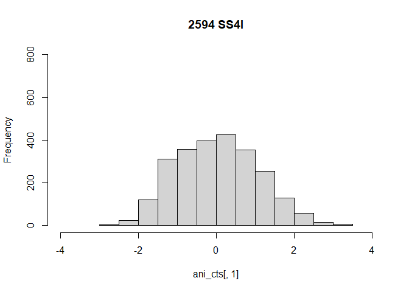<!-- -->

    ## [1] "2599"

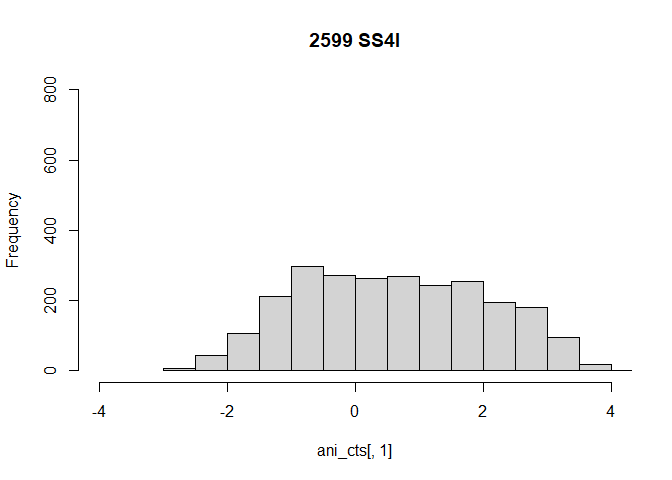<!-- -->

    ## [1] "2612"

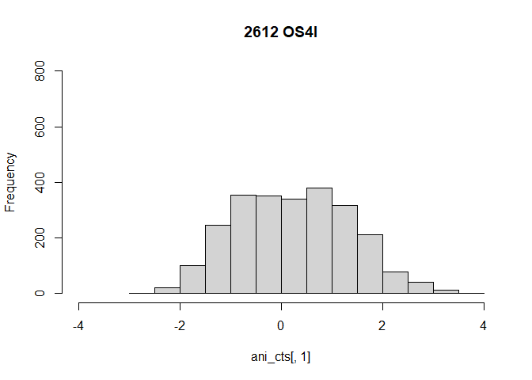<!-- -->

    ## [1] "2617"

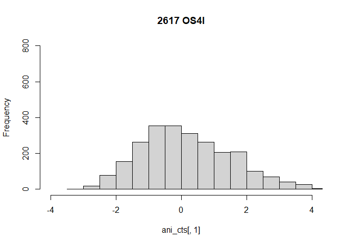<!-- -->

    ## [1] "2639"

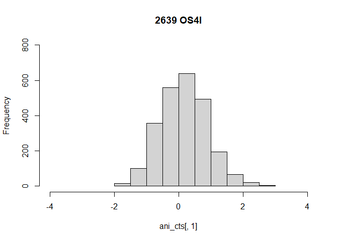<!-- -->

    ## [1] "2647"

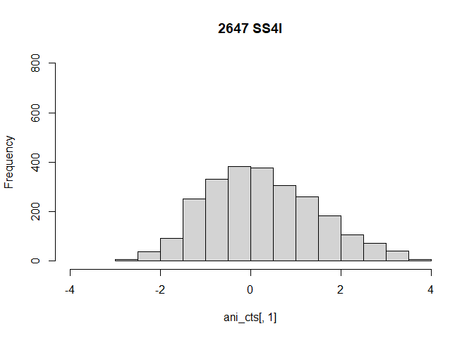<!-- -->

    ## [1] "2658"

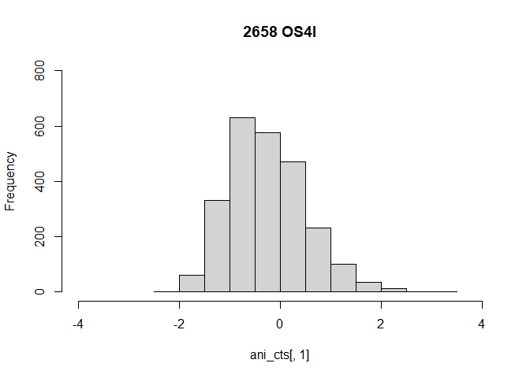<!-- -->

    ## [1] "2659"

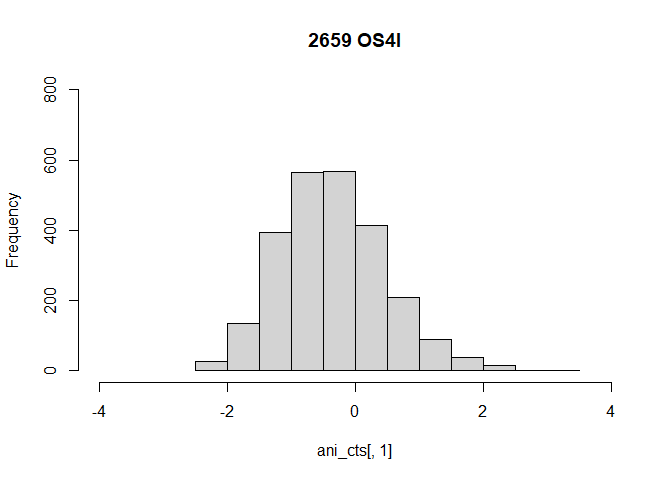<!-- -->

    ## [1] "2660"

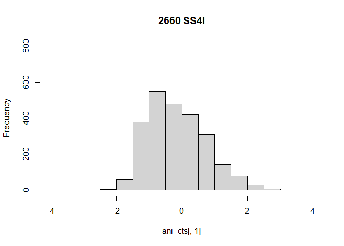<!-- -->

    ## [1] "2664"

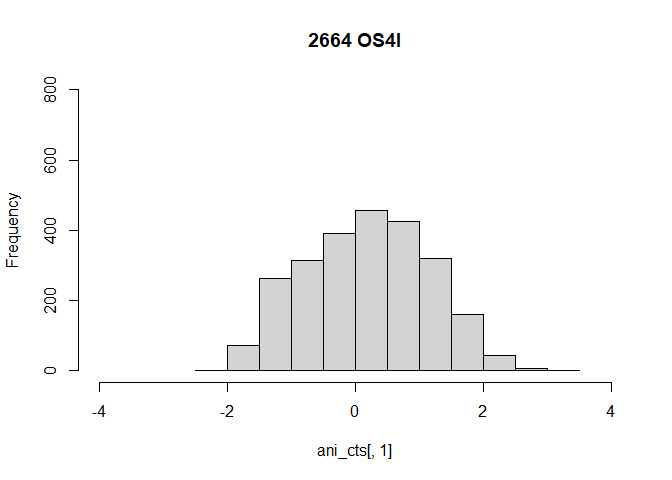<!-- -->

    ## [1] "2665"

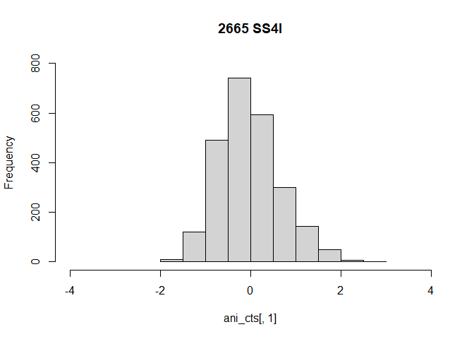<!-- -->

    ## [1] "2728"

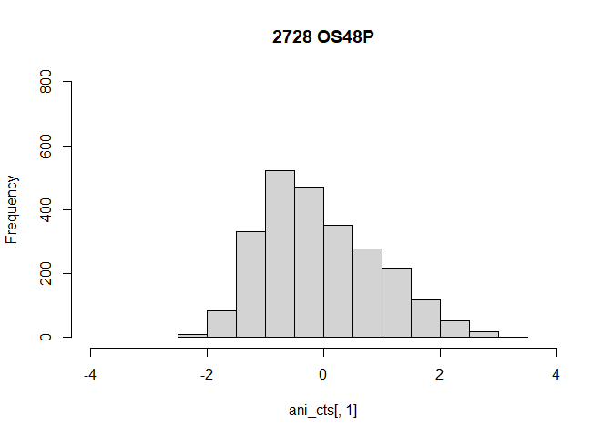<!-- -->

    ## [1] "2736"

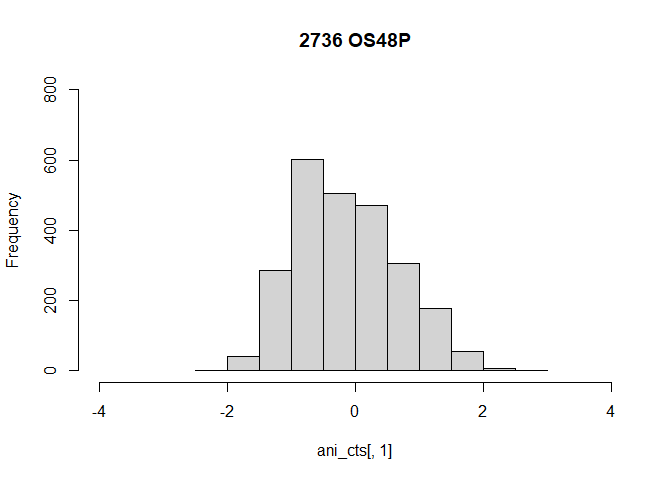<!-- -->

    ## [1] "2737"

<!-- -->

    ## [1] "2756"

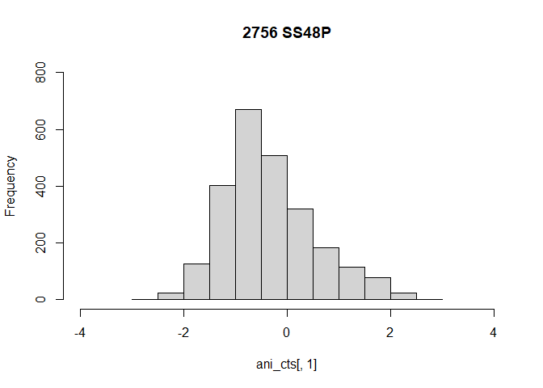<!-- -->

    ## [1] "2758"

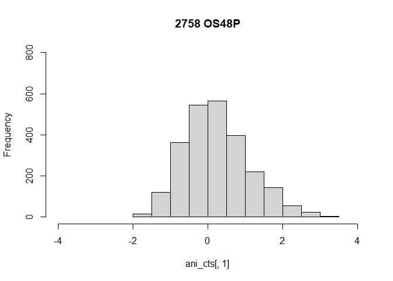<!-- -->

    ## [1] "2762"

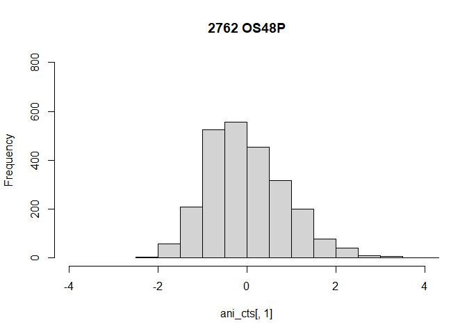<!-- -->

    ## [1] "2766"

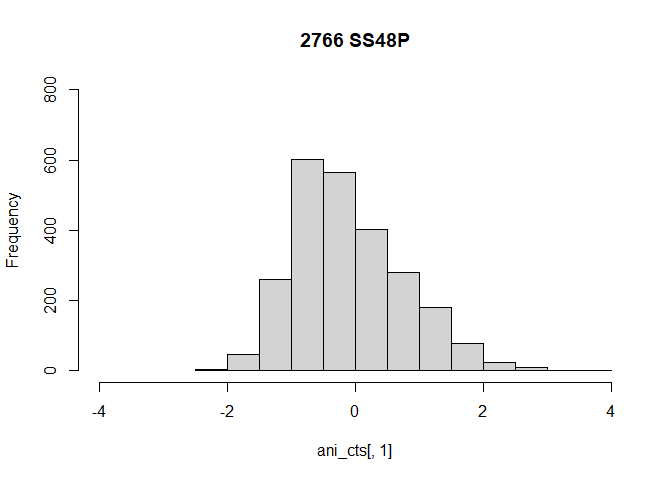<!-- -->

    ## [1] "2801"

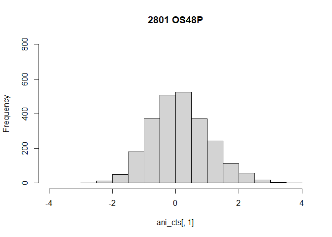<!-- -->

    ## [1] "2887"

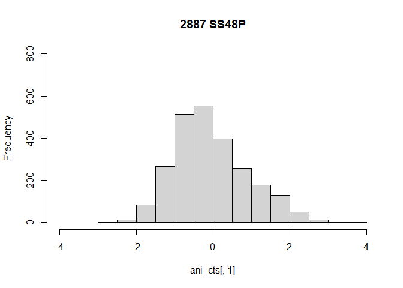<!-- -->

    ## [1] "2911"

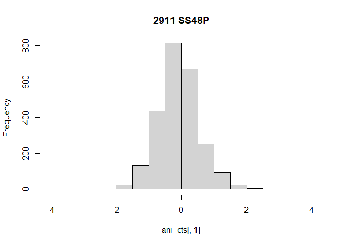<!-- -->

    ## [1] "2919"

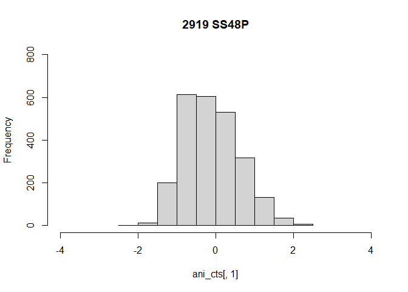<!-- -->

    ## [1] "2920"

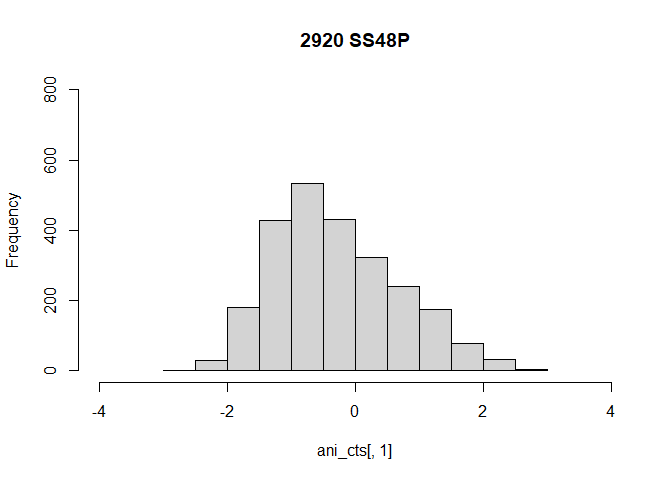<!-- -->

``` r
# #for raw counts
# for (ani in colnames(mod_inputs)) {
#   ani_df <- mod_inputs %>% select(ani)
#   ani_cts <- ani_df[1]
#   hist(ani_cts[,1], xlim = c(0, 200000), main = ani)
# }
```

animals with medium partner preference scores: “Counts2599I”,
“Counts2887P”, “Counts2758P”, “Counts2647I”  
excluding animal 2599

``` r
#filter out animal 2599
want_inputs_excl <- want_inputs %>% select(-c("Counts2599I")) #"Counts2599I" , "Counts2887I", "Counts2758I", "Counts2647I"
want_metrics_excl <- want_metrics %>% filter(!Animal %in% c("2599")) #, "2887", "2758", "2647"

norm_cts_all_excl <- get_norm_cts(want_inputs_excl, want_metrics_excl)
```

    ## factor levels were dropped which had no samples

    ## estimating size factors

    ## estimating dispersions

    ## gene-wise dispersion estimates

    ## mean-dispersion relationship

    ## final dispersion estimates

    ## fitting model and testing

``` r
mod_inputs_meta_excl <- transpose_norm_cts(norm_cts_all_excl)

#normalize counts (z-score)
norm_new_excl <- zscore_norm_cts(mod_inputs_meta_excl, all_genes)

norm_new_summ_mtx_excl <- avg_zscored_cts(norm_new_excl)
```

``` r
#to make and save heatmaps for each module
mods <- 6 #numbers here indicate the modules you want to make heatmap  (all modules would be 1:23)
for (m in mods) {
  make_heatmap(norm_new_summ_mtx_excl, mod = m, save = FALSE)
}
```

    ## 'heatmap_width' should not be set in draw() for horizontal heatmap list
    ## (Note a single heatmap is a horizontal heatmap list). Please directly
    ## set it in `Heatmap()`.

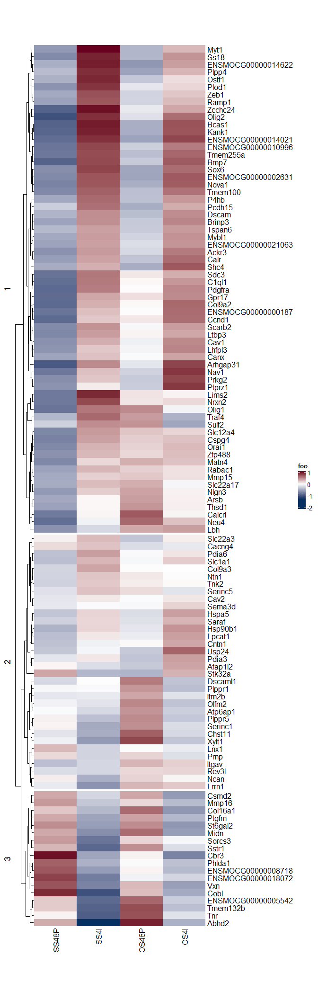<!-- -->

to get out clustering from heatmap and make ridgeline plots of z-scored
expression for each Module-6 gene

``` r
mods <- 6 #numbers here indicate the modules you want to make heatmap of
for (m in mods) {
  make_ridgelines(norm_new_summ_mtx_excl, norm_new, norm_cts_all_excl, metrics, mod = m, save = FALSE)
}
```

    ## Picking joint bandwidth of 0.405

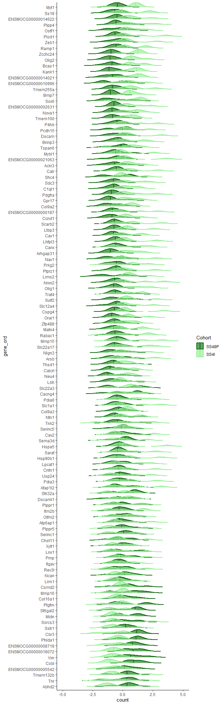<!-- -->

    ## Picking joint bandwidth of 0.475

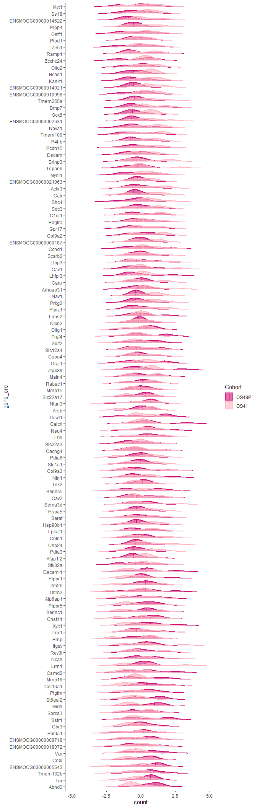<!-- -->

this block is to look at the difference between TRUE distribution of
gene change scores (per module) vs. the shuffled distribution (animal
IDs shuffled).  
first, i calculated the median for each gene in “paired” and “separated”
animals, then subtracted these values to find a change score  
then, i shuffled animal ID to create a null distribution of change
scores (should be centered around zero)  
then, i used an F-test to compare these distributions  
if the module is truly “socially sensitive”, the variance of the TRUE
change scores should be greater than the variance of the shuffled change
scores  
here i have combined OS and SS to JUST look at paired vs. isolated

``` r
##for non-shuffled change scores - only looking at separation condition
combine_norm_new <- mod_inputs_meta_excl %>% select(c("Animal", "Separation", all_genes)) #mod_inputs_meta_excl
combine_norm_new[all_genes] <- scale(combine_norm_new[all_genes])

#take median value of each group (i.e. separation condition)
combine_OSSS <- combine_norm_new %>% select(c("Animal", "Separation", all_genes)) %>% group_by(Separation) %>% dplyr::summarise_if(is.numeric, median)
rownames(combine_OSSS) <- combine_OSSS$Separation
stash_names <- rownames(combine_OSSS)

#do some data wrangling to get the isolated - paired value for each gene
combine_OSSS_mat <- combine_OSSS[,-1]
combine_OSSS_mat <- t(combine_OSSS_mat) %>% as.data.frame()
colnames(combine_OSSS_mat) <- stash_names
combine_OSSS_mat$IsoMinPair <- combine_OSSS_mat$Isolated - combine_OSSS_mat$Paired
combine_OSSS_mat$Gene <- rownames(combine_OSSS_mat)
combine_OSSS_mat <- combine_OSSS_mat %>% merge(mod_genes, on = "Gene")

#set up a df to hold p-values from F-test to compare distributions
hold_comb_values <- data.frame()
#we need to iterate through seeds for the shuffle because there aren't that many animals, so the seed can make a big difference
for (s in 1:100) {
  print(s)
  set.seed(s)
  
  #shuffle animal ID and then do same data manipulation as above
  norm_cts_shuff <- norm_cts_all_excl
  colnames(norm_cts_shuff) <- sample(colnames(norm_cts_shuff))
  
  mod_inputs_meta_shuff <- transpose_norm_cts(norm_cts_shuff)

  combine_norm_new_shuff <- mod_inputs_meta_shuff %>% select(c("Animal", "Separation", all_genes))
  combine_norm_new_shuff[all_genes] <- scale(combine_norm_new_shuff[all_genes])
  
  combine_OSSS_shuff <- combine_norm_new_shuff %>% select(c("Animal", "Separation", all_genes)) %>% group_by(Separation) %>% dplyr::summarise_if(is.numeric, median)
  rownames(combine_OSSS_shuff) <- combine_OSSS_shuff$Separation
  stash_names <- rownames(combine_OSSS_shuff)
  
  combine_OSSS_mat_shuff <- combine_OSSS_shuff[,-1]
  combine_OSSS_mat_shuff <- t(combine_OSSS_mat_shuff) %>% as.data.frame()
  colnames(combine_OSSS_mat_shuff) <- stash_names
  combine_OSSS_mat_shuff$IsoMinPair <- combine_OSSS_mat_shuff$Isolated - combine_OSSS_mat$Paired
  combine_OSSS_mat_shuff$Gene <- rownames(combine_OSSS_mat_shuff)
  combine_OSSS_mat_shuff <- combine_OSSS_mat_shuff %>% merge(mod_genes, on = "Gene")
  
  #iterate through modules to do a separate stats test for each seed (true vs. shuffled). this will give you 100 p-values per module
  for (mod in 1:23) { 
    mod_df <- combine_OSSS_mat %>% filter(Module == mod)
    mod_df_shuff <- combine_OSSS_mat_shuff %>% filter(Module == mod)
    
    all_var_test <- var.test(mod_df$IsoMinPair, mod_df_shuff$IsoMinPair)
    
    ##you can plot as a split violin if you want, but probably don't want to make 2300 plots
    # vioplot(IsoMinPair~Module, data=mod_df, col = "palevioletred", plotCentre = "line", side = "left", ylim = c(-3, 3))
    # vioplot(IsoMinPair~Module, data=mod_df_shuff, col = "lightblue", plotCentre = "line", side = "right", ylim = c(-3, 3), add = T, areaEqual = F)

    mini_df <- data.frame(Module = mod, seed = s, pval = all_var_test[3]$p.value, Fstat = all_var_test$statistic)
  
    hold_comb_values <- rbind(hold_comb_values, mini_df)
  }
}
```

SAVE csv

``` r
setwd("output/")
write.csv(hold_comb_values, "shuffled_seed_module_combineOSSS_pvals_100iter_excl2599.csv")
```

read back in csv

``` r
hold_comb_values <- read.csv("output/shuffled_seed_module_combineOSSS_pvals_100iter_excl2599.csv")
```

get summary stats from these tests

``` r
iter_summ_comb <- hold_comb_values %>% group_by(Module) %>% summarise(mean_pval = mean(pval), mean_F = mean(Fstat), median_pval = median(pval))
```

plot the data!  
first plot is bubble plot where size is % times p-value is under cutoff,
mean/median pval under cutoff is color  
second plot is a boxplot of the log10(p-values) for each module

``` r
hold_comb_values$log10pval <- log10(hold_comb_values$pval)

#get percent of iterations for each module with log10(p-val) < -5, then mean and median p-val
iter_summ_comb_cutoff <- hold_comb_values %>% group_by(Module) %>% summarise(perc_iters = sum(log10pval < -5), mean_pval = mean(log10pval), median_pval = median(log10pval))

#set up color palette for plotting mean p-values
myPalette <- colorRampPalette(c("whitesmoke", "#67001F"))(200) #, "#f0f921"


#plot bubble plot
p <- ggplot(iter_summ_comb_cutoff, aes(x = as.factor(Module), y = 1, fill = abs(mean_pval))) +
  geom_point(aes(size = perc_iters), alpha = 1, shape = 21) +
  scale_fill_gradientn(colors = myPalette, limits = c(0, max(abs(iter_summ_comb_cutoff$mean_pval))),
                       guide = guide_colorbar(frame.colour = "black", ticks.colour = "black")) +
  # scale_size_continuous(limits = c(0, min(iter_summ_comb_cutoff$mean_pval))) +
  # scale_fill_manual(values = clust_cols, guide = FALSE) +
  # scale_color_manual(values = clust_cols, guide = FALSE) +
  scale_y_discrete(labels = 1:23) +
  theme(panel.background = element_blank(), panel.border = element_rect(colour = "grey70", fill = NA, size = 1))

print(p)
```

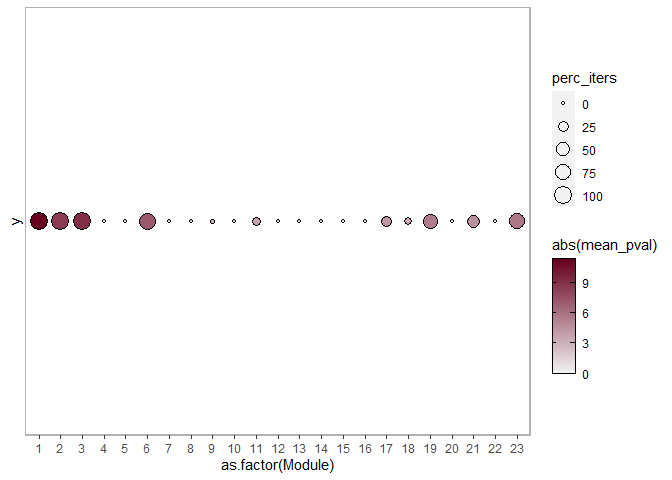<!-- -->

``` r
#plot boxplot
p2 <- ggplot(hold_comb_values, aes(x = as.factor(Module), y = log10(pval))) + geom_boxplot() + geom_hline(yintercept = -5, color = "red", linetype = "dashed") + theme_classic()
print(p2)
```

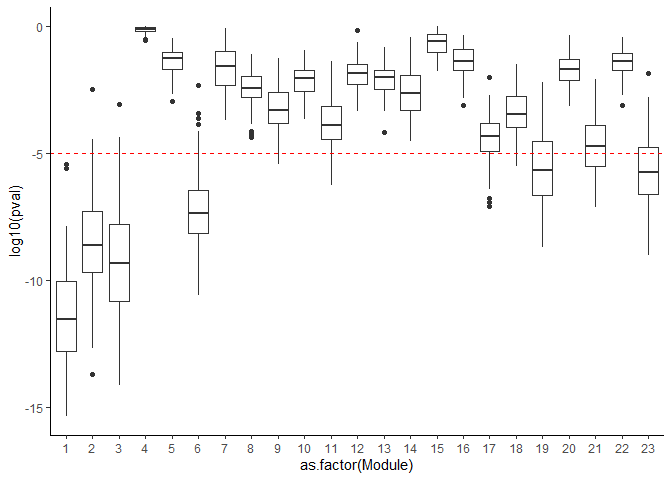<!-- -->

``` r
#pvalue plot
setwd("output/")
ggsave("bubbleplot_combineSSOS_pvals_cutoff_Ftests_excl2599.pdf", p)
```

    ## Saving 7 x 5 in image

``` r
ggsave("boxplot_combineSSOS_pvals_Ftests_excl2599.pdf", p2)
```

    ## Saving 7 x 5 in image

heatmap clustering animals by separation condition

``` r
setwd("output/")
mods <- 6
for (mod in mods) {
  m_genes <- mod_genes$Gene[mod_genes$Module == mod]
  m_genes <- intersect(m_genes, rownames(norm_cts_all_excl))
  
  norm_cts_mod <- norm_new_excl %>% select(Animal, Cohort, Separation, m_genes)
  rownames(norm_cts_mod) <- norm_cts_mod$Animal
  col_fun = colorRamp2(c(min(norm_cts_mod[,-c(1:3)]), 0, max(norm_cts_mod[,-c(1:3)])), c("#053061","white", "#67001F"))
  
  # row_ha <- rowAnnotation(Cohort = norm_cts_mod$Cohort, col = list(Cohort = c("OS48P" = "deeppink3", "SS48P" = "darkgreen", "OS4I" = "lightpink", "SS4I" = "lightgreen")))
  row_ha <- rowAnnotation(Separation = norm_cts_mod$Separation, col = list(Separation = c("Paired" = "darkblue", "Isolated" = "lightblue")))
  ht <- Heatmap(norm_cts_mod[,-c(1:3)], right_annotation = row_ha, column_title = paste0("Module-", mod), col = col_fun) #km = 4, 
  draw(ht)
  #get out dendrogram info
  og_dend <- row_dend(ht)
  #to save heatmap
  pdf(paste0("module_", mod, "_heatmap_paired_isolated_excl2599.pdf"))
  draw(Heatmap(norm_cts_mod[,-c(1:3)], right_annotation = row_ha, cluster_rows = og_dend, split = 4, column_title = paste0("Module-", mod), col = col_fun)) #km = 4,
  dev.off()

}
```

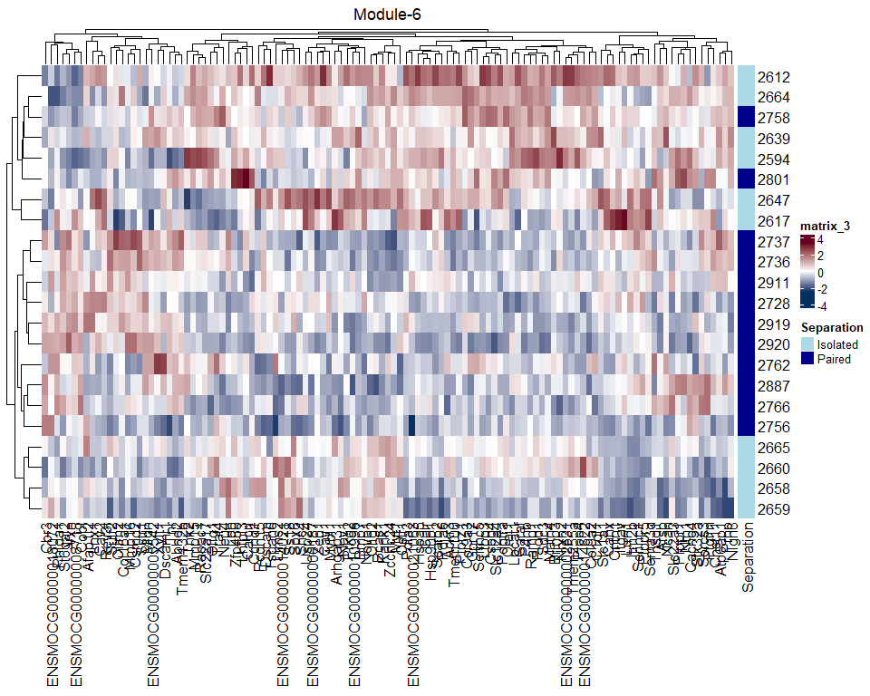<!-- -->

``` r
sessionInfo()
```

    ## R version 4.2.2 (2022-10-31 ucrt)
    ## Platform: x86_64-w64-mingw32/x64 (64-bit)
    ## Running under: Windows 10 x64 (build 22631)
    ## 
    ## Matrix products: default
    ## 
    ## locale:
    ## [1] LC_COLLATE=English_United States.utf8 
    ## [2] LC_CTYPE=English_United States.utf8   
    ## [3] LC_MONETARY=English_United States.utf8
    ## [4] LC_NUMERIC=C                          
    ## [5] LC_TIME=English_United States.utf8    
    ## 
    ## attached base packages:
    ## [1] grid      stats4    stats     graphics  grDevices utils     datasets 
    ## [8] methods   base     
    ## 
    ## other attached packages:
    ##  [1] gprofiler2_0.2.1            vioplot_0.5.0              
    ##  [3] zoo_1.8-12                  sm_2.2-6.0                 
    ##  [5] ggridges_0.5.4              colorRamp2_0.1.0           
    ##  [7] ComplexHeatmap_2.14.0       SuperExactTest_1.1.0       
    ##  [9] stringi_1.7.12              scales_1.2.1               
    ## [11] UpSetR_1.4.0                RRHO2_1.0                  
    ## [13] VennDiagram_1.7.3           futile.logger_1.4.3        
    ## [15] EnhancedVolcano_1.16.0      DESeq2_1.38.3              
    ## [17] SummarizedExperiment_1.28.0 Biobase_2.58.0             
    ## [19] MatrixGenerics_1.10.0       matrixStats_0.63.0         
    ## [21] GenomicRanges_1.50.2        GenomeInfoDb_1.34.9        
    ## [23] IRanges_2.32.0              S4Vectors_0.36.2           
    ## [25] BiocGenerics_0.44.0         ggpubr_0.6.0               
    ## [27] ez_4.4-0                    gridExtra_2.3              
    ## [29] car_3.1-2                   carData_3.0-5              
    ## [31] readxl_1.4.2                viridis_0.6.2              
    ## [33] viridisLite_0.4.1           wesanderson_0.3.6          
    ## [35] GGally_2.1.2                ggrepel_0.9.3              
    ## [37] ggfortify_0.4.16            lubridate_1.9.2            
    ## [39] forcats_1.0.0               stringr_1.5.0              
    ## [41] dplyr_1.1.1                 purrr_1.0.1                
    ## [43] readr_2.1.4                 tidyr_1.3.0                
    ## [45] tibble_3.2.1                ggplot2_3.4.2              
    ## [47] tidyverse_2.0.0            
    ## 
    ## loaded via a namespace (and not attached):
    ##   [1] backports_1.4.1        circlize_0.4.15        systemfonts_1.0.4     
    ##   [4] plyr_1.8.8             lazyeval_0.2.2         splines_4.2.2         
    ##   [7] BiocParallel_1.32.5    digest_0.6.31          foreach_1.5.2         
    ##  [10] htmltools_0.5.5        fansi_1.0.4            magrittr_2.0.3        
    ##  [13] memoise_2.0.1          cluster_2.1.4          doParallel_1.0.17     
    ##  [16] tzdb_0.4.0             Biostrings_2.66.0      annotate_1.76.0       
    ##  [19] timechange_0.2.0       colorspace_2.1-0       blob_1.2.4            
    ##  [22] textshaping_0.3.6      xfun_0.38              jsonlite_1.8.4        
    ##  [25] crayon_1.5.2           RCurl_1.98-1.12        lme4_1.1-33           
    ##  [28] iterators_1.0.14       glue_1.6.2             gtable_0.3.3          
    ##  [31] zlibbioc_1.44.0        XVector_0.38.0         GetoptLong_1.0.5      
    ##  [34] DelayedArray_0.24.0    shape_1.4.6            abind_1.4-5           
    ##  [37] futile.options_1.0.1   DBI_1.1.3              rstatix_0.7.2         
    ##  [40] Rcpp_1.0.10            xtable_1.8-4           clue_0.3-64           
    ##  [43] bit_4.0.5              htmlwidgets_1.6.2      httr_1.4.5            
    ##  [46] RColorBrewer_1.1-3     farver_2.1.1           pkgconfig_2.0.3       
    ##  [49] reshape_0.8.9          XML_3.99-0.14          locfit_1.5-9.7        
    ##  [52] utf8_1.2.3             labeling_0.4.2         tidyselect_1.2.0      
    ##  [55] rlang_1.1.1            reshape2_1.4.4         AnnotationDbi_1.60.0  
    ##  [58] munsell_0.5.0          cellranger_1.1.0       tools_4.2.2           
    ##  [61] cachem_1.0.7           cli_3.6.0              generics_0.1.3        
    ##  [64] RSQLite_2.3.1          broom_1.0.4            evaluate_0.20         
    ##  [67] fastmap_1.1.1          ragg_1.2.5             yaml_2.3.7            
    ##  [70] knitr_1.42             bit64_4.0.5            KEGGREST_1.38.0       
    ##  [73] nlme_3.1-162           formatR_1.14           compiler_4.2.2        
    ##  [76] rstudioapi_0.14        plotly_4.10.1          png_0.1-8             
    ##  [79] ggsignif_0.6.4         geneplotter_1.76.0     highr_0.10            
    ##  [82] lattice_0.21-8         Matrix_1.6-2           nloptr_2.0.3          
    ##  [85] vctrs_0.6.1            pillar_1.9.0           lifecycle_1.0.3       
    ##  [88] GlobalOptions_0.1.2    data.table_1.14.6      bitops_1.0-7          
    ##  [91] R6_2.5.1               codetools_0.2-19       lambda.r_1.2.4        
    ##  [94] boot_1.3-28.1          MASS_7.3-58.3          rjson_0.2.21          
    ##  [97] withr_2.5.0            GenomeInfoDbData_1.2.9 mgcv_1.8-42           
    ## [100] parallel_4.2.2         hms_1.1.3              minqa_1.2.5           
    ## [103] rmarkdown_2.25         Cairo_1.6-0
