UMAP Clustering and cell type proportions
================
Liza Brusman
2024-02-26

``` r
#load packages
library(dplyr)
library(tidyr)
library(Seurat)
library(scCustomize)
library(ggplot2)
library(forcats)
library(ggpubr)
library(palettetown)
library(gridExtra)
library(glmmTMB)
library(DHARMa)
```

import previously saved seurat object

``` r
#import seurat object. samples from all animals have already been integrated and non-nucleus accumbens cells have already been filtered out
#this file should be ~17.6 GB when imported
SCT_norm <- readRDS("output/SCT_norm.rds")
```

create aesthetic UMAP

``` r
#pick new palette for UMAP
palette <- c("#304880", "#4898D0", "#88C0F0", "#9060A0", "#C078C0", "#389078", "#70A830", "#98D048", "#60D0A0", "#80E8C0", "#783028", "#B82820", "#D04058", "#F87878", "#F89040") 

#reorder clusters for plotting
order <- c("Drd1Pdyn", "Drd1PdynOprm1", "Drd1Penk", "Drd2Penk", "Drd2NoPenk", "GABAergicNeurons", "Dlx2ImmatureNeurons", "SstNpyInterneurons", "PvalbInterneurons", "CholinergicInterneurons", "MatureOligos", "ImmatureOligos", "Astrocytes", "Microglia", "RadialGlia-LikeCells")

DefaultAssay(SCT_norm) <- "SCT"
Idents(SCT_norm) <- "new_clusts"

# reorder clusters
Idents(SCT_norm) <- factor(Idents(SCT_norm), 
                            levels=order)

#create UMAP
ani.umap <- DimPlot(object = SCT_norm, reduction = "umap", label = FALSE, cols = palette, raster = FALSE)
print(ani.umap)
```

<!-- -->

``` r
# setwd("output/")
# ggsave(
#   "umap_final.pdf",
#   plot = ani.umap,
#   device = pdf,
#   scale = 1,
#   width = 9.5,
#   height = 7,
#   units = c("in"),
#   dpi = 300,
#   limitsize = FALSE,
#   bg = "white"
# )
```

make dotplot of known marker genes

``` r
# reorder clusters so they're in right order to plot
order <- rev(c("Drd1Pdyn", "Drd1PdynOprm1", "Drd1Penk", "Drd2Penk", "Drd2NoPenk", "GABAergicNeurons", "Dlx2ImmatureNeurons", "SstNpyInterneurons", "PvalbInterneurons", "CholinergicInterneurons", "MatureOligos", "ImmatureOligos", "Astrocytes", "Microglia", "RadialGlia-LikeCells"))

Idents(SCT_norm) <- "new_clusts"

Idents(SCT_norm) <- factor(Idents(SCT_norm), 
                            levels=order)

#set default assay to SCT
DefaultAssay(SCT_norm) <- "SCT"

markers.to.plot <- c("DRD1A", "DRD2", "Pdyn", "Penk", "Oprm1", "Igfbpl1", "Dlx2", "Sst", "Npy", "Vip", "Kit", "Chat", "Mog", "Olig2", "Pdgfra", "Gja1", "Aif1", "Vim", "Elavl2", "Gad1", "Syt1")

# #create dotplot with original colors
# dots <- DotPlot_scCustom(SCT_norm, features = markers.to.plot, dot.scale = 12, col.min=0, col.max=3, colors_use = viridis_plasma_light_high) + RotatedAxis()
# print(dots)

#create dotplot with new colors
dots <- DotPlot(SCT_norm, features = markers.to.plot, dot.scale = 12, col.min=0, col.max=3, cols = c("whitesmoke", "black")) + 
    RotatedAxis()
print(dots)
```

<!-- -->

``` r
# setwd("output/")
# ggsave(
#   "dotplot_black.pdf",
#   plot = dots,
#   device = pdf,
#   scale = 1,
#   width = 12,
#   height = 8,
#   units = c("in"),
#   dpi = 300,
#   limitsize = TRUE,
#   bg = "white"
# )
```

get top marker genes for each cluster

``` r
#find all markers
Idents(SCT_norm) <- "new_clusts"
markers <- FindAllMarkers(SCT_norm, only.pos=TRUE, min.pct=0.25, logfc.threshold=0.25)
markers <- markers %>% group_by(cluster) %>% arrange(desc(avg_log2FC), .by_group=TRUE)

# setwd("output/")
# write.csv(markers, "SCT_norm_markers.csv")
```

read in markers

``` r
markers <- read.csv("output/SCT_norm_markers.csv")
```

make heatmap of top 10 marker genes for each cluster this takes a long
time to run

``` r
DefaultAssay(SCT_norm) <- "SCT"
Idents(SCT_norm) <- "new_clusts"

order <- c("Drd1Pdyn", "Drd1PdynOprm1", "Drd1Penk", "Drd2Penk", "Drd2NoPenk", "GABAergicNeurons", "Dlx2ImmatureNeurons", "SstNpyInterneurons", "PvalbInterneurons", "CholinergicInterneurons", "MatureOligos", "ImmatureOligos", "Astrocytes", "Microglia", "RadialGlia-LikeCells")

palette <- c("#304880", "#4898D0", "#88C0F0", "#9060A0", "#C078C0", "#389078", "#70A830", "#98D048", "#60D0A0", "#80E8C0", "#783028", "#B82820", "#D04058", "#F87878", "#F89040") #"#98F088", 

# reorder clusters
Idents(SCT_norm) <- factor(Idents(SCT_norm),
                            levels=order)

#find top 10 markers for each cluster
markers %>% group_by(cluster) %>% top_n(n=10, wt=avg_log2FC) -> top10
top10 <- top10 %>% arrange(factor(cluster, levels = order))

heat <- DoHeatmap(SCT_norm, features = top10$gene, group.colors = palette) + NoLegend() + scale_fill_viridis_c(option = "magma") + theme(text = element_text(size = 8))
```

    ## Scale for fill is already present.
    ## Adding another scale for fill, which will replace the existing scale.

``` r
print(heat)
```

<!-- -->

``` r
# setwd("output/")
# ggsave(
#   "heatmap.png",
#   plot = heat,
#   device = png,
#   scale = 1,
#   width = 12,
#   height = 8,
#   units = c("in"),
#   dpi = 300,
#   limitsize = TRUE,
#   bg = "white"
# )
```

stacked barplot of cell types in groups

``` r
# reorder clusters
order <- c("Drd1Pdyn", "Drd1PdynOprm1", "Drd1Penk", "Drd2Penk", "Drd2NoPenk", "GABAergicNeurons", "Dlx2ImmatureNeurons", "SstNpyInterneurons", "PvalbInterneurons", "CholinergicInterneurons", "MatureOligos", "ImmatureOligos", "Astrocytes", "Microglia", "RadialGlia-LikeCells")
palette <- c("#304880", "#4898D0", "#88C0F0", "#9060A0", "#C078C0", "#389078", "#70A830", "#98D048", "#60D0A0", "#80E8C0", "#783028", "#B82820", "#D04058", "#F87878", "#F89040") #"#98F088",

Idents(SCT_norm) <- "new_clusts"
Idents(SCT_norm) <- factor(Idents(SCT_norm), 
                            levels=order)
#find proportions of each cell type per group
SCT_norm$Group <- paste(SCT_norm$Sex, SCT_norm$SSOS, sep = "_")
props <- prop.table(table(Idents(SCT_norm), SCT_norm$Group), margin = 2)
#x100 to get percentages
props <- props*100
#reorder columns to plot in correct order
props <- props[,c("F_SS", "F_OS", "M_SS", "M_OS")]

# Open a pdf file
pdf("output/stackedbar.pdf", width = 8, height = 10)
#set font parameters for barplot
par(cex.axis=2, cex.lab=3)
# Get the stacked barplot
barplot(props, 
        col=palette ,
        border="white", 
        space=0.04, 
        font.axis=1,
        # cex.axis = 2,
        # cex.lab = 2,
        xlab="Group",
        ylab="Percent of Cells",
        las = 1
        # legend=rownames(props)
        )
#close pdf file
dev.off()
```

    ## png 
    ##   2

import metadata

``` r
metadata <- read.csv("../../docs/seq_beh_metadata.csv")
```

``` r
#find proportions of each cell type per animal
Idents(SCT_norm) <- "new_clusts"
props_perani <- prop.table(table(Idents(SCT_norm), SCT_norm$Ani), margin = 2)
#x100 to get percentages
props_perani <- props_perani*100
#reorder columns to plot in correct order
# props <- props[,c("F_SS", "F_OS", "M_SS", "M_OS")]

props_perani <- props_perani %>% as.data.frame
props_perani <- props_perani %>% rename("animal" = "Var2")

props_perani <- merge(props_perani, metadata, on = "animal")
props_perani$Group <- paste(props_perani$sex, props_perani$SS_OS, sep = "_")
```

``` r
# reorder clusters
order <- c("Drd1Pdyn", "Drd1PdynOprm1", "Drd1Penk", "Drd2Penk", "Drd2NoPenk", "GABAergicNeurons", "Dlx2ImmatureNeurons", "SstNpyInterneurons", "PvalbInterneurons", "CholinergicInterneurons", "MatureOligos", "ImmatureOligos", "Astrocytes", "Microglia", "RadialGlia-LikeCells")

setwd("output/")
#look at percentages by cluster
my_comparisons <- list( c("F_SS", "F_OS"), c("M_SS", "M_OS"), c("F_OS", "M_OS"), c("F_SS", "M_SS"))
for (clust in order) {
  print(clust)
  mini_df <- props_perani %>% filter(Var1 == clust)
  p <- mini_df %>% mutate(Group = fct_relevel(Group, "F_SS", "F_OS", "M_SS", "M_OS")) %>% ggplot(aes(x = Group, y = Freq, fill = Group, color = Group, alpha = 0.8)) + 
    geom_violin(lwd = 0.75) + 
    geom_point(position = position_dodge(width = 0.75), color = "slategrey", size = 2, alpha = 1) + 
    stat_compare_means(comparisons= my_comparisons, paired = FALSE) +
    scale_fill_manual(values = c("F_SS" = "mediumpurple",
                                "F_OS"="darkorchid4",
                                "M_SS"="lightseagreen",
                                "M_OS"="deepskyblue4")) +
    scale_color_manual(values = c("F_SS" = "mediumpurple",
                                "F_OS"="darkorchid4",
                                "M_SS"="lightseagreen",
                                "M_OS"="deepskyblue4")) +
    ylim(0, NA) +
    ggtitle(clust) + 
    ylab("Percent of Cells") +
    xlab("Group") +
    theme_classic() +
    theme(text = element_text(size = 40))# + theme(axis.text.x = element_text(angle = 45, vjust = 1, hjust=1))
    print(p)

  
  # fname_pdf <- paste(clust, "props_violin.pdf", sep ="_")
  # fname_png <- paste(clust, "props_violin.png", sep ="_")
  # ggsave(fname_pdf, p, height = 8, width = 10, units = "in", device = pdf)
  # ggsave(fname_png, p, bg = "white", height = 8, width = 10, units = "in", device = png)
  }
```

    ## [1] "Drd1Pdyn"

<!-- -->

    ## [1] "Drd1PdynOprm1"

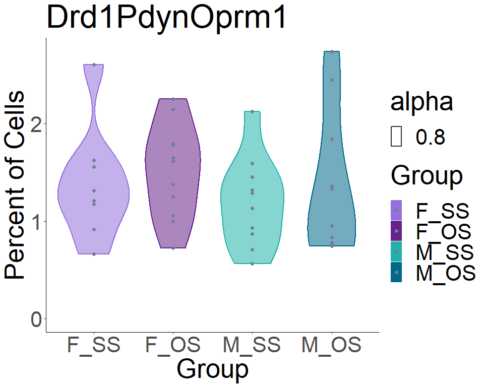<!-- -->

    ## [1] "Drd1Penk"

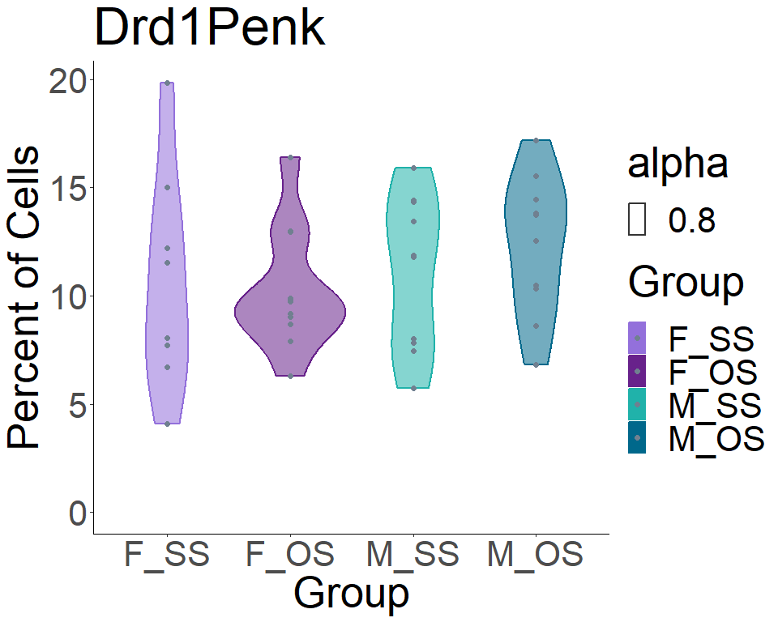<!-- -->

    ## [1] "Drd2Penk"

<!-- -->

    ## [1] "Drd2NoPenk"

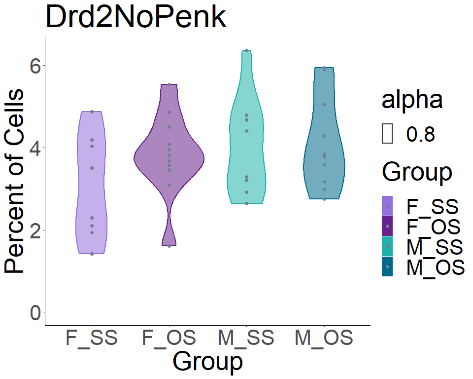<!-- -->

    ## [1] "GABAergicNeurons"

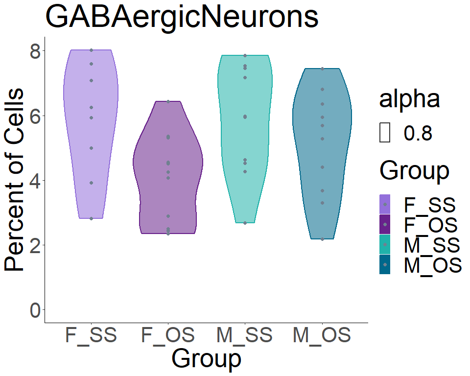<!-- -->

    ## [1] "Dlx2ImmatureNeurons"

<!-- -->

    ## [1] "SstNpyInterneurons"

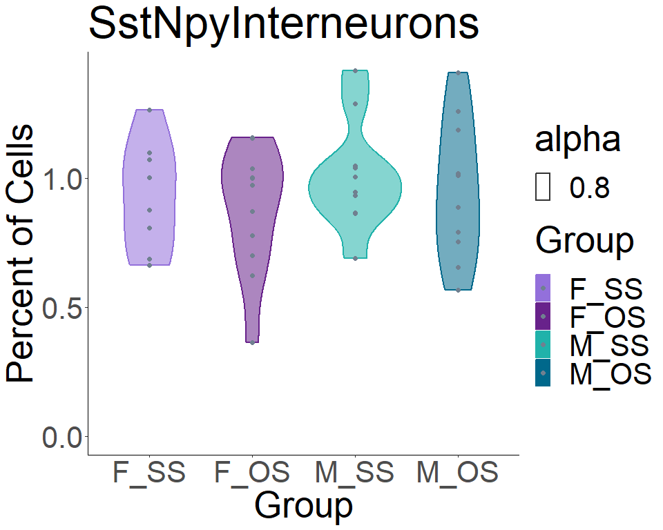<!-- -->

    ## [1] "PvalbInterneurons"

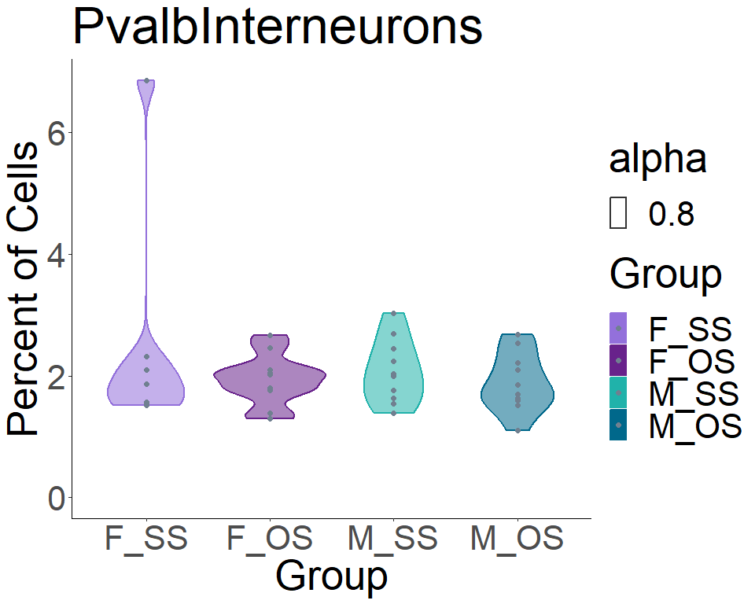<!-- -->

    ## [1] "CholinergicInterneurons"

<!-- -->

    ## [1] "MatureOligos"

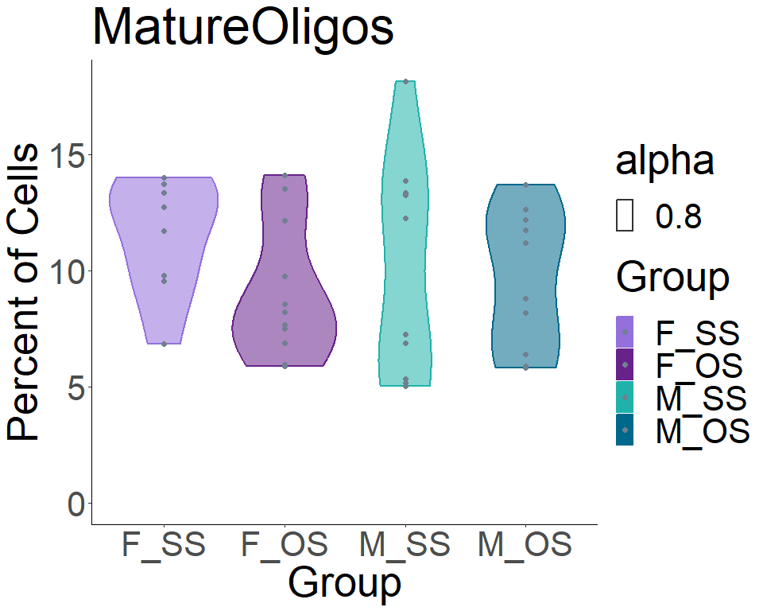<!-- -->

    ## [1] "ImmatureOligos"

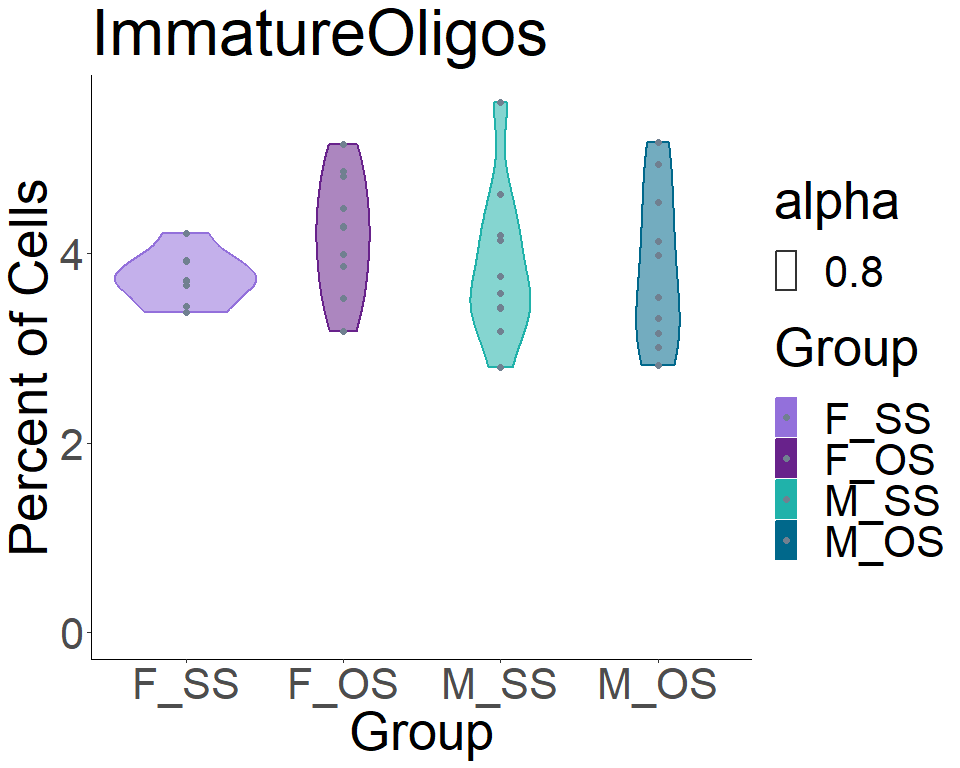<!-- -->

    ## [1] "Astrocytes"

<!-- -->

    ## [1] "Microglia"

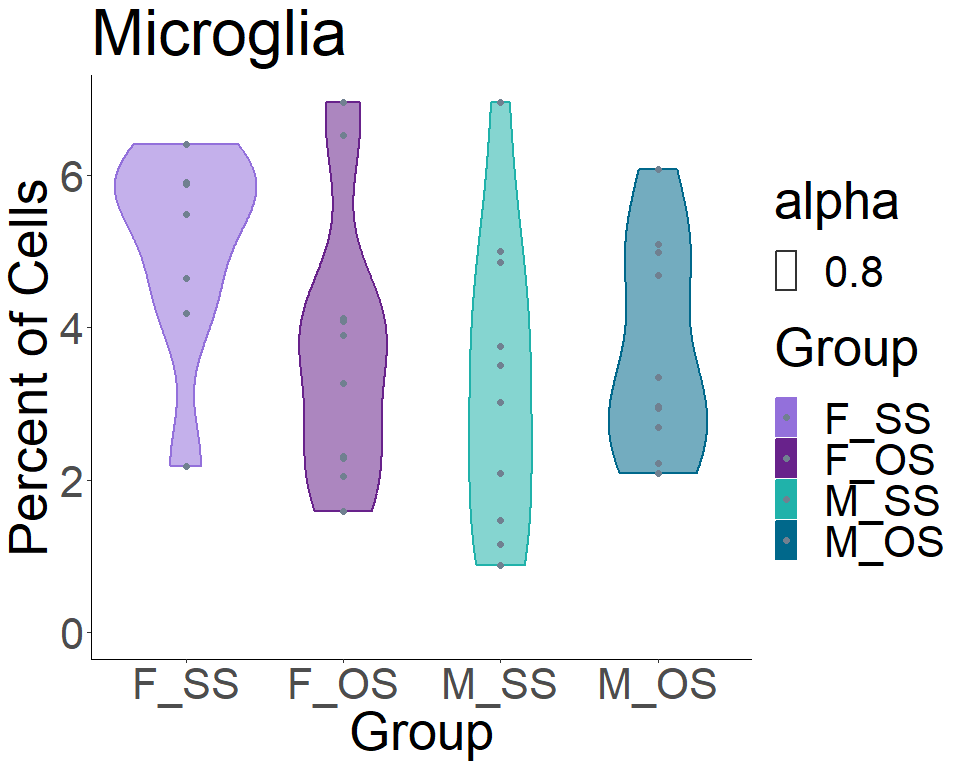<!-- -->

    ## [1] "RadialGlia-LikeCells"

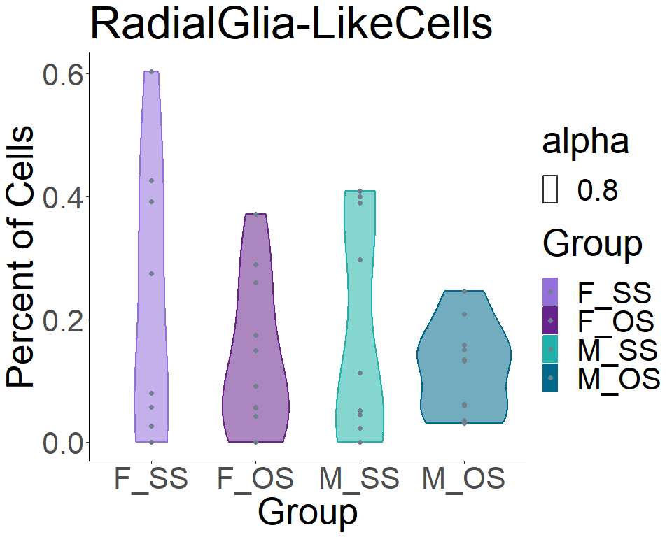<!-- -->

faceted plots

``` r
# reorder clusters
order <- c("Drd1Pdyn", "Drd1PdynOprm1", "Drd1Penk", "Drd2Penk", "Drd2NoPenk", "GABAergicNeurons", "Dlx2ImmatureNeurons", "SstNpyInterneurons", "PvalbInterneurons", "CholinergicInterneurons", "MatureOligos", "ImmatureOligos", "Astrocytes", "Microglia", "RadialGlia-LikeCells")

#look at percentages by cluster
my_comparisons <- list( c("F_SS", "F_OS"), c("M_SS", "M_OS"), c("F_OS", "M_OS"), c("F_SS", "M_SS"))
plt_list <- list()
for (clust in order) {
  print(clust)
  mini_df <- props_perani %>% filter(Var1 == clust)
  p <- mini_df %>% mutate(Group = fct_relevel(Group, "F_SS", "F_OS", "M_SS", "M_OS")) %>% ggplot(aes(x = Group, y = Freq, fill = Group, color = Group, alpha = 0.8)) + 
    geom_violin(lwd = 0.75) + 
    geom_point(position = position_dodge(width = 0.75), color = "slategrey", size = 1, alpha = 1) + 
    # stat_compare_means(comparisons= my_comparisons, paired = FALSE) +
    scale_fill_manual(values = c("F_SS" = "mediumpurple",
                                "F_OS"="darkorchid4",
                                "M_SS"="lightseagreen",
                                "M_OS"="deepskyblue4")) +
    scale_color_manual(values = c("F_SS" = "mediumpurple",
                                "F_OS"="darkorchid4",
                                "M_SS"="lightseagreen",
                                "M_OS"="deepskyblue4")) +
    ylim(0, NA) +
    ggtitle(clust) + 
    ylab("Percent of Cells") +
    xlab("Group") +
    theme_classic() +
    theme(text = element_text(size = 8))# + theme(axis.text.x = element_text(angle = 45, vjust = 1, hjust=1))
    print(p)

  plt_list[[clust]] <- p
}
```

    ## [1] "Drd1Pdyn"

<!-- -->

    ## [1] "Drd1PdynOprm1"

<!-- -->

    ## [1] "Drd1Penk"

<!-- -->

    ## [1] "Drd2Penk"

<!-- -->

    ## [1] "Drd2NoPenk"

<!-- -->

    ## [1] "GABAergicNeurons"

<!-- -->

    ## [1] "Dlx2ImmatureNeurons"

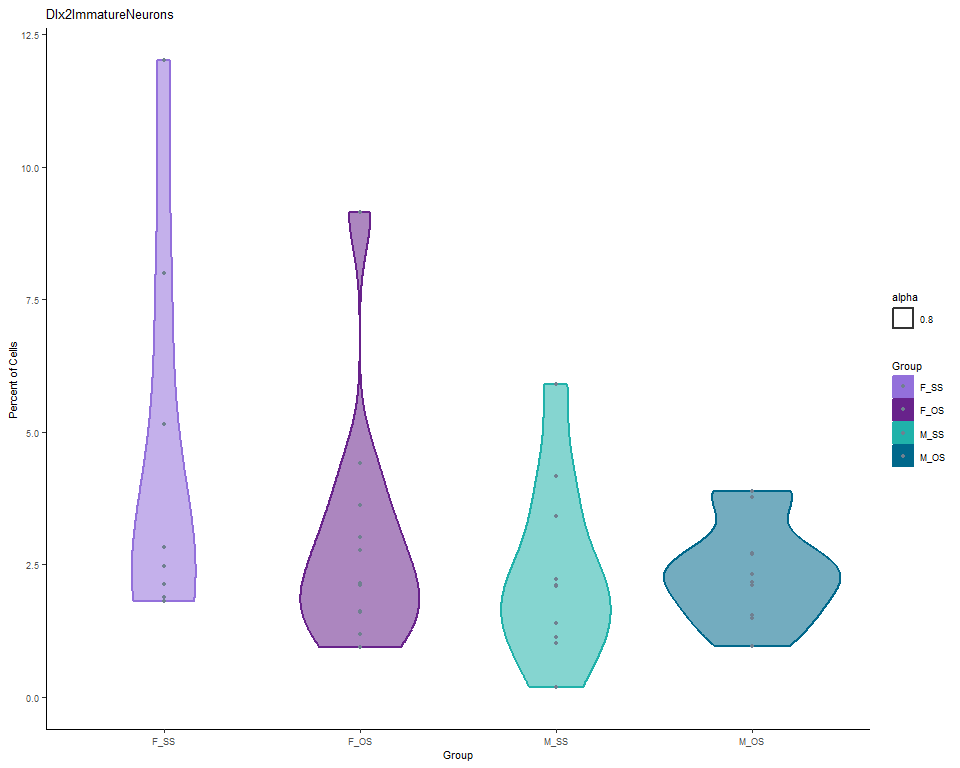<!-- -->

    ## [1] "SstNpyInterneurons"

<!-- -->

    ## [1] "PvalbInterneurons"

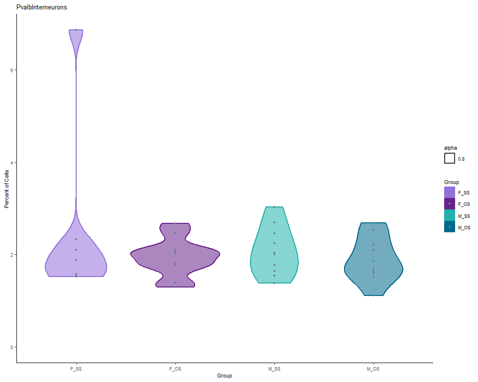<!-- -->

    ## [1] "CholinergicInterneurons"

<!-- -->

    ## [1] "MatureOligos"

<!-- -->

    ## [1] "ImmatureOligos"

<!-- -->

    ## [1] "Astrocytes"

<!-- -->

    ## [1] "Microglia"

<!-- -->

    ## [1] "RadialGlia-LikeCells"

<!-- -->

``` r
all_plt <- grid.arrange(grobs = plt_list, nrow = 3)
```

<!-- -->

``` r
all_plt
```

    ## TableGrob (3 x 5) "arrange": 15 grobs
    ##                          z     cells    name           grob
    ## Drd1Pdyn                 1 (1-1,1-1) arrange gtable[layout]
    ## Drd1PdynOprm1            2 (1-1,2-2) arrange gtable[layout]
    ## Drd1Penk                 3 (1-1,3-3) arrange gtable[layout]
    ## Drd2Penk                 4 (1-1,4-4) arrange gtable[layout]
    ## Drd2NoPenk               5 (1-1,5-5) arrange gtable[layout]
    ## GABAergicNeurons         6 (2-2,1-1) arrange gtable[layout]
    ## Dlx2ImmatureNeurons      7 (2-2,2-2) arrange gtable[layout]
    ## SstNpyInterneurons       8 (2-2,3-3) arrange gtable[layout]
    ## PvalbInterneurons        9 (2-2,4-4) arrange gtable[layout]
    ## CholinergicInterneurons 10 (2-2,5-5) arrange gtable[layout]
    ## MatureOligos            11 (3-3,1-1) arrange gtable[layout]
    ## ImmatureOligos          12 (3-3,2-2) arrange gtable[layout]
    ## Astrocytes              13 (3-3,3-3) arrange gtable[layout]
    ## Microglia               14 (3-3,4-4) arrange gtable[layout]
    ## RadialGlia-LikeCells    15 (3-3,5-5) arrange gtable[layout]

``` r
# setwd("output/")
# ggsave("all_cluster_props_violins.pdf", all_plt, width = 16, height = 8, units = "in")
```

do stats on violin plots

``` r
props_perani_wide <- props_perani %>% pivot_wider(id_cols = c("animal", "sex", "SS_OS"), names_from = "Var1", values_from = "Freq")
all_contrasts <- data.frame(contrast = character(), 
                            estimate = numeric(), 
                            SE = numeric(), 
                            df = numeric(), 
                            t.ratio = numeric(), 
                            p.value = numeric(), 
                            Module = character())

for (clust in order) {
  form <- formula(paste0(clust, "~sex*SS_OS"))
  fit <- glmmTMB(form, data = props_perani_wide)
  print(summary(fit))
  
  # simres <- simulateResiduals(fit)
  # plot(simres, title = clust)
  
  EMM <- emmeans(fit, ~ sex*SS_OS)
  # print(summary(pairwise_comparisons))
  coef <- contrast(EMM, "pairwise")[c(1, 2, 5, 6)]
  coef2 <- summary(coef, adjust = "fdr")
  print(coef2)
  mini.df <- coef2 %>% as.data.frame()
  mini.df$Cluster <- clust
  
  all_contrasts <- rbind(all_contrasts, mini.df)
  
}
```

sessioninfo

``` r
sessionInfo()
```

    ## R version 4.2.2 (2022-10-31 ucrt)
    ## Platform: x86_64-w64-mingw32/x64 (64-bit)
    ## Running under: Windows 10 x64 (build 22621)
    ## 
    ## Matrix products: default
    ## 
    ## locale:
    ## [1] LC_COLLATE=English_United States.utf8 
    ## [2] LC_CTYPE=English_United States.utf8   
    ## [3] LC_MONETARY=English_United States.utf8
    ## [4] LC_NUMERIC=C                          
    ## [5] LC_TIME=English_United States.utf8    
    ## 
    ## attached base packages:
    ## [1] stats     graphics  grDevices utils     datasets  methods   base     
    ## 
    ## other attached packages:
    ##  [1] DHARMa_0.4.6       glmmTMB_1.1.8      gridExtra_2.3      palettetown_0.1.1 
    ##  [5] ggpubr_0.6.0       forcats_1.0.0      ggplot2_3.4.2      scCustomize_1.1.1 
    ##  [9] SeuratObject_4.1.3 Seurat_4.3.0       tidyr_1.3.0        dplyr_1.1.1       
    ## 
    ## loaded via a namespace (and not attached):
    ##   [1] backports_1.4.1        circlize_0.4.15        plyr_1.8.8            
    ##   [4] igraph_1.4.2           lazyeval_0.2.2         sp_1.6-0              
    ##   [7] TMB_1.9.10             splines_4.2.2          listenv_0.9.0         
    ##  [10] scattermore_0.8        TH.data_1.1-2          digest_0.6.31         
    ##  [13] htmltools_0.5.5        fansi_1.0.4            magrittr_2.0.3        
    ##  [16] tensor_1.5             paletteer_1.5.0        cluster_2.1.4         
    ##  [19] ROCR_1.0-11            globals_0.16.2         matrixStats_0.63.0    
    ##  [22] sandwich_3.0-2         timechange_0.2.0       spatstat.sparse_3.0-1 
    ##  [25] colorspace_2.1-0       ggrepel_0.9.3          xfun_0.38             
    ##  [28] jsonlite_1.8.4         lme4_1.1-33            progressr_0.13.0      
    ##  [31] spatstat.data_3.0-1    survival_3.5-5         zoo_1.8-12            
    ##  [34] glue_1.6.2             polyclip_1.10-4        gtable_0.3.3          
    ##  [37] emmeans_1.8.5          leiden_0.4.3           car_3.1-2             
    ##  [40] future.apply_1.10.0    shape_1.4.6            abind_1.4-5           
    ##  [43] scales_1.2.1           mvtnorm_1.1-3          rstatix_0.7.2         
    ##  [46] spatstat.random_3.1-4  miniUI_0.1.1.1         Rcpp_1.0.10           
    ##  [49] viridisLite_0.4.1      xtable_1.8-4           reticulate_1.28       
    ##  [52] htmlwidgets_1.6.2      httr_1.4.5             RColorBrewer_1.1-3    
    ##  [55] ellipsis_0.3.2         ica_1.0-3              farver_2.1.1          
    ##  [58] pkgconfig_2.0.3        uwot_0.1.14            deldir_1.0-6          
    ##  [61] utf8_1.2.3             janitor_2.2.0          labeling_0.4.2        
    ##  [64] tidyselect_1.2.0       rlang_1.1.1            reshape2_1.4.4        
    ##  [67] later_1.3.0            munsell_0.5.0          tools_4.2.2           
    ##  [70] cli_3.6.0              ggprism_1.0.4          generics_0.1.3        
    ##  [73] broom_1.0.4            ggridges_0.5.4         evaluate_0.20         
    ##  [76] stringr_1.5.0          fastmap_1.1.1          yaml_2.3.7            
    ##  [79] goftest_1.2-3          rematch2_2.1.2         knitr_1.42            
    ##  [82] fitdistrplus_1.1-8     purrr_1.0.1            RANN_2.6.1            
    ##  [85] pbapply_1.7-0          future_1.32.0          nlme_3.1-162          
    ##  [88] mime_0.12              ggrastr_1.0.1          compiler_4.2.2        
    ##  [91] rstudioapi_0.14        beeswarm_0.4.0         plotly_4.10.1         
    ##  [94] png_0.1-8              ggsignif_0.6.4         spatstat.utils_3.0-2  
    ##  [97] tibble_3.2.1           stringi_1.7.12         highr_0.10            
    ## [100] lattice_0.21-8         Matrix_1.6-1           nloptr_2.0.3          
    ## [103] vctrs_0.6.1            pillar_1.9.0           lifecycle_1.0.3       
    ## [106] spatstat.geom_3.1-0    lmtest_0.9-40          GlobalOptions_0.1.2   
    ## [109] estimability_1.4.1     RcppAnnoy_0.0.20       data.table_1.14.6     
    ## [112] cowplot_1.1.1          irlba_2.3.5.1          httpuv_1.6.9          
    ## [115] patchwork_1.1.2        R6_2.5.1               promises_1.2.0.1      
    ## [118] KernSmooth_2.23-20     vipor_0.4.5            parallelly_1.35.0     
    ## [121] codetools_0.2-19       boot_1.3-28.1          MASS_7.3-58.3         
    ## [124] withr_2.5.0            sctransform_0.3.5      multcomp_1.4-23       
    ## [127] mgcv_1.8-42            parallel_4.2.2         grid_4.2.2            
    ## [130] coda_0.19-4            minqa_1.2.5            rmarkdown_2.25        
    ## [133] snakecase_0.11.0       carData_3.0-5          Rtsne_0.16            
    ## [136] spatstat.explore_3.1-0 numDeriv_2016.8-1.1    shiny_1.7.4           
    ## [139] lubridate_1.9.2        ggbeeswarm_0.7.1

Add a new chunk by clicking the *Insert Chunk* button on the toolbar or
by pressing *Ctrl+Alt+I*.

When you save the notebook, an HTML file containing the code and output
will be saved alongside it (click the *Preview* button or press
*Ctrl+Shift+K* to preview the HTML file).

The preview shows you a rendered HTML copy of the contents of the
editor. Consequently, unlike *Knit*, *Preview* does not run any R code
chunks. Instead, the output of the chunk when it was last run in the
editor is displayed.
