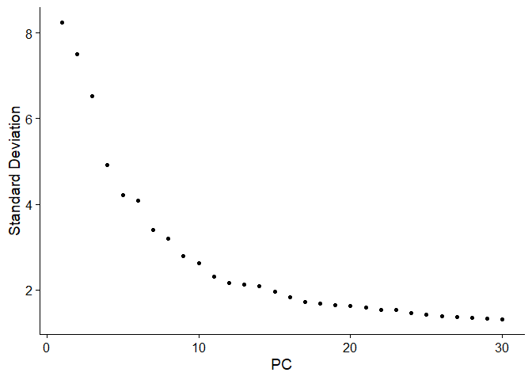
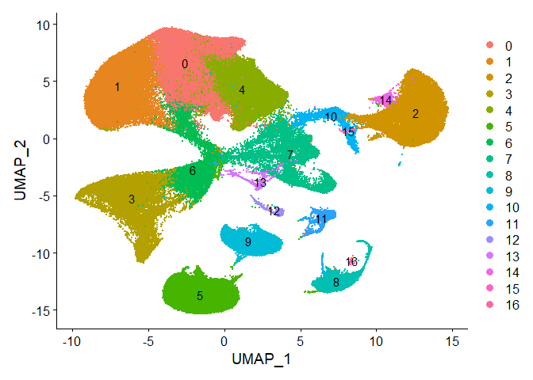
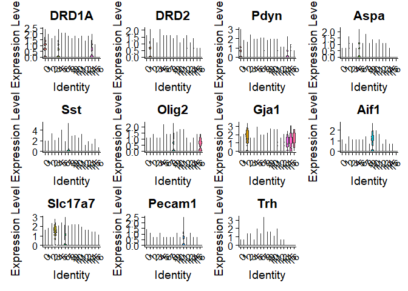
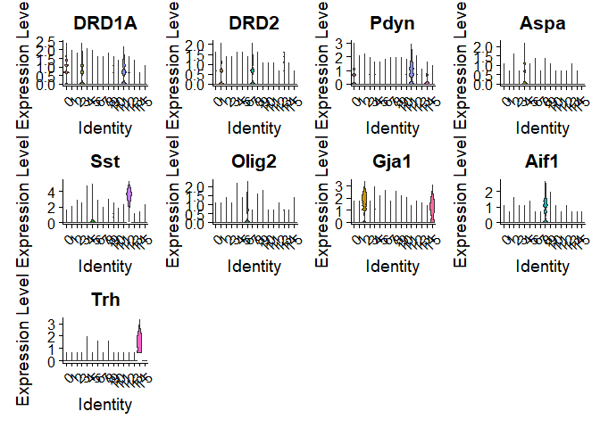
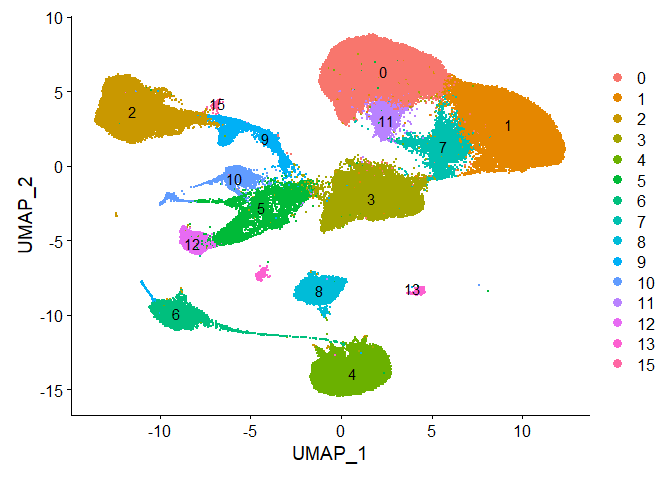
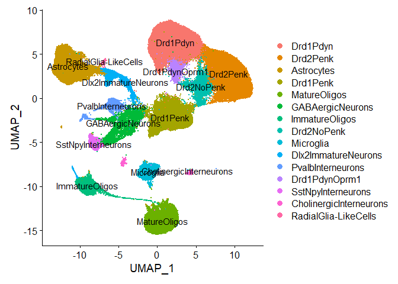

Batch correction and choosing UMAP parameters
================
Liza Brusman
2024-02-26

load packages

``` r
#load packages
library(dplyr)
library(tidyr)
library(Seurat)
library(scCustomize)
library(ggplot2)
library(forcats)
library(ggpubr)
```

import seurat object with all samples integrated

``` r
SCT_norm <- readRDS("C:/Users/Liza/Desktop/seq_analysis/rccluster/SCT_integration_cluster/output/all_samples_integrated.rds")
```

regress out sequencing cohort and behavior cohort effects

``` r
#set default assay in Seurat object
DefaultAssay(object = SCT_norm) <- "RNA"
#remove any cells with >7500 counts (probably doublets)
SCT_norm <- subset(SCT_norm, nCount_RNA < 7500)
#regress out cohort effects
SCT_norm <- SCTransform(SCT_norm, vars.to.regress = c("SeqCohort", "BehCohort"), return.only.var.genes = TRUE)
```

save batch corrected seurat object

``` r
setwd("output/")
saveRDS(SCT_norm, file = "SCT_nofilt.rds")
```

then can read in that file if we don’t want to do the batch correction
part again

``` r
SCT_norm <- readRDS("output/SCT_nofilt.rds")
```

elbow plot of \# dimensions

``` r
elb.plt <- ElbowPlot(object = SCT_norm, ndims = 30)
print(elb.plt)
```

<!-- -->

find best number of PCs for UMAP and which clusters to remove

``` r
SCT_norm <- RunPCA(SCT_norm,npcs = 50)
```

    ## PC_ 1 
    ## Positive:  Penk, Atp2b1, Atp1b1, Gria2, Elmod1, Atp1a3, Grin1, Ndrg4, Snap25, Adcy5 
    ##     Gpr88, Pde1b, Tac1, Tmem130, Cx3cl1, ENSMOCG00000017923, ENSMOCG00000002921, Chn1, Ptprn, Gnal 
    ##     Rgs9, Sez6, Ptpn5, Peg3, Scg2, Gpm6a, Car11, Celf2, Nsg2, ENSMOCG00000004472 
    ## Negative:  Plp1, Ptgds, Mbp, Cldn11, Mag, Mal, Apod, Tubb4a, Mog, Ugt8a 
    ##     ENSMOCG00000006609, Ppp1r14a, Cryab, Gpr37, Myrf, Opalin, Sgk1, Enpp2, Hapln2, Pllp 
    ##     Qdpr, Cnp, Cntn2, Lpar1, Fa2h, Scd2, Bcas1, Cd9, Evi2a, Abca2 
    ## PC_ 2 
    ## Positive:  Cst3, Apoe, Slc1a3, Slc1a2, Atp1a2, Gja1, Ctss, Plpp3, Htra1, Gpr37l1 
    ##     Agt, Cx3cr1, C1qb, Slc7a10, Sparcl1, Csf1r, S1pr1, Fetub, Atp1b2, Ntsr2 
    ##     Slc7a11, Bcan, P2ry12, Laptm5, Hexb, ENSMOCG00000014634, Zfp36l2, Aqp4, Efemp1, Slc27a1 
    ## Negative:  Plp1, Penk, Atp2b1, Gria2, Atp1b1, App, Elmod1, Atp1a3, Adcy5, Grin1 
    ##     Ndrg4, Gpr88, Pde1b, Tac1, Snap25, Tmem130, Gnal, Ptprn, Cx3cl1, Rgs9 
    ##     ENSMOCG00000017923, ENSMOCG00000002921, Ptpn5, Mbp, Scg2, Sez6, Plppr4, Car11, Chn1, Nsg2 
    ## PC_ 3 
    ## Positive:  Cst3, Ctss, Cx3cr1, C1qb, Csf1r, P2ry12, Laptm5, ENSMOCG00000014634, C3, Slco2b1 
    ##     C1qa, Tmem119, Gpr34, ENSMOCG00000009232, Aif1, Fcrls, C1qc, Ccr5, Cd5l, ENSMOCG00000018499 
    ##     Ly86, Hexb, Fcer1g, P2ry13, Cd53, Ifngr1, Sparc, ENSMOCG00000021052, Itgam, Blnk 
    ## Negative:  Slc1a2, Slc1a3, Apoe, Atp1a2, Gja1, Plpp3, Htra1, Gpr37l1, Agt, Slc7a10 
    ##     Sparcl1, Fetub, S1pr1, Atp1b2, Ntsr2, Bcan, Slc7a11, Efemp1, Aqp4, Slc27a1 
    ##     Fgfr3, Ttyh1, Prodh, Fads2, Cpe, Rgma, Myorg, Gramd3, Lgi4, Dkk3 
    ## PC_ 4 
    ## Positive:  Slc1a3, Cst3, Slc1a2, Apoe, Ctss, Gja1, Plp1, Ptgds, Plpp3, Penk 
    ##     Agt, Cx3cr1, Gpr37l1, C1qb, Htra1, Slc7a10, Csf1r, Ntsr2, Bcan, Fetub 
    ##     Cyp46a1, P2ry12, Laptm5, Atp2b1, Ttyh1, ENSMOCG00000014634, Slc7a11, Elmod1, Slc27a1, Adcy5 
    ## Negative:  Flt1, ENSMOCG00000019320, Cxcl12, Atp13a5, Itm2a, ENSMOCG00000020797, Cldn5, Abcb1a, Vtn, Slc6a20a 
    ##     Igfbp7, Pecam1, Selenop, Sparc, Itih5, Kdr, Adgrf5, Tek, Prom1, Itga1 
    ##     Klf2, Ptprb, Lef1, Slc2a1, Wfdc1, Esam, Vim, Pltp, Cdh5, Eng 
    ## PC_ 5 
    ## Positive:  Penk, Atp2b1, Adcy5, Gpr88, Elmod1, Pde1b, Rgs9, Gnal, Ppp1r1b, Tac1 
    ##     Sez6, Phactr1, Gpr6, Wfs1, Strip2, Baiap2, Gria2, Adora2a, Ddx5, Car11 
    ##     ENSMOCG00000004472, Chn1, Cx3cl1, Ptpn5, Adamts3, Ppp1r2, Cacna2d3, Ngef, Cyp46a1, Cfap54 
    ## Negative:  Sst, Npy, Nos1, Crhbp, Chodl, Lhx6, Pdgfra, Pcdh18, Otc, ENSMOCG00000000187 
    ##     Peg3, Gpr17, Gpr101, Elfn1, Mxra7, Dner, ENSMOCG00000019997, Cygb, Elavl2, Slc6a1 
    ##     Atp1b1, Gad1, Cdh13, Grin3a, Col25a1, Moxd1, Calb2, Gpr83, Ache, Sox6

``` r
SCT_norm <- FindNeighbors(SCT_norm, reduction = "pca", dims = 1:30)
```

    ## Computing nearest neighbor graph

    ## Computing SNN

``` r
SCT_norm <- FindClusters(SCT_norm, resolution = 0.2) 
```

    ## Modularity Optimizer version 1.3.0 by Ludo Waltman and Nees Jan van Eck
    ## 
    ## Number of nodes: 178020
    ## Number of edges: 6091390
    ## 
    ## Running Louvain algorithm...
    ## Maximum modularity in 10 random starts: 0.9646
    ## Number of communities: 19
    ## Elapsed time: 79 seconds

    ## 2 singletons identified. 17 final clusters.

``` r
SCT_norm <- RunUMAP(SCT_norm, reduction = "pca", dims = 1:30)
```

    ## 16:33:55 UMAP embedding parameters a = 0.9922 b = 1.112

    ## 16:33:55 Read 178020 rows and found 30 numeric columns

    ## 16:33:55 Using Annoy for neighbor search, n_neighbors = 30

    ## 16:33:55 Building Annoy index with metric = cosine, n_trees = 50

    ## 0%   10   20   30   40   50   60   70   80   90   100%

    ## [----|----|----|----|----|----|----|----|----|----|

    ## **************************************************|
    ## 16:34:10 Writing NN index file to temp file C:\Users\Liza\AppData\Local\Temp\RtmpI5shSh\file2e205e05dc3
    ## 16:34:10 Searching Annoy index using 1 thread, search_k = 3000
    ## 16:35:06 Annoy recall = 100%
    ## 16:35:06 Commencing smooth kNN distance calibration using 1 thread with target n_neighbors = 30
    ## 16:35:13 Initializing from normalized Laplacian + noise (using irlba)
    ## 16:35:39 Commencing optimization for 200 epochs, with 8105786 positive edges
    ## 16:38:10 Optimization finished

``` r
ani.umap <- DimPlot(object = SCT_norm, reduction = "umap", label = TRUE, raster = FALSE) #+ scale_x_reverse() + scale_y_reverse()
print(ani.umap)
```

<!-- -->

``` r
umap.vln <- VlnPlot(SCT_norm, features=c("DRD1A", "DRD2", "Pdyn", "Aspa", "Sst", "Olig2", "Gja1", "Aif1", "Slc17a7", "Pecam1", "Trh"), pt.size = 0, combine = TRUE)
```

    ## Rasterizing points since number of points exceeds 100,000.
    ## To disable this behavior set `raster=FALSE`
    ## Rasterizing points since number of points exceeds 100,000.
    ## To disable this behavior set `raster=FALSE`
    ## Rasterizing points since number of points exceeds 100,000.
    ## To disable this behavior set `raster=FALSE`
    ## Rasterizing points since number of points exceeds 100,000.
    ## To disable this behavior set `raster=FALSE`
    ## Rasterizing points since number of points exceeds 100,000.
    ## To disable this behavior set `raster=FALSE`
    ## Rasterizing points since number of points exceeds 100,000.
    ## To disable this behavior set `raster=FALSE`
    ## Rasterizing points since number of points exceeds 100,000.
    ## To disable this behavior set `raster=FALSE`
    ## Rasterizing points since number of points exceeds 100,000.
    ## To disable this behavior set `raster=FALSE`
    ## Rasterizing points since number of points exceeds 100,000.
    ## To disable this behavior set `raster=FALSE`
    ## Rasterizing points since number of points exceeds 100,000.
    ## To disable this behavior set `raster=FALSE`
    ## Rasterizing points since number of points exceeds 100,000.
    ## To disable this behavior set `raster=FALSE`

``` r
print(umap.vln)
```

<!-- -->
take out clusters that have Slc17a7 (excitatory neurons - not NAc) or
Pecam1 - endothelial cells

``` r
#clusters 3 and 6 express Slc17a7, cluster 11 expresses Pecam
SCT_norm <- subset(SCT_norm, idents = c(3, 6, 11), invert=TRUE)
```

``` r
#run PCA on new object
SCT_norm <- RunPCA(SCT_norm, npcs = 50)
```

    ## PC_ 1 
    ## Positive:  Plp1, Ptgds, Mbp, Cldn11, Mag, Mal, Apod, Tubb4a, Mog, Ugt8a 
    ##     ENSMOCG00000006609, Ppp1r14a, Cryab, Gpr37, Myrf, Opalin, Sgk1, Enpp2, Hapln2, Pllp 
    ##     Qdpr, Cnp, Cntn2, Lpar1, Fa2h, Scd2, Bcas1, Cd9, Evi2a, Abca2 
    ## Negative:  Penk, Atp2b1, Cst3, Gria2, Elmod1, Atp1b1, Adcy5, Gpr88, Tac1, Pde1b 
    ##     Slc1a2, Atp1a3, Grin1, Ctss, Ndrg4, Rgs9, Gnal, Apoe, Tmem130, Cx3cl1 
    ##     Sez6, Ptpn5, ENSMOCG00000002921, Scg2, Car11, Chn1, Ptprn, Cyp46a1, Gpm6a, Sst 
    ## PC_ 2 
    ## Positive:  Cst3, Apoe, Slc1a3, Slc1a2, Atp1a2, Gja1, Ctss, Plpp3, Htra1, Gpr37l1 
    ##     Agt, Cx3cr1, C1qb, Csf1r, Slc7a10, Sparcl1, S1pr1, Fetub, Atp1b2, Ntsr2 
    ##     Slc7a11, Bcan, P2ry12, Laptm5, ENSMOCG00000014634, Hexb, Zfp36l2, Aqp4, Efemp1, Slc27a1 
    ## Negative:  Penk, Atp2b1, Gria2, Adcy5, Elmod1, App, Atp1b1, Gpr88, Tac1, Pde1b 
    ##     Atp1a3, Grin1, Gnal, Ndrg4, Rgs9, Plp1, Tmem130, Ptpn5, Cx3cl1, Sez6 
    ##     Scg2, Ptprn, ENSMOCG00000002921, Car11, Sst, Cacna2d3, Plppr4, Nsg2, ENSMOCG00000017923, Strip2 
    ## PC_ 3 
    ## Positive:  Cst3, Ctss, Cx3cr1, C1qb, Csf1r, P2ry12, Laptm5, ENSMOCG00000014634, C3, Slco2b1 
    ##     C1qa, Tmem119, Gpr34, ENSMOCG00000009232, Aif1, Fcrls, C1qc, Ccr5, Cd5l, ENSMOCG00000018499 
    ##     Ly86, Hexb, Fcer1g, P2ry13, Cd53, Ifngr1, ENSMOCG00000021052, Sparc, Itgam, Blnk 
    ## Negative:  Slc1a2, Slc1a3, Apoe, Atp1a2, Gja1, Plpp3, Htra1, Gpr37l1, Agt, Slc7a10 
    ##     Sparcl1, Fetub, S1pr1, Atp1b2, Ntsr2, Bcan, Slc7a11, Efemp1, Aqp4, Slc27a1 
    ##     Fgfr3, Ttyh1, Prodh, Fads2, Cpe, Rgma, Myorg, Gramd3, Lgi4, Dkk3 
    ## PC_ 4 
    ## Positive:  Sst, Npy, Nos1, Crhbp, Chodl, Pdgfra, Lhx6, Pcdh18, ENSMOCG00000000187, Otc 
    ##     Gpr17, Peg3, Gpr101, Elfn1, Mxra7, Cygb, Dner, Slc6a1, Gad1, Elavl2 
    ##     ENSMOCG00000019997, Grin3a, Col25a1, Moxd1, Sox6, Cspg4, Calb2, Gpr83, Ache, Atp1b1 
    ## Negative:  Penk, Atp2b1, Adcy5, Gpr88, Elmod1, Pde1b, Rgs9, Gnal, Ppp1r1b, Sez6 
    ##     Phactr1, Tac1, Gpr6, Baiap2, Gria2, Chn1, Strip2, Wfs1, ENSMOCG00000004472, Adora2a 
    ##     Car11, Ddx5, Cx3cl1, Adamts3, Ngef, Ptpn5, Ppp1r2, Cyp46a1, Cacna2d3, Icam5 
    ## PC_ 5 
    ## Positive:  Sst, Npy, Ptgds, Slc1a2, Slc1a3, Penk, Gja1, Agt, Nos1, Cst3 
    ##     Apoe, Slc7a10, S1pr1, Atp2b1, Cyp46a1, Gpr88, Adcy5, Elmod1, Slc7a11, Cldn11 
    ##     Crhbp, Mal, Atp1b1, Tac1, Pde1b, Rgma, Ntsr2, Slc27a1, Efemp1, Aqp4 
    ## Negative:  Pdgfra, Gpr17, ENSMOCG00000000187, Cspg4, C1ql1, Bcas1, Ptprz1, Kank1, Cav1, Vxn 
    ##     ENSMOCG00000002631, Tmem255b, Sparcl1, Olig1, Col9a3, ENSMOCG00000014622, Lhfpl3, Olig2, Matn4, Calcrl 
    ##     Serinc5, Arsb, Cav2, Susd5, Arhgap31, Mmp15, Col9a2, Mtss2, ENSMOCG00000007565, Sapcd2

``` r
#find neighbors
SCT_norm <- FindNeighbors(SCT_norm, reduction = "pca", dims = 1:50)
```

    ## Computing nearest neighbor graph

    ## Computing SNN

``` r
#create clusters
SCT_norm <- FindClusters(SCT_norm, resolution = 0.18) 
```

    ## Modularity Optimizer version 1.3.0 by Ludo Waltman and Nees Jan van Eck
    ## 
    ## Number of nodes: 142908
    ## Number of edges: 4934009
    ## 
    ## Running Louvain algorithm...
    ## Maximum modularity in 10 random starts: 0.9685
    ## Number of communities: 19
    ## Elapsed time: 76 seconds

    ## 3 singletons identified. 16 final clusters.

``` r
#run UMAP
SCT_norm <- RunUMAP(SCT_norm, reduction = "pca", dims = 1:50)
```

    ## 16:42:02 UMAP embedding parameters a = 0.9922 b = 1.112

    ## 16:42:02 Read 142908 rows and found 50 numeric columns

    ## 16:42:02 Using Annoy for neighbor search, n_neighbors = 30

    ## 16:42:02 Building Annoy index with metric = cosine, n_trees = 50

    ## 0%   10   20   30   40   50   60   70   80   90   100%

    ## [----|----|----|----|----|----|----|----|----|----|

    ## **************************************************|
    ## 16:42:20 Writing NN index file to temp file C:\Users\Liza\AppData\Local\Temp\RtmpI5shSh\file2e2031a17c9d
    ## 16:42:20 Searching Annoy index using 1 thread, search_k = 3000
    ## 16:43:08 Annoy recall = 100%
    ## 16:43:08 Commencing smooth kNN distance calibration using 1 thread with target n_neighbors = 30
    ## 16:43:14 Initializing from normalized Laplacian + noise (using irlba)
    ## 16:43:26 Commencing optimization for 200 epochs, with 6530466 positive edges
    ## 16:45:20 Optimization finished

``` r
#change default identity to clusters
Idents(SCT_norm) <- "seurat_clusters"
ani.umap <- DimPlot(object = SCT_norm, reduction = "umap", label = TRUE, raster = TRUE)
```

    ## Rasterizing points since number of points exceeds 100,000.
    ## To disable this behavior set `raster=FALSE`

``` r
print(ani.umap)
```

<!-- -->

``` r
#violin plot of different genes in data by cluster
#features are marker genes
umap.vln <- VlnPlot(SCT_norm, features=c("DRD1A", "DRD2", "Pdyn", "Aspa", "Sst", "Olig2", "Gja1", "Aif1", "Trh", assay = "RNA", slot = "counts"), pt.size = 0, combine = TRUE)
```

    ## Rasterizing points since number of points exceeds 100,000.
    ## To disable this behavior set `raster=FALSE`
    ## Rasterizing points since number of points exceeds 100,000.
    ## To disable this behavior set `raster=FALSE`
    ## Rasterizing points since number of points exceeds 100,000.
    ## To disable this behavior set `raster=FALSE`
    ## Rasterizing points since number of points exceeds 100,000.
    ## To disable this behavior set `raster=FALSE`
    ## Rasterizing points since number of points exceeds 100,000.
    ## To disable this behavior set `raster=FALSE`
    ## Rasterizing points since number of points exceeds 100,000.
    ## To disable this behavior set `raster=FALSE`
    ## Rasterizing points since number of points exceeds 100,000.
    ## To disable this behavior set `raster=FALSE`
    ## Rasterizing points since number of points exceeds 100,000.
    ## To disable this behavior set `raster=FALSE`
    ## Rasterizing points since number of points exceeds 100,000.
    ## To disable this behavior set `raster=FALSE`

``` r
print(umap.vln)
```

<!-- -->

remove cluster 14 which expresses Trh (not NAc)

``` r
#cluster 14 expresses Trh (not NAc)
SCT_norm <- subset(SCT_norm, idents = c(14), invert = TRUE)

ani.umap <- DimPlot(object = SCT_norm, reduction = "umap", label = TRUE, raster = FALSE)
print(ani.umap)
```

<!-- -->

rename clusters based on marker genes

``` r
Idents(SCT_norm) <- "seurat_clusters"
SCT_norm <- RenameIdents(SCT_norm,
                        "0" = "Drd1Pdyn",
                        "1" = "Drd2Penk",
                        "2" = "Astrocytes", 
                        "3" = "Drd1Penk",
                        "4" = "MatureOligos",
                        "5" = "GABAergicNeurons",
                        "6" = "ImmatureOligos",
                        "7" = "Drd2NoPenk",
                        "8" = "Microglia",
                        "9" = "Dlx2ImmatureNeurons",
                        "10" = "PvalbInterneurons",
                        "11" = "Drd1PdynOprm1",
                        "12" = "SstNpyInterneurons",
                        "13" = "CholinergicInterneurons",
                        "15" = "RadialGlia-LikeCells")
SCT_norm$new_clusts <- Idents(SCT_norm)

Idents(SCT_norm) <- "new_clusts"
DimPlot(object = SCT_norm, reduction = "umap", label = TRUE, raster = FALSE)
```

<!-- -->

add group name

``` r
SCT_norm$Group <- paste(SCT_norm$Sex, SCT_norm$SSOS, sep = "_")
```

SAVE new RDS file of final Seurat object

``` r
setwd("output/")
saveRDS(SCT_norm, file = "SCT_norm.rds")
```

session info

``` r
sessionInfo()
```

    ## R version 4.2.2 (2022-10-31 ucrt)
    ## Platform: x86_64-w64-mingw32/x64 (64-bit)
    ## Running under: Windows 10 x64 (build 22621)
    ## 
    ## Matrix products: default
    ## 
    ## locale:
    ## [1] LC_COLLATE=English_United States.utf8 
    ## [2] LC_CTYPE=English_United States.utf8   
    ## [3] LC_MONETARY=English_United States.utf8
    ## [4] LC_NUMERIC=C                          
    ## [5] LC_TIME=English_United States.utf8    
    ## 
    ## attached base packages:
    ## [1] stats     graphics  grDevices utils     datasets  methods   base     
    ## 
    ## other attached packages:
    ## [1] ggpubr_0.6.0       forcats_1.0.0      ggplot2_3.4.2      scCustomize_1.1.1 
    ## [5] SeuratObject_4.1.3 Seurat_4.3.0       tidyr_1.3.0        dplyr_1.1.1       
    ## 
    ## loaded via a namespace (and not attached):
    ##   [1] Rtsne_0.16             ggbeeswarm_0.7.1       colorspace_2.1-0      
    ##   [4] ggsignif_0.6.4         deldir_1.0-6           ellipsis_0.3.2        
    ##   [7] ggridges_0.5.4         snakecase_0.11.0       circlize_0.4.15       
    ##  [10] GlobalOptions_0.1.2    rstudioapi_0.14        spatstat.data_3.0-1   
    ##  [13] farver_2.1.1           leiden_0.4.3           listenv_0.9.0         
    ##  [16] ggrepel_0.9.3          lubridate_1.9.2        fansi_1.0.4           
    ##  [19] codetools_0.2-19       splines_4.2.2          knitr_1.42            
    ##  [22] polyclip_1.10-4        jsonlite_1.8.4         broom_1.0.4           
    ##  [25] ica_1.0-3              cluster_2.1.4          png_0.1-8             
    ##  [28] uwot_0.1.14            ggprism_1.0.4          shiny_1.7.4           
    ##  [31] sctransform_0.3.5      spatstat.sparse_3.0-1  compiler_4.2.2        
    ##  [34] httr_1.4.5             backports_1.4.1        Matrix_1.6-1          
    ##  [37] fastmap_1.1.1          lazyeval_0.2.2         cli_3.6.0             
    ##  [40] later_1.3.0            htmltools_0.5.5        tools_4.2.2           
    ##  [43] igraph_1.4.2           gtable_0.3.3           glue_1.6.2            
    ##  [46] RANN_2.6.1             reshape2_1.4.4         Rcpp_1.0.10           
    ##  [49] carData_3.0-5          scattermore_0.8        vctrs_0.6.1           
    ##  [52] spatstat.explore_3.1-0 nlme_3.1-162           progressr_0.13.0      
    ##  [55] lmtest_0.9-40          spatstat.random_3.1-4  xfun_0.38             
    ##  [58] stringr_1.5.0          globals_0.16.2         timechange_0.2.0      
    ##  [61] mime_0.12              miniUI_0.1.1.1         lifecycle_1.0.3       
    ##  [64] irlba_2.3.5.1          rstatix_0.7.2          goftest_1.2-3         
    ##  [67] future_1.32.0          MASS_7.3-58.3          zoo_1.8-12            
    ##  [70] scales_1.2.1           promises_1.2.0.1       spatstat.utils_3.0-2  
    ##  [73] parallel_4.2.2         rematch2_2.1.2         RColorBrewer_1.1-3    
    ##  [76] yaml_2.3.7             reticulate_1.28        pbapply_1.7-0         
    ##  [79] gridExtra_2.3          ggrastr_1.0.1          stringi_1.7.12        
    ##  [82] highr_0.10             paletteer_1.5.0        shape_1.4.6           
    ##  [85] rlang_1.1.1            pkgconfig_2.0.3        matrixStats_0.63.0    
    ##  [88] evaluate_0.20          lattice_0.21-8         ROCR_1.0-11           
    ##  [91] purrr_1.0.1            tensor_1.5             labeling_0.4.2        
    ##  [94] patchwork_1.1.2        htmlwidgets_1.6.2      cowplot_1.1.1         
    ##  [97] tidyselect_1.2.0       parallelly_1.35.0      RcppAnnoy_0.0.20      
    ## [100] plyr_1.8.8             magrittr_2.0.3         R6_2.5.1              
    ## [103] generics_0.1.3         withr_2.5.0            pillar_1.9.0          
    ## [106] fitdistrplus_1.1-8     survival_3.5-5         abind_1.4-5           
    ## [109] sp_1.6-0               tibble_3.2.1           future.apply_1.10.0   
    ## [112] car_3.1-2              janitor_2.2.0          KernSmooth_2.23-20    
    ## [115] utf8_1.2.3             spatstat.geom_3.1-0    plotly_4.10.1         
    ## [118] rmarkdown_2.25         grid_4.2.2             data.table_1.14.6     
    ## [121] digest_0.6.31          xtable_1.8-4           httpuv_1.6.9          
    ## [124] munsell_0.5.0          beeswarm_0.4.0         viridisLite_0.4.1     
    ## [127] vipor_0.4.5

Add a new chunk by clicking the *Insert Chunk* button on the toolbar or
by pressing *Ctrl+Alt+I*.

When you save the notebook, an HTML file containing the code and output
will be saved alongside it (click the *Preview* button or press
*Ctrl+Shift+K* to preview the HTML file).

The preview shows you a rendered HTML copy of the contents of the
editor. Consequently, unlike *Knit*, *Preview* does not run any R code
chunks. Instead, the output of the chunk when it was last run in the
editor is displayed.
